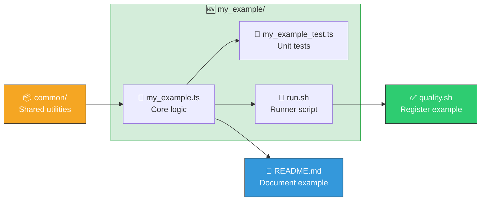

# Contributing to NEAT-AI-Examples

Thank you for your interest in contributing! This guide covers contributor-specific details. For
project overview, running examples, testing commands, and benchmarks, see [README.md](README.md).

## Prerequisites

### Deno

Install the [Deno](https://deno.land/) runtime. Version 2.x or later is recommended.

```bash
# macOS / Linux
curl -fsSL https://deno.land/install.sh | sh
```

After installation, ensure `deno` is on your `PATH`:

```bash
deno --version
```

### NEAT-AI-Discovery Rust Library (optional)

The Discovery example requires a native Rust FFI library. Build it from the
[NEAT-AI-Discovery](https://github.com/stSoftwareAU/NEAT-AI-Discovery) repository:

```bash
cargo build --release
```

Then copy the compiled library to `~/.cargo/lib/`:

| Platform | Library file                 | Destination                               |
| -------- | ---------------------------- | ----------------------------------------- |
| macOS    | `libneat_ai_discovery.dylib` | `~/.cargo/lib/libneat_ai_discovery.dylib` |
| Linux    | `libneat_ai_discovery.so`    | `~/.cargo/lib/libneat_ai_discovery.so`    |

> **Note:** The Discovery example is allowed to fail in CI because the Rust library is not yet
> available as a CI artefact. All other examples must pass.

## Development Workflow

Before submitting any changes, run the full quality gate (`./quality.sh`), which runs `deno lint`,
`deno fmt --check`, `deno test`, and all example runner scripts. See
[Quality Check](README.md#quality-check) in the README for full details on each step.

## Adding a New Example

Each example follows a consistent three-file pattern:



Use these steps to add a new one:

### 1. Create the example directory

```bash
mkdir my_example
```

### 2. Write the example module

Create `my_example/my_example.ts` with the core logic. Import shared utilities from `common/`:

```ts
import { generateSyntheticData, scoreCreature } from "../common/synthetic_data.ts";
import { setupWorkingDirs } from "../common/working_dirs.ts";
```

### 3. Write unit tests

Create `my_example/my_example_test.ts` next to the module. Tests must be "what" tests — call real
functions with test data and assert on outputs, exit codes, or side effects. See
[AGENTS.md](AGENTS.md) for the full testing philosophy.

### 4. Write the runner script

Create `my_example/run.sh`:

```bash
#!/bin/bash
set -euo pipefail

SCRIPT_DIR="$(cd -P "$(dirname "${BASH_SOURCE[0]}")" && pwd -P)"
REPO_ROOT="$(cd "${SCRIPT_DIR}/.." && pwd -P)"
cd "${REPO_ROOT}"

if ! command -v deno &> /dev/null; then
  export PATH="$HOME/.deno/bin:$PATH"
fi

deno run \
  --allow-read \
  --allow-write \
  --allow-env \
  --allow-run \
  my_example/my_example.ts \
  "$@"
```

Make it executable:

```bash
chmod +x my_example/run.sh
```

### 5. Register the example in quality.sh

Add a `run_example` call so the quality gate exercises it:

```bash
run_example "My Example" "./my_example/run.sh"
```

### 6. Update README.md

Add a section describing what the example demonstrates, how it works, and how to run it.

### 7. Verify

Run the full quality gate to confirm everything passes:

```bash
./quality.sh
```

## Code Style

### Australian English

All code, comments, and documentation **must** use Australian English spelling (e.g. colour,
behaviour, organisation, favour, metre, centre, optimise). See [AGENTS.md](AGENTS.md) for the
complete list of spelling conventions.

### Formatting

The project enforces consistent formatting via `deno fmt` with the configuration in `deno.json`:

- 2-space indentation (no tabs)
- 100-character line width
- Double quotes

Run `deno fmt` before committing to auto-fix formatting issues.

## Pull Request Checklist

Before submitting a pull request, verify the following:

- [ ] `./quality.sh` passes — lint, format, tests, and examples all succeed
- [ ] New code has corresponding unit tests (placed next to the module as `*_test.ts`)
- [ ] Australian English spelling is used throughout
- [ ] `README.md` is updated if your change adds or modifies an example
- [ ] Commit messages are clear and reference the relevant issue number
- [ ] The PR targets the `Develop` branch

## Getting Help

If you have questions about the project or need guidance, open a GitHub issue or check the existing
documentation:

- [README.md](README.md) — project overview, examples, testing, linting, and benchmarks
- [AGENTS.md](AGENTS.md) — AI agent instructions and detailed testing guidelines
