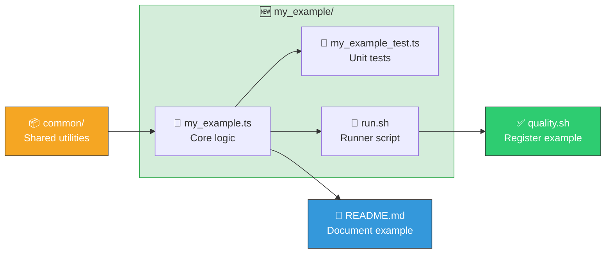

# 🤝 Contributing to NEAT-AI-Examples

Thank you for your interest in contributing! This guide covers contributor-specific details. For
project overview, running examples, testing commands, and benchmarks, see [README.md](README.md).

## 📋 Prerequisites

### 🦕 Deno

Install the [Deno](https://deno.land/) runtime. Version 2.x or later is recommended.

```bash
# macOS / Linux
curl -fsSL https://deno.land/install.sh | sh
```

After installation, ensure `deno` is on your `PATH`:

```bash
deno --version
```

### 🦀 NEAT-AI-Discovery Rust Library (optional)

The Discovery example requires a native Rust FFI library. Build it from the
[NEAT-AI-Discovery](https://github.com/stSoftwareAU/NEAT-AI-Discovery) repository:

```bash
cargo build --release
```

Then copy the compiled library to `~/.cargo/lib/`:

| Platform | Library file                 | Destination                               |
| -------- | ---------------------------- | ----------------------------------------- |
| macOS    | `libneat_ai_discovery.dylib` | `~/.cargo/lib/libneat_ai_discovery.dylib` |
| Linux    | `libneat_ai_discovery.so`    | `~/.cargo/lib/libneat_ai_discovery.so`    |

> [!NOTE]
> The Discovery example is allowed to fail in CI because the Rust library is not yet available as a
> CI artefact. All other examples must pass.

## 🔄 Development Workflow

Before submitting any changes, run the full quality gate (`./quality.sh`), which runs
`quality/bash_syntax.sh` (a `bash -n` syntax gate over every shell script), `deno lint`,
`deno fmt --check`, `deno test`, and all example runner scripts. See
[Quality Check](README.md#-quality-check) in the README for full details on each step.

> [!TIP]
> Run `./quality.sh` early and often — it catches lint, formatting, test, and runtime issues all in
> one go!

## 📚 PR Summaries

Every PR ships a summary describing what changed and why. Summaries are the project's durable memory
of what worked and what failed, so they all live in **one** place:

```text
docs/archive/pr-summaries/pr-summary-<PR>.md
```

Nothing else belongs in `docs/archive/` — a summary written to `docs/`, or loose in `docs/archive/`,
splits the corpus so a glob over the canonical path silently misses it. `docs/archive_test.ts`
enforces the layout and checks that relative links inside each summary still resolve (paths are
relative to the summary, so the repository root is `../../../`).

## 🆕 Adding a New Example

Each example follows a consistent three-file pattern:



Use these steps to add a new one:

### 1. 📁 Create the example directory

```bash
mkdir my_example
```

### 2. 📝 Write the example module

Create `my_example/my_example.ts` with the core logic. Import shared utilities from `common/`:

```ts
import { generateSyntheticData, scoreCreature } from "../common/synthetic_data.ts";
import { setupWorkingDirs } from "../common/working_dirs.ts";
```

If your example needs a real-world dataset, do **not** commit the raw data — download it at runtime
with [`common/data_cache.ts`](AGENTS.md#-shared-utilities) so the repository stays small:

```ts
import { fetchDataset } from "../common/data_cache.ts";

await fetchDataset({
  url: "https://example.com/dataset.csv",
  path: ".my-example/data/dataset.csv",
  sha256: "abc123…", // optional integrity check
});
```

### 3. 🧪 Write unit tests

Create `my_example/my_example_test.ts` next to the module. Tests must be "what" tests — call real
functions with test data and assert on outputs, exit codes, or side effects. See
[AGENTS.md](AGENTS.md) for the full testing philosophy.

### 4. 🚀 Write the runner script

Create `my_example/run.sh`:

```bash
#!/bin/bash
set -euo pipefail

SCRIPT_DIR="$(cd -P "$(dirname "${BASH_SOURCE[0]}")" && pwd -P)"
REPO_ROOT="$(cd "${SCRIPT_DIR}/.." && pwd -P)"
cd "${REPO_ROOT}"

if ! command -v deno &> /dev/null; then
  export PATH="$HOME/.deno/bin:$PATH"
fi

deno run \
  --allow-read \
  --allow-write \
  --allow-env \
  --allow-run \
  my_example/my_example.ts \
  "$@"
```

Make it executable:

```bash
chmod +x my_example/run.sh
```

### 5. ✅ Register the example in quality.sh

Add a `run_example` call so the quality gate exercises it:

```bash
run_example "My Example" "./my_example/run.sh"
```

### 6. 📖 Update README.md

Add a section describing what the example demonstrates, how it works, and how to run it.

### 7. ✔️ Verify

Run the full quality gate to confirm everything passes:

```bash
./quality.sh
```

## 🎨 Code Style

### 🇦🇺 Australian English

All code, comments, and documentation **must** use Australian English spelling. Here is a quick
reference for common words:

| ✅ Australian English | ❌ American English |
| --------------------- | ------------------- |
| colour                | color               |
| behaviour             | behavior            |
| organisation          | organization        |
| favour                | favor               |
| metre                 | meter               |
| centre                | center              |
| optimise              | optimize            |
| analyse               | analyze             |
| licence (noun)        | license             |
| artefact              | artifact            |
| recognise             | recognize           |
| summarise             | summarize           |
| categorise            | categorize          |
| standardise           | standardize         |
| customise             | customize           |
| initialise            | initialize          |

See [AGENTS.md](AGENTS.md) for the complete set of spelling conventions.

### ✨ Formatting

The project enforces consistent formatting via `deno fmt` with the configuration in `deno.json`:

- 2-space indentation (no tabs)
- 100-character line width
- Double quotes

> [!TIP]
> Run `deno fmt` before committing to auto-fix formatting issues.

## ✔️ Pull Request Checklist

Before submitting a pull request, verify the following:

- [ ] `./quality.sh` passes — lint, format, tests, and examples all succeed
- [ ] New code has corresponding unit tests (placed next to the module as `*_test.ts`)
- [ ] Australian English spelling is used throughout 🇦🇺
- [ ] `README.md` is updated if your change adds or modifies an example
- [ ] [`CHANGELOG.md`](CHANGELOG.md) has an `[Unreleased]` entry if the change is notable (a
      behaviour shift, a new example, or a dependency bump that changes results)
- [ ] The PR summary is written to `docs/archive/pr-summaries/pr-summary-<PR>.md` (see
      [PR Summaries](#-pr-summaries))
- [ ] Commit messages are clear and reference the relevant issue number
- [ ] The PR targets the `Develop` branch
- [ ] The PR summary is written to `docs/archive/pr-summaries/pr-summary-<PR>.md`

### 🗄️ PR-summary archive

Every PR summary lives at `docs/archive/pr-summaries/pr-summary-<PR>.md` — one flat directory, one
naming convention, no exceptions. That directory is the project's durable record of what worked and
what failed, so it must stay greppable as a single corpus: a summary written anywhere else (the
`docs/` root, or the old flat `docs/archive/` path) is invisible to anyone globbing the archive.
`docs/archive_test.ts` enforces the layout (issue
[#792](https://github.com/stSoftwareAU/NEAT-AI-Examples/issues/792)).

## 🔐 Code Owners & Branch Protection

Privileged surfaces — the GitHub Actions workflows under `.github/workflows/`, the local composite
actions under `.github/actions/` (they run inside those jobs, with the same secrets in scope), and
the supply-chain scripts (`bump-deps.sh`, `bump_deps.ts`, `quality.sh`) — are guarded by
[`.github/CODEOWNERS`](.github/CODEOWNERS). These paths run with secrets beyond the default
`GITHUB_TOKEN` (the write-capable `ACTIONS_PUSH` PAT, `SEMGREP_APP_TOKEN`, `CODECOV_TOKEN`), so a
change to them must be reviewed by
[`@stSoftwareAU/developers`](https://github.com/orgs/stSoftwareAU/teams/developers).

For the CODEOWNERS rule to be enforced at merge time, the `Develop` branch protection rule must have
**Require review from Code Owners** enabled. Recommended companion settings (repo-level GitHub
configuration, not visible from the clone):

- at least one required PR approval before merge to `Develop`;
- block direct push and force-push to `Develop`;
- require a linear history (for the rebase/squash workflow).

## 💬 Getting Help

If you have questions about the project or need guidance, open a GitHub issue or check the existing
documentation:

- 📖 [README.md](README.md) — project overview, examples, testing, linting, and benchmarks
- 🤖 [AGENTS.md](AGENTS.md) — AI agent instructions and detailed testing guidelines
