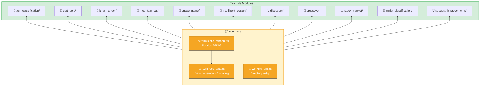
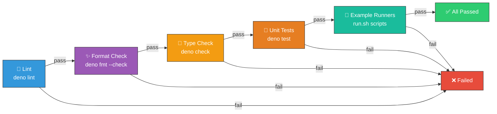
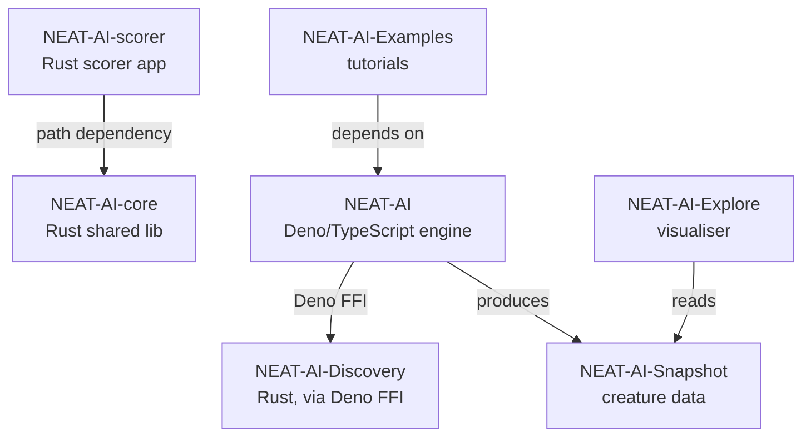

# 🧠 NEAT-AI-Examples

[](https://github.com/stSoftwareAU/NEAT-AI-Examples/actions/workflows/quality.yml)
[](LICENSE)
[](https://deno.land/)

Worked examples for [`NEAT-AI`](https://github.com/stSoftwareAU/NEAT-AI). Each example is a small,
self-contained program that generates its own synthetic data, so you can run it immediately with no
external dependencies beyond Deno (and, for Discovery, the NEAT-AI-Discovery Rust library).

This page is the **what** and **how** at a glance. Follow the link in each row for the full
walkthrough — the per-example README explains the workflow, options, and output artefacts.

## 🧬 Examples at a Glance

| Example                                                   | What it shows                                                                                             | How to run                      |
| --------------------------------------------------------- | --------------------------------------------------------------------------------------------------------- | ------------------------------- |
| [🧠 XOR](xor_classification/README.md)                    | The "Hello World" of neuroevolution — evolve a tiny network that learns the XOR truth table.              | `./xor_classification/run.sh`   |
| [🎢 Cart-Pole](cart_pole/README.md)                       | Evolve a controller that balances an inverted pole on a moving cart and render the run as an SVG strip.   | `./cart_pole/run.sh`            |
| [🚀 Lunar Lander](lunar_lander/README.md)                 | Evolve a controller that lands a 2D lunar lander softly on a marked pad with limited fuel.                | `./lunar_lander/run.sh`         |
| [🚗 Mountain Car](mountain_car/README.md)                 | Evolve a swing-up controller that drives an under-powered car up a sinusoidal hill to the goal flag.      | `./mountain_car/run.sh`         |
| [🐍 Snake](snake_game/README.md)                          | Evolve a controller that plays the classic Snake grid game and render the playthrough as an animated SVG. | `./snake_game/run.sh`           |
| [🗺️ Maze Navigation](maze_navigation/README.md)           | Evolve an agent to navigate a fixed grid maze from start to goal using local wall + heading sensors.      | `./maze_navigation/run.sh`      |
| [🧬 Intelligent Design](intelligent_design/README.md)     | Systematically swap activation functions on hidden neurons to find better squashes than random mutation.  | `./intelligent_design/run.sh`   |
| [🔍 Discovery](discovery/README.md)                       | Cripple a creature by removing a neuron, then use evolutionary search to recover its behaviour.           | `./discovery/run.sh`            |
| [🔀 Crossover](crossover/README.md)                       | Breed two parents with different architectures into an offspring and (optionally) evolve it further.      | `./crossover/run.sh`            |
| [📈 Stock Market](stock_market/README.md)                 | Evolve a tiny network that predicts next-period S&P 500 direction from a window of recent returns.        | `./stock_market/run.sh`         |
| [🔢 MNIST](mnist_classification/README.md)                | Evolve a 196 → 10 logistic classifier on a small MNIST subset and render an animated grid of predictions. | `./mnist_classification/run.sh` |
| [💡 Suggest Improvements](suggest_improvements/README.md) | Analyse the project and emit categorised improvement suggestions you can file as GitHub issues.           | `./suggest_improvements/run.sh` |

## 📸 Screenshots

Each control / classification example renders a deterministic SVG you can preview here without
running the code locally.

### 🧠 XOR — decision boundary


The champion network's learnt decision surface, sampled across the unit square. The four XOR
truth-table points sit on opposite corners of the boundary.

### 🎢 Cart-Pole — balancing run


A horizontal strip of simulation frames from the champion's run. Each frame shows the cart's
position and the pole angle at that timestep.

### 🚀 Lunar Lander — descent trajectory


The lander's descent trajectory, rendered above the lunar surface. The marked pad shows the target
touchdown zone; the lander's tilt and thruster bursts trace the controller's behaviour.

### 🚗 Mountain Car — swing-up to the summit


An under-powered car oscillates across a sinusoidal valley and finally crests the goal flag at
`x = 0.5`. The car icon animates along the recorded trajectory and changes colour the moment it
crosses the flag line, with a bottom progress bar marking the playhead.

### 🐍 Snake — animated playthrough


A NEAT-AI controller plays the classic Snake grid game on a 12×12 board. The snake is rendered as a
chain of rounded rectangles (a yellow head and green body); the food cell pulses via opacity
animation; the score counter ticks up via SMIL `<set>` overlays whenever the snake eats. A bottom
playhead progress bar sweeps left-to-right to mark the loop.

### 🗺️ Maze Navigation — agent traverses the maze


A NEAT-AI agent navigates a fixed 12×12 grid maze using only local sensors: four wall-distance
readings (N/E/S/W) and a packed unit-vector heading-to-goal. The agent renders as a circle that
animates along the recorded trajectory; a dotted breadcrumb polyline traces the path so the run
remains readable after the loop ends; the goal cell pulses via opacity animation when the agent
arrives.

### 📈 Stock Market — direction predictions


The S&P 500 close-price polyline over the held-out test window. Four-colour ▲/▼ markers encode each
prediction-vs-outcome combination (green ▲ correct up, orange ▲ missed up; blue ▼ correct down, red
▼ missed down). A dashed play-head sweeps left-to-right so viewers can walk the controller's
decisions chronologically. **Teaching example only — not investment advice.**

### 🔢 MNIST — handwritten digit predictions


A 5 × 4 grid of held-out MNIST test digits. Each cell cross-fades through three samples over the
9-second loop, and the label below each cell shows `T:<true> P:<predicted>` — green when the
champion classifies correctly, red on a miss. Pixel intensity is rendered through a purple → teal →
yellow ramp.

```mermaid
flowchart TD
    NEAT["🧠 NEAT-AI Library"]
    COMMON["📦 Common Utilities<br/>Shared data generation,<br/>scoring & directory setup"]

    XOR["🧠 XOR<br/>Hello World of NEAT —<br/>learn the XOR truth table"]
    CART["🎢 Cart-Pole<br/>Balance an inverted pole<br/>on a moving cart"]
    LUNAR["🚀 Lunar Lander<br/>Land softly on a flat<br/>pad with limited fuel"]
    MCAR["🚗 Mountain Car<br/>Swing up an under-powered<br/>car to crest the goal flag"]
    SNAKE["🐍 Snake<br/>Play the classic Snake<br/>grid game"]
    ID["🧬 Intelligent Design<br/>Optimise activation functions<br/>for hidden neurons"]
    DISC["🔍 Discovery<br/>Recover missing neurons<br/>via evolutionary search"]
    CROSS["🔀 Crossover<br/>Breed two creatures<br/>to produce offspring"]
    STOCK["📈 Stock Market<br/>Predict next-period S&P 500<br/>direction from prior returns"]
    MNIST["🔢 MNIST<br/>Classify handwritten digits<br/>from a 14×14 down-sample"]
    SUGGEST["💡 Suggest Improvements<br/>Analyse project &<br/>generate suggestions"]

    NEAT --> COMMON
    COMMON --> XOR
    COMMON --> CART
    COMMON --> LUNAR
    COMMON --> MCAR
    COMMON --> SNAKE
    COMMON --> ID
    COMMON --> DISC
    COMMON --> CROSS
    COMMON --> STOCK
    COMMON --> MNIST
    COMMON --> SUGGEST

    style NEAT fill:#4a90d9,stroke:#333,color:#fff
    style COMMON fill:#f5a623,stroke:#333,color:#fff
    style XOR fill:#3498db,stroke:#333,color:#fff
    style CART fill:#9b59b6,stroke:#333,color:#fff
    style LUNAR fill:#1abc9c,stroke:#333,color:#fff
    style MCAR fill:#e67e22,stroke:#333,color:#fff
    style SNAKE fill:#27ae60,stroke:#333,color:#fff
    style ID fill:#7ed321,stroke:#333,color:#fff
    style DISC fill:#bd10e0,stroke:#333,color:#fff
    style CROSS fill:#e74c3c,stroke:#333,color:#fff
    style STOCK fill:#16a085,stroke:#333,color:#fff
    style MNIST fill:#34495e,stroke:#333,color:#fff
    style SUGGEST fill:#50e3c2,stroke:#333,color:#fff
```



## 📦 Shared Utilities

The [`common/`](common/) module provides the building blocks every example reuses:

- 🎲 **`deterministic_random.ts`** — splitmix32-style seeded PRNG so runs are reproducible across
  machines.
- 📊 **`synthetic_data.ts`** — `generateSyntheticData` and `scoreCreature`. Each example picks its
  own seed so data sets are independent but deterministic.
- 📁 **`working_dirs.ts`** — `setupWorkingDirs` creates `data/`, `creatures/`, and `output/`
  subdirectories under a per-example hidden root and clears `output/` on each run.



## 📋 Prerequisites

- [Deno](https://deno.land/) 2.x
- Discovery example only: the NEAT-AI-Discovery Rust library at
  `~/.cargo/lib/libneat_ai_discovery.dylib` (or the appropriate extension for your platform). See
  [discovery/README.md](discovery/README.md#-prerequisites) for build instructions.

## ✅ Quality Check

Run linting, formatting, type checks, unit tests, and every example end-to-end:

```bash
./quality.sh
```



A GitHub Actions workflow ([`.github/workflows/quality.yml`](.github/workflows/quality.yml)) runs
the same pipeline on every push and pull request to `Develop`. Failing checks block merges.

> [!NOTE]
> The Discovery example needs a native Rust FFI library that is not yet available in CI, so its step
> is allowed to fail gracefully there.

<details>
<summary>🧪 Running tests, lint, fmt, and benchmarks independently</summary>

```bash
# All unit tests
deno test --no-check --allow-read --allow-write --allow-env

# A single test file
deno test --no-check --allow-read --allow-write --allow-env discovery/discover_missing_neuron_test.ts

# Lint, format check, and type check
deno lint
deno fmt --check
deno check **/*.ts

# Benchmarks (run in isolation, not part of quality.sh)
deno bench --allow-read --allow-write --allow-env
deno bench --allow-read --allow-write --allow-env discovery/
```

The formatter (configured in [`deno.json`](deno.json)) uses 2-space indentation, 100-character line
width, and double quotes. See [AGENTS.md](AGENTS.md) for the full testing philosophy and the
unit-tests-vs-benchmarks rules.

</details>

## Related Repositories

The NEAT-AI project is split across seven public repositories. Each focuses on one concern and
composes with the others as shown below.

| Repository                                                             | Role                                                                                                              |
| ---------------------------------------------------------------------- | ----------------------------------------------------------------------------------------------------------------- |
| [NEAT-AI](https://github.com/stSoftwareAU/NEAT-AI)                     | Primary Deno/TypeScript neural-network engine (evolution, training, WASM activation).                             |
| [NEAT-AI-core](https://github.com/stSoftwareAU/NEAT-AI-core)           | Shared native Rust library (`neat-core`) with numerics, topology helpers, and the chunked `.bin` training stream. |
| [NEAT-AI-Discovery](https://github.com/stSoftwareAU/NEAT-AI-Discovery) | Rust discovery module invoked by NEAT-AI via Deno FFI to search architectures and hyper-parameters.               |
| [NEAT-AI-Snapshot](https://github.com/stSoftwareAU/NEAT-AI-Snapshot)   | Creature/genome snapshot format and fixtures produced by NEAT-AI and consumed by downstream tools.                |
| [NEAT-AI-scorer](https://github.com/stSoftwareAU/NEAT-AI-scorer)       | Production forward-only scoring application built on `neat-core` via a path dependency.                           |
| [NEAT-AI-Explore](https://github.com/stSoftwareAU/NEAT-AI-Explore)     | Visualiser for creatures that reads NEAT-AI-Snapshot data.                                                        |
| [NEAT-AI-Examples](https://github.com/stSoftwareAU/NEAT-AI-Examples)   | Worked examples and tutorials that depend on NEAT-AI.                                                             |

### Dependency graph



## 🤝 Contributing

See [CONTRIBUTING.md](CONTRIBUTING.md) for development setup, how to add new examples, coding
standards, and the pull request checklist.

## 📄 Licence

Apache Licence 2.0 — see [LICENSE](LICENSE).
