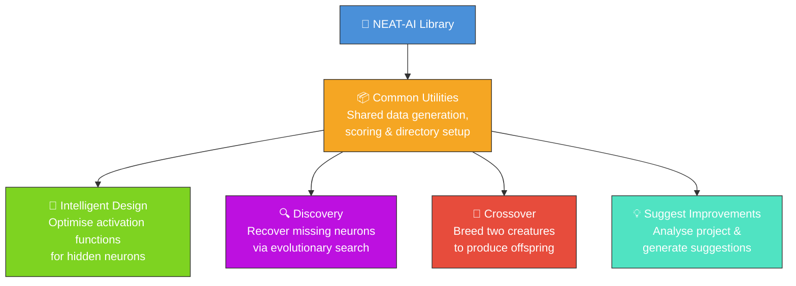
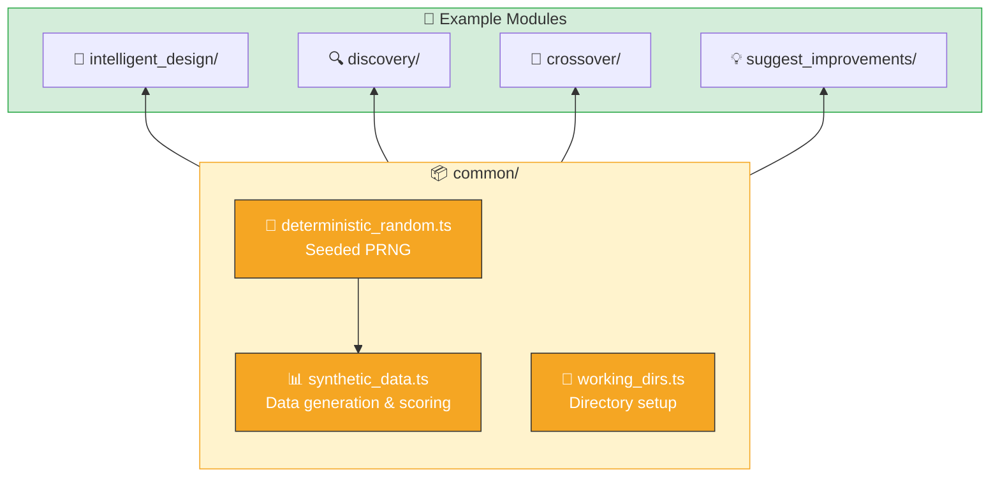
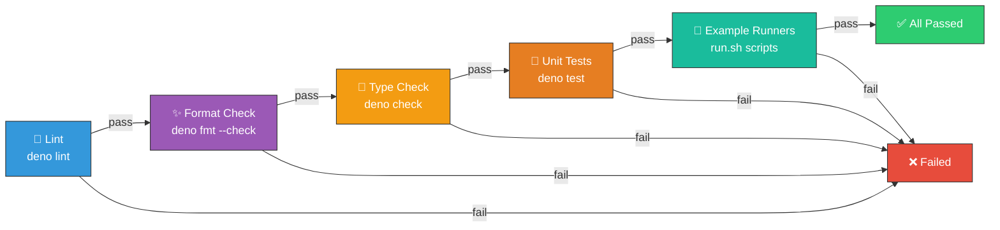
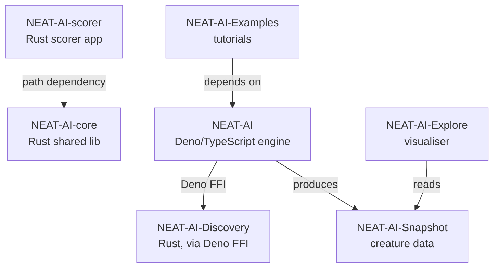

# 🧠 NEAT-AI-Examples

[](https://github.com/stSoftwareAU/NEAT-AI-Examples/actions/workflows/quality.yml)
[](LICENSE)
[](https://deno.land/)

Worked examples for [`NEAT-AI`](https://github.com/stSoftwareAU/NEAT-AI). Each example is a small,
self-contained program that generates its own synthetic data, so you can run it immediately with no
external dependencies beyond Deno (and, for Discovery, the NEAT-AI-Discovery Rust library).

This page is the **what** and **how** at a glance. Follow the link in each row for the full
walkthrough — the per-example README explains the workflow, options, and output artefacts.

## 🧬 Examples at a Glance

| Example                                                   | What it shows                                                                                            | How to run                      |
| --------------------------------------------------------- | -------------------------------------------------------------------------------------------------------- | ------------------------------- |
| [🧬 Intelligent Design](intelligent_design/README.md)     | Systematically swap activation functions on hidden neurons to find better squashes than random mutation. | `./intelligent_design/run.sh`   |
| [🔍 Discovery](discovery/README.md)                       | Cripple a creature by removing a neuron, then use evolutionary search to recover its behaviour.          | `./discovery/run.sh`            |
| [🔀 Crossover](crossover/README.md)                       | Breed two parents with different architectures into an offspring and (optionally) evolve it further.     | `./crossover/run.sh`            |
| [🎢 Cart-Pole](cart_pole/README.md)                       | Evolve a controller that balances an inverted pole on a moving cart and render the run as an SVG strip.  | `./cart_pole/run.sh`            |
| [💡 Suggest Improvements](suggest_improvements/README.md) | Analyse the project and emit categorised improvement suggestions you can file as GitHub issues.          | `./suggest_improvements/run.sh` |



## 📦 Shared Utilities

The [`common/`](common/) module provides the building blocks every example reuses:

- 🎲 **`deterministic_random.ts`** — splitmix32-style seeded PRNG so runs are reproducible across
  machines.
- 📊 **`synthetic_data.ts`** — `generateSyntheticData` and `scoreCreature`. Each example picks its
  own seed so data sets are independent but deterministic.
- 📁 **`working_dirs.ts`** — `setupWorkingDirs` creates `data/`, `creatures/`, and `output/`
  subdirectories under a per-example hidden root and clears `output/` on each run.



## 📋 Prerequisites

- [Deno](https://deno.land/) 2.x
- Discovery example only: the NEAT-AI-Discovery Rust library at
  `~/.cargo/lib/libneat_ai_discovery.dylib` (or the appropriate extension for your platform). See
  [discovery/README.md](discovery/README.md#-prerequisites) for build instructions.

## ✅ Quality Check

Run linting, formatting, type checks, unit tests, and every example end-to-end:

```bash
./quality.sh
```



A GitHub Actions workflow ([`.github/workflows/quality.yml`](.github/workflows/quality.yml)) runs
the same pipeline on every push and pull request to `Develop`. Failing checks block merges.

> [!NOTE]
> The Discovery example needs a native Rust FFI library that is not yet available in CI, so its step
> is allowed to fail gracefully there.

<details>
<summary>🧪 Running tests, lint, fmt, and benchmarks independently</summary>

```bash
# All unit tests
deno test --no-check --allow-read --allow-write --allow-env

# A single test file
deno test --no-check --allow-read --allow-write --allow-env discovery/discover_missing_neuron_test.ts

# Lint, format check, and type check
deno lint
deno fmt --check
deno check **/*.ts

# Benchmarks (run in isolation, not part of quality.sh)
deno bench --allow-read --allow-write --allow-env
deno bench --allow-read --allow-write --allow-env discovery/
```

The formatter (configured in [`deno.json`](deno.json)) uses 2-space indentation, 100-character line
width, and double quotes. See [AGENTS.md](AGENTS.md) for the full testing philosophy and the
unit-tests-vs-benchmarks rules.

</details>

## Related Repositories

The NEAT-AI project is split across seven public repositories. Each focuses on one concern and
composes with the others as shown below.

| Repository                                                             | Role                                                                                                              |
| ---------------------------------------------------------------------- | ----------------------------------------------------------------------------------------------------------------- |
| [NEAT-AI](https://github.com/stSoftwareAU/NEAT-AI)                     | Primary Deno/TypeScript neural-network engine (evolution, training, WASM activation).                             |
| [NEAT-AI-core](https://github.com/stSoftwareAU/NEAT-AI-core)           | Shared native Rust library (`neat-core`) with numerics, topology helpers, and the chunked `.bin` training stream. |
| [NEAT-AI-Discovery](https://github.com/stSoftwareAU/NEAT-AI-Discovery) | Rust discovery module invoked by NEAT-AI via Deno FFI to search architectures and hyper-parameters.               |
| [NEAT-AI-Snapshot](https://github.com/stSoftwareAU/NEAT-AI-Snapshot)   | Creature/genome snapshot format and fixtures produced by NEAT-AI and consumed by downstream tools.                |
| [NEAT-AI-scorer](https://github.com/stSoftwareAU/NEAT-AI-scorer)       | Production forward-only scoring application built on `neat-core` via a path dependency.                           |
| [NEAT-AI-Explore](https://github.com/stSoftwareAU/NEAT-AI-Explore)     | Visualiser for creatures that reads NEAT-AI-Snapshot data.                                                        |
| [NEAT-AI-Examples](https://github.com/stSoftwareAU/NEAT-AI-Examples)   | Worked examples and tutorials that depend on NEAT-AI.                                                             |

### Dependency graph



## 🤝 Contributing

See [CONTRIBUTING.md](CONTRIBUTING.md) for development setup, how to add new examples, coding
standards, and the pull request checklist.

## 📄 Licence

Apache Licence 2.0 — see [LICENSE](LICENSE).
