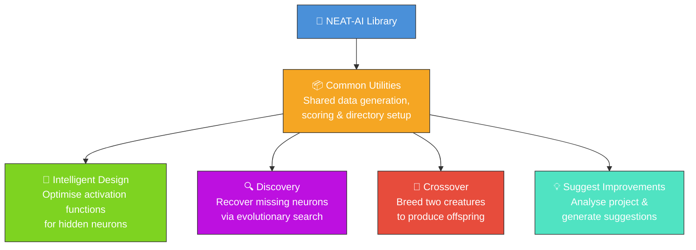
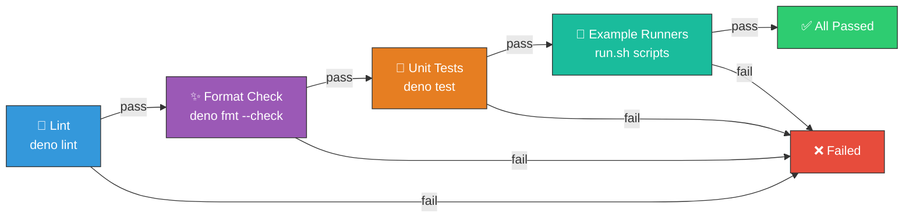
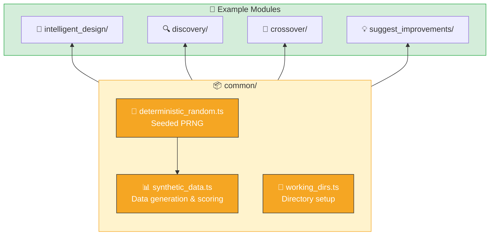
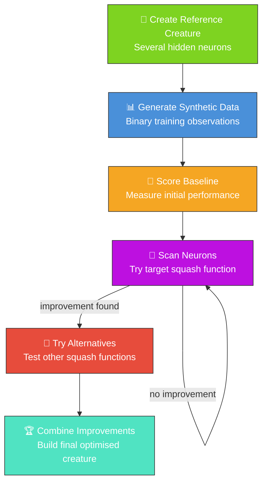

# NEAT-AI-Examples

Companion programs demonstrating how to use [`NEAT-AI`](https://github.com/stSoftwareAU/NEAT-AI).
Each example is self-contained and generates its own synthetic data, so you can run them immediately
without any external dependencies beyond Deno and the NEAT-AI library.

## 🧬 Examples Overview



## Prerequisites

- [Deno](https://deno.land/) runtime installed
- For the Discovery example: the NEAT-AI-Discovery Rust library installed at
  `~/.cargo/lib/libneat_ai_discovery.dylib` (or the appropriate extension for your platform)

## Quality Check

Run linting, formatting checks, unit tests, and all examples to verify everything works correctly:

```bash
./quality.sh
```

This script runs the following pipeline:



1. **Linting** — `deno lint` with the recommended rule set configured in `deno.json`.
2. **Formatting** — `deno fmt --check` to enforce consistent style (2-space indent, 100-char line
   width, double quotes).
3. **Unit tests** — `deno test` across the project (tests live next to each module as `*_test.ts`
   files).
4. **Example programs** — each example runner script, verifying the full end-to-end workflow.

### Continuous Integration

A GitHub Actions workflow automatically runs the quality checks on every push and pull request to
the `Develop` branch. The workflow configuration is at `.github/workflows/quality.yml`. Failing
checks will block merges, ensuring all examples remain functional across contributions.

> **Note:** The Discovery example requires a native Rust FFI library that is not yet available in
> CI, so its step is allowed to fail gracefully.

### Running Tests Independently

```bash
# All unit tests
deno test --no-check --allow-read --allow-write --allow-env

# A single test file
deno test --no-check --allow-read --allow-write --allow-env discovery/discover_missing_neuron_test.ts
```

### Linting and Formatting

The project uses `deno lint` (recommended rules) and `deno fmt` for consistent code style. To check
locally:

```bash
# Check for lint issues
deno lint

# Check formatting (no changes)
deno fmt --check

# Auto-fix formatting
deno fmt
```

The formatting configuration (in `deno.json`) uses 2-space indentation, 100-character line width,
and double quotes. All code must pass both lint and format checks before merging.

### Unit Tests vs Benchmarks

- **Unit tests** verify _what_ the code produces (correct outputs, valid structures, expected side
  effects). They never measure timing.
- **Benchmarks** measure _how fast_ the code runs. They use `deno bench` and run in isolation.

Unit tests run in parallel, so timing measurements inside them are unreliable. Keep performance
assertions in benchmarks only. See [AGENTS.md](AGENTS.md) for the full testing guidelines.

### Running Benchmarks

Benchmarks live alongside their modules as `*_bench.ts` files and measure execution time for key
operations such as creature activation, data generation, and scoring.

```bash
# All benchmarks
deno bench --allow-read --allow-write --allow-env

# Benchmarks for a specific module
deno bench --allow-read --allow-write --allow-env discovery/
deno bench --allow-read --allow-write --allow-env intelligent_design/
```

Benchmarks are intentionally separate from unit tests and are **not** included in `quality.sh` or
CI, since they are designed to run in isolation on a consistent machine for meaningful results.

## Common Utilities



The `common/` module provides shared functionality used across all examples:

- **`deterministic_random.ts`** — A seeded pseudo-random number generator (PRNG) using a
  splitmix32-style algorithm. Given the same seed, the sequence is identical across runs and
  platforms.
- **`synthetic_data.ts`** — Deterministic binary training data generation (`generateSyntheticData`)
  and creature scoring (`scoreCreature`). Each example defines its own `SyntheticConfig` with a
  unique seed so data sets are independent but reproducible.
- **`working_dirs.ts`** — Standard working directory setup (`setupWorkingDirs`). Creates `data/`,
  `creatures/`, and `output/` subdirectories under a given root, emptying `output/` on each run.

Examples import from `common/` and add only their example-specific logic (creature definitions,
domain-specific workflows).

## Intelligent Design: Squash Improvement Scan

`intelligent_design/improve_squash_example.ts` demonstrates how to use the Intelligent Design module
to systematically test different activation functions (squashes) for each hidden neuron in a
creature. This technique is used in production workflows to optimise trained models by finding
better squash functions than those produced by random mutation.

### How it works



1. Creates a reference creature with several hidden neurons
2. Generates synthetic training data
3. Scores the baseline creature
4. Scans each hidden neuron, trying the target squash function
5. For neurons that improve, tries alternative squash functions
6. Combines the best improvements into a final creature

### Running the example

```bash
./intelligent_design/run.sh
```

By default, the example tries `GELU` as the target squash. You can specify a different squash:

```bash
./intelligent_design/run.sh Swish
./intelligent_design/run.sh LeakyReLU
```

The script writes all artefacts to `.synthetic-intelligent-design/`, a hidden directory ignored by
git. You will find:

- `data/` – Binary training data for scoring
- `creatures/baseline.json` – The original reference creature
- `creatures/improved.json` – The improved creature (if improvements were found)
- `output/` – Individual improved creatures for each neuron

### Tacit Knowledge

In production workflows, successful squash substitutions are recorded as "tacit knowledge" –
mappings from neuron UUID to squash function. This knowledge can be shared across machines (via a
"hive" file in a git repository) or kept local. When a model is loaded, tacit knowledge is applied
to quickly reapply known-good squash substitutions without rescanning.

## Discovery: Recover a Missing Neuron

`discovery/discover_missing_neuron.ts` demonstrates the neuron discovery workflow. It creates a
simple creature, generates synthetic training data, removes a hidden neuron to "cripple" the
creature, and then runs discovery to attempt to recover the missing functionality.

### How it works

1. Creates a reference creature with 4 inputs, 4 hidden neurons, and 1 output
2. Generates synthetic training data based on the creature's behavior
3. Removes a hidden neuron (LeakyReLU) to create a "crippled" creature
4. Compares baseline and crippled scores to show the performance loss
5. Runs `Creature.discoveryDir()` to search for improvements
6. Reports whether discovery found a way to recover performance

### Prerequisites

- The NEAT-AI-Discovery Rust library must be installed. Build it via `cargo build --release` in the
  NEAT-AI-Discovery repository and copy the resulting library to `~/.cargo/lib/`.
- Deno with FFI permissions enabled

### Running the example

```bash
./discovery/run.sh
```

The script writes all artefacts to `.synthetic-discovery/`, a hidden directory ignored by git. You
will find:

- `data/` – Binary training data containing the synthetic observations
- `creatures/baseline.json` – The untouched reference creature
- `creatures/crippled.json` – The creature with the target neuron removed
- `creatures/discovered.json` – The best candidate returned by discovery (when available)

## Crossover: Breeding Two Creatures

`crossover/crossover_example.ts` demonstrates how to breed two parent creatures with different
neural network architectures to produce offspring. Crossover is a fundamental neuroevolution
operation where traits from both parents are combined into a child creature.

### How it works

1. Creates two parent creatures with different activation functions (TANH/LOGISTIC vs
   SELU/LeakyReLU)
2. Generates synthetic training data based on parent A's behaviour
3. Scores both parents against the training data
4. Performs crossover — the mother's neurons are always included, the father's unique neurons have a
   50% chance of inclusion, and matching weights/biases are blended (averaged)
5. Scores the offspring and compares performance to both parents
6. Optionally evolves the offspring for several generations to demonstrate multi-generation
   improvement

### Running the example

```bash
./crossover/run.sh
```

The script writes all artefacts to `.synthetic-crossover/`, a hidden directory ignored by git. You
will find:

- `data/` – Binary training data for scoring
- `creatures/parent_a.json` – The first parent creature
- `creatures/parent_b.json` – The second parent creature
- `creatures/offspring.json` – The crossover offspring
- `creatures/evolved.json` – The offspring after multi-generation evolution
- `output/` – Additional offspring from repeated crossover

## Suggest Improvements: Project Analyser

`suggest_improvements/suggest_improvements.ts` analyses the NEAT-AI-Examples project structure and
produces actionable improvement suggestions. These suggestions can be filed as GitHub issues using
the GH CLI.

### How it works

1. Scans the project for common improvement opportunities
2. Categorises suggestions (CI/CD, code quality, documentation, new examples)
3. Produces a structured list with titles, descriptions, and categories
4. Optionally writes a markdown summary to `.synthetic-suggest-improvements/`

### Running the example

```bash
./suggest_improvements/run.sh
```

The output lists each improvement suggestion with its category and description. To file the
suggestions as GitHub issues, use the GH CLI:

```bash
gh issue create --title "Improvement title" --label "enhancement" --body "Description"
```

## Contributing

Contributions are welcome! See [CONTRIBUTING.md](CONTRIBUTING.md) for development setup, how to add
new examples, coding standards, and the pull request checklist.

## License

See [LICENSE](LICENSE) for details.
