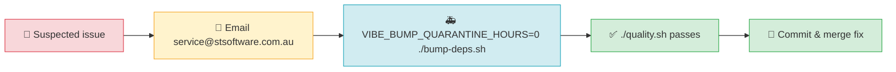

# 🔒 Security Policy

This document is the incident-readiness anchor for **NEAT-AI-Examples**. It names who to contact
about a security or supply-chain concern, and how the team fast-tracks a dependency fix during an
incident.

## 📣 Reporting a vulnerability

Please report suspected vulnerabilities, compromised dependencies, or other security concerns
**privately** — do not open a public GitHub issue for an unfixed vulnerability.

- **Disclosure contact:** [service@stsoftware.com.au](mailto:service@stsoftware.com.au)

Include as much detail as you can: the affected file or dependency, how to reproduce the problem,
and the impact you observed. We aim to acknowledge a report promptly and will keep you informed as
we investigate and remediate.

## 🚑 Emergency dependency-bump procedure

Dependency bumps normally pass through a 24-hour supply-chain quarantine window (see
[`bump-deps.sh`](bump-deps.sh) and the `VIBE_BUMP_QUARANTINE_HOURS` override it documents). When a
security fix must land faster than that window allows, fast-track it as follows:

```bash
# Skip the quarantine window for this run, then bump and verify.
VIBE_BUMP_QUARANTINE_HOURS=0 ./bump-deps.sh
./quality.sh
```

Review the resulting `deno.json` / `deno.lock` diff, confirm `./quality.sh` passes, then commit and
merge. Use the `VIBE_BUMP_QUARANTINE_HOURS=0` override **only** for a genuine security fast-track;
routine bumps must respect the default 24-hour quarantine.



## 🔗 Related documents

- [CONTRIBUTING.md](CONTRIBUTING.md) — contribution workflow and the quality gate.
- [bump-deps.sh](bump-deps.sh) — supply-chain-aware dependency updater and quarantine knob.
- [AGENTS.md](AGENTS.md) — guidelines for humans and AI agents.
