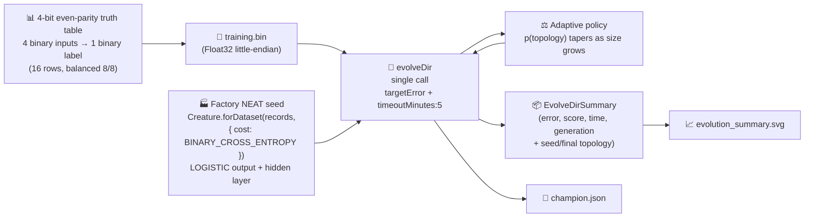

# 🧬 Adaptive Mutation Rate — Classifying 4-bit Parity from a Factory Seed

> 🏭 **Generation 1 is built by the NEAT-AI factory (issue #533).** Instead of a bare
> `new Creature(4, 1)`, the seed is minted by
> `Creature.forDataset(records, { cost: "BINARY_CROSS_ENTROPY" })`, which couples the output to a
> LOGISTIC activation and pre-sizes a conservative hidden layer. **Only the seed changes — evolution
> is untouched.** Seed weights and biases stay random; NEAT-AI must still **find** the parity
> classifier on its own. This is a milestone-sanctioned departure from the no-warm-start policy (see
> below).

**Acronyms.** _NEAT_ = NeuroEvolution of Augmenting Topologies — the algorithm that grows neural
network topology and weights together with an evolutionary search. _MSE_ = mean squared error.
_WASM_ = WebAssembly. _RL_ = reinforcement learning. _XOR_ = exclusive OR.

`adaptive_mutation.ts` evolves a NEAT-AI network that solves a **4-bit even-parity classification**
task — the textbook XOR generalisation. Parity is not linearly separable, so it needs hidden
capacity; the factory seed starts with a small conservative hidden layer whose **random** weights
still score around chance, so NEAT-AI **must** grow and tune the network before accuracy can climb.
That structural growth is exactly the signal the demo is built around: the same NEAT-AI **adaptive
mutation policy** that drives the growth naturally tapers topology mutations as size rises and lets
weight tuning take over.

The example seeds NEAT-AI via the data-derived factory
`Creature.forDataset(records, { cost: "BINARY_CROSS_ENTROPY" })`, runs `Creature.evolveDir(...)`
over a binary `.bin` training set built from the 4-bit even-parity truth table, and quotes real
measured numbers from the latest local run. The factory chooses **only** the seed's topology and
weight-init scaling from problem-intrinsic facts; the weights and biases stay random and `evolveDir`
keeps its default scoring, so evolution behaves exactly as before.


## 🏭 Factory seed — a milestone-sanctioned departure

Generation 1 is minted by the NEAT-AI factory
`Creature.forDataset(records, { cost: "BINARY_CROSS_ENTROPY" })`. From problem-intrinsic facts only,
the factory:

- couples the output activation to the cost — `BINARY_CROSS_ENTROPY` ⇒ a **LOGISTIC** output
  ([NEAT-AI #2793](https://github.com/stSoftwareAU/NEAT-AI/issues/2793)), the exact activation this
  example's `>= 0.5` threshold and `{0, 1}` MSE both assume;
- sizes a **conservative hidden-capacity budget** from the problem shape (Heaton's rule → a small
  RELU hidden layer);
- scales the random weight init per activation (He / Xavier).

**Only the seed's topology and scaling are factory-derived** — seed weights and biases remain
random, drawn from NEAT-AI's seeded PRNG, and `evolveDir` keeps its default MSE scoring. All
structural growth beyond the seed still comes from the unchanged mutation operators, so the example
converges as before (or faster).

This is a **deliberate, milestone-sanctioned departure** from the
[no-warm-start policy](../AGENTS.md#-no-warm-starts--evolution-must-start-from-random-noise) in
`AGENTS.md`, made under the factory-adoption tracker
([#517](https://github.com/stSoftwareAU/NEAT-AI-Examples/issues/517); see
[`docs/factory_adoption.md`](../docs/factory_adoption.md)). The bare `new Creature(4, 1)` baseline
is retained in code as `buildRandomSeedCreature(seed)` for test / resume fixtures.

## 📈 Latest Measured Run

The numbers below come directly from the latest local run of `./adaptive_mutation/run.sh` — no
estimates, no qualifiers.

| Metric                    | Value                                                            |
| ------------------------- | ---------------------------------------------------------------- |
| Task                      | 4-bit even parity (16-row truth table)                           |
| Seed                      | `Creature.forDataset(records, { cost: "BINARY_CROSS_ENTROPY" })` |
| Generations               | 955 (solved — `targetError` reached)                             |
| Wall-clock                | 1 m 1 s                                                          |
| Final training accuracy   | 1.0000 (16 of 16 rows correct)                                   |
| Held-out accuracy         | 1.0000                                                           |
| Final best fitness        | 1.0000                                                           |
| Held-out score (-MSE)     | ≈ 0.0000 (essentially perfect)                                   |
| Seed neurons / synapses   | 9 / 20 (4 factory-sized hidden)                                  |
| Final neurons / synapses  | 11 / 27                                                          |
| `targetError`             | 0.05                                                             |
| `timeoutMinutes` (safety) | 5                                                                |

Topology genuinely changed: NEAT grew the network from the factory seed (9 neurons / 20 synapses,
including a 4-neuron factory-sized hidden layer) to 11 neurons / 27 synapses across 955 generations.
The factory hidden layer ships with **random** weights, so gen-1 accuracy still sits around chance;
classification accuracy then climbs to **1.0000 at the final generation** — the captured "noise →
competent" arc, now starting from a factory-derived topology instead of a bare seed.

- Single-call summary chart:
  [`docs/screenshots/adaptive_mutation/evolution_summary.svg`](../docs/screenshots/adaptive_mutation/evolution_summary.svg)


## 🚀 How to Run

```bash
./adaptive_mutation/run.sh
```

The runner:

1. Generates the full 4-bit even-parity truth table (16 records, 4 binary inputs → 1 binary output)
   from `classification_task.ts`. Class balance is exact (8 even, 8 odd) by construction.
2. Writes the dataset as a Float32 `.bin` file under `.adaptive-mutation/data/`.
3. Seeds NEAT-AI via the factory `Creature.forDataset(records, { cost: "BINARY_CROSS_ENTROPY" })` —
   LOGISTIC output, a factory-sized hidden layer, He/Xavier-scaled random weights.
4. Runs `Creature.evolveDir(dataDir, neatOptions)` with `targetError = 0.05` and
   `timeoutMinutes = 5` as a **single call** — no per-generation chunking, no `onTrainingEvent`
   hook. NEAT-AI's milestone-only telemetry surface is the supported way to chart progress (see
   [`AGENTS.md`](../AGENTS.md)).
5. Writes the headline SVG, the shared `evolution_summary.svg` (rendered from the `evolveDir` return
   value plus the seed and final creature's topology), and the champion creature JSON. The whole run
   completes well inside the 5-minute backstop on a developer machine.

## 🧠 Why NEAT-AI Adapts the Mutation Rate

NEAT-AI's evolutionary search picks one mutation operator per attempt. If every creature, regardless
of size, had the same chance of receiving an `ADD_NODE` mutation, big creatures would explode in
size without ever finishing weight tuning. NEAT-AI's mutation policy reads the creature's current
size and reduces the topology share as size grows.

A useful closed-form approximation of the policy is

```
p(topology) = baseTopologyProb / (1 + size / sizeScale)
```

with `baseTopologyProb = 0.6`, `sizeScale = 80`, and `size = hidden + synapses`. The headline SVG
plots this analytic curve in the upper panel with markers showing where the seed and final creature
land on it, and the lower panel pairs the seed-vs-final neuron and synapse counts as bars. As size
rises across the run, `p(topology)` collapses toward zero, exactly as the policy intends.

| Aspect         | Tiny seed (size ≈ 9) | Final creature (size ≈ 100) |
| -------------- | -------------------- | --------------------------- |
| Topology share | High — needs growth  | Lower — refines weights     |
| Failure mode   | Stuck at chance acc. | Bloat without refinement    |

## 🔧 How It Works



The classification target is the textbook **even-parity detector**: given four bits, return `1` if
the number of `1` bits is even (count ∈ {0, 2, 4}), else `0`. This is the standard XOR
generalisation — parity is not linearly separable, so it needs hidden capacity. The factory seed
ships a small conservative hidden layer, but with **random** weights it still scores around chance,
so NEAT-AI **must** grow and tune the network before accuracy can move off chance. The captured
noise → competent arc — gen 1 ≈ chance, final ≥ target accuracy — is exactly what the demo is built
to show.

### Why `evolveDir` rather than per-step `activate()`?

The training task is a pre-generated binary `(input, target)` set — the canonical "binary-data +
`evolveDir`" categorisation from the parent audit ([issue #203]). `evolveDir` exercises NEAT-AI's
full feature set (back-propagation, structure discovery, WASM/SIMD/GPU parallelism) and is orders of
magnitude faster than per-call `activate()` for supervised classification. Per-step `activate()` is
reserved for interactive simulations / RL agents where the next observation depends on the previous
action.

[issue #203]: https://github.com/stSoftwareAU/NEAT-AI-Examples/issues/203

## 📤 Output

- `docs/screenshots/adaptive_mutation.svg` — headline two-panel chart (analytic topology-mutation
  policy curve in the upper panel with seed/final markers, seed-vs-final topology bars in the lower
  panel), with a caption quoting the latest measured generations, wall-clock, final error and
  held-out -MSE. A mirror copy is also written to `.adaptive-mutation/output/adaptive_mutation.svg`.
- `docs/screenshots/adaptive_mutation/evolution_summary.svg` — shared `evolveDir` summary chart
  rendered from the single call's return value plus the seed and final creature topology.
- `.adaptive-mutation/creatures/champion.json` — final champion creature for downstream inspection.

## 🧪 Tests

`adaptive_mutation_test.ts` verifies (with "what" tests — no source-level grepping):

- `buildSeedCreature` mints a factory seed with the right arity, a LOGISTIC output coupled to
  `BINARY_CROSS_ENTROPY`, a data-derived hidden layer, deterministic weights/biases per seed, and
  valid finite `[0, 1]` outputs; it rejects an empty record set. `datasetToFactoryRecords` mirrors
  the dataset's inputs and targets.
- `buildRandomSeedCreature` (the retained bare-constructor baseline) has zero hidden neurons, a
  pinned LOGISTIC output, and is deterministic per seed.
- `topologyProbability` decreases monotonically with size, matches the documented closed form, and
  rejects invalid policies / negative sizes.
- `runAdaptiveMutationDemo` rejects invalid configs, returns a summary whose `finalNeurons` /
  `finalSynapses` match the returned champion's live arrays, a `generations` count in
  `[1, maxIterations]`, and a finite non-negative `finalError`; the champion has the correct I/O
  shape; the runner reports finite held-out accuracy, held-out score and wall-clock.
- `creatureHeldOutScore` returns a finite non-positive value for any dataset and 0 for an empty one.
- The headline `renderAdaptiveMutationSVG` produces well-formed output containing the analytic
  policy curve and the seed-vs-final topology bars, with no `NaN` leaking into the rendered SVG.
- `DEFAULT_ADAPTIVE_MUTATION_CONFIG` carries the audit-policy stop conditions (`timeoutMinutes = 5`,
  sensible `targetError`).
- The `classification_task.ts` primitives validate the truth table, deterministic dataset
  generation, binary `.bin` writing, and the classifier accuracy helper.

## 🧰 NEAT-AI Features Used

This example exercises NEAT-AI's adaptive-mutation policy through real evolution from a factory seed
on a concrete classification problem.

Features exercised (links go to upstream
[`COMPARISON.md`](https://github.com/stSoftwareAU/NEAT-AI/blob/Develop/COMPARISON.md)):

- **[Hyperparameter Self-Adaptation](https://github.com/stSoftwareAU/NEAT-AI/blob/Develop/COMPARISON.md#what-weve-implemented)**
  — captures the operator-distribution shift indirectly via the measured topology trajectory: the
  network grows from the factory seed while the analytic policy curve collapses toward zero, exactly
  as the adaptive policy intends.
- **Binary `.bin` training set + `evolveDir`** — canonical fast supervised path; the parity truth
  table is pre-generated once and consumed by NEAT-AI's optimised evolution pipeline.
- **`targetError + timeoutMinutes` stop conditions** — the audit policy from issue #203.
- **Cost-coupled factory seed** — `Creature.forDataset(records, { cost: "BINARY_CROSS_ENTROPY" })`
  derives a LOGISTIC output, a conservative hidden layer, and He/Xavier weight-init scaling from the
  problem shape; the bare `new Creature(4, 1)` baseline is retained as `buildRandomSeedCreature` for
  fixtures.
- **Structural mutation beyond the factory seed** — `ADD_NODE` and `ADD_CONN` operators grow the
  hidden topology further as evolution tunes the parity classifier.
