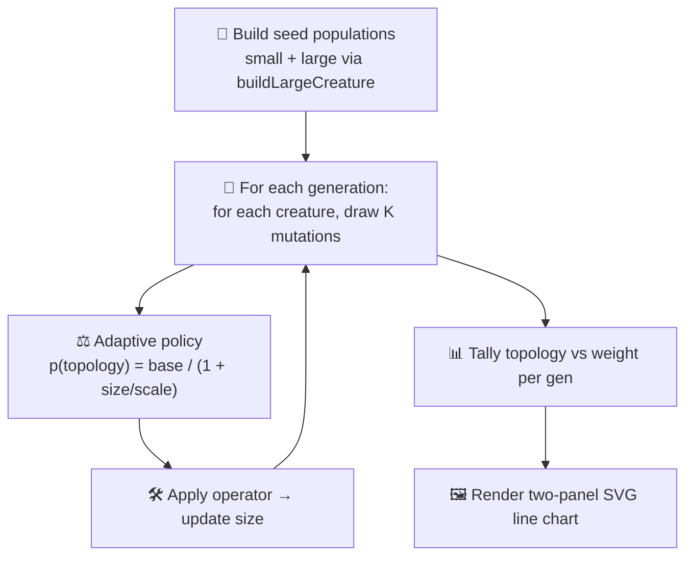

# 🧬 Adaptive Mutation Rate — Topology vs Weight Shift

**Acronym.** _NEAT_ = NeuroEvolution of Augmenting Topologies — the algorithm that grows neural
network topology and weights together with an evolutionary search.

`adaptive_mutation.ts` visualises one of NEAT-AI's hidden but important behaviours: as a creature
grows, the mutation operator distribution shifts away from **topology mutations** (add/remove
neuron, add/remove synapse) and toward **weight/bias mutations**. Tiny seed creatures need new
structure — adding a hidden neuron is often the only way forward — but once a creature has hundreds
of neurons and thousands of synapses, the remaining error is overwhelmingly down to weight tuning.
This demo runs two evolution loops on the same synthetic task and renders the per-generation
topology share for each so the auto-shift is visible at a glance.


## 🚀 How to Run

```bash
./adaptive_mutation/run.sh
```

The runner prints the initial sizes, the mean topology share for each run, and the shift (small
minus large) — the larger this number, the more aggressively the policy is favouring weights once
the creature has grown. The whole run completes in well under a second on a developer machine.

## 🧠 Why does NEAT-AI need this?

NEAT-AI's evolutionary search picks one mutation operator per attempt. If every creature, regardless
of size, had the same chance of receiving an `ADD_NEURON` mutation, big creatures would explode in
size without ever finishing weight tuning. NEAT-AI's mutation policy reads the creature's current
size and reduces the topology share as size grows, so:

| Aspect         | Tiny seed (~5 hidden) | Large creature (~256 hidden, ~10k synapses)           |
| -------------- | --------------------- | ----------------------------------------------------- |
| Topology share | High — needs growth   | Near zero — structure already present                 |
| Weight share   | Low                   | Near one — error is dominated by weight tuning        |
| Why            | No capacity to fit    | Capacity is there; refine the weights                 |
| Failure mode   | Stuck under-fit       | Bloat without refinement (if topology share stays up) |

The acceptance criterion captured by the test suite is straightforward: **the mean topology share
across the small-creature run must strictly exceed the mean topology share across the large-creature
run**.

## 🔧 How It Works



### The synthetic task

Both runs start from a creature produced by `buildLargeCreature` (issue #83):

- The **small** run uses `initialHidden = 5` and `density = 0.5` — about a dozen synapses.
- The **large** run uses the helper's defaults (~256 hidden, ~10,000 synapses).

Beyond the seed creature size, the two runs share an identical configuration: same number of
generations, same population size, same mutations per generation, same adaptive policy.

### The adaptive policy

For a creature with `size = hidden + synapses`, the probability of choosing a topology operator is

```
p(topology) = baseTopologyProb / (1 + size / sizeScale)
```

Default `baseTopologyProb = 0.6` and `sizeScale = 80`. For a tiny creature (size ≈ 13) that yields p
≈ 0.52; for a large creature (size ≈ 10,256) it collapses to under 0.005. Given the topology bucket
the operator is picked from `{add_neuron, add_synapse, remove_neuron, remove_synapse}` by
configurable weight; given the weight bucket it is picked from `{mod_weight, mod_bias}`.

### Why no actual NEAT-AI training pass?

The mutation-rate adaptation is a **policy** behaviour, not a training step. The demo therefore
tracks creature size as it would evolve under each operator (an `add_neuron` grows the synapse count
by one, a `remove_synapse` shrinks it by one, weight/bias operators leave it alone) without running
a full evolutionary fitness loop. That keeps the demo self-contained, byte-deterministic, and well
under the 90-second budget while still illustrating the shift the library performs internally.

## 📤 Output

- `docs/screenshots/adaptive_mutation.svg` — a two-panel line chart. **Left** panel: small-creature
  run, with the topology curve (orange) starting around 0.5 and gently drifting downward as the
  network grows. **Right** panel: large-creature run, with the topology curve effectively pinned at
  zero from generation 1 onward; the weight curve (blue) sits at one. Both panels share the same
  `[0, 1]` Y axis so the diverging curves are directly comparable. A mirror copy is also written to
  `.adaptive-mutation/output/adaptive_mutation.svg`.

## 🧪 Tests

`adaptive_mutation_test.ts` verifies:

- `topologyProbability` decreases monotonically with size and rejects invalid policies.
- `chooseOperator` is biased toward topology operators on tiny creatures and toward weight operators
  on huge creatures.
- `applyOperator` keeps neuron and synapse counts non-negative and updates them by the documented
  deltas.
- `runSingleEvolution` records exactly `generations` `GenerationRecord` entries; every record's
  `topologyRate + weightRate` equals 1, and the total mutations per generation equals
  `mutationsPerGeneration × populationSize`.
- The end-to-end run satisfies the issue acceptance criterion — **mean topology share is strictly
  lower in the large-creature run than in the small-creature run** — by a wide margin on the default
  seed.
- The whole run is byte-deterministic for the same config.
- The rendered SVG is well-formed, embeds both panels, and references the topology / weight curve
  CSS classes.
