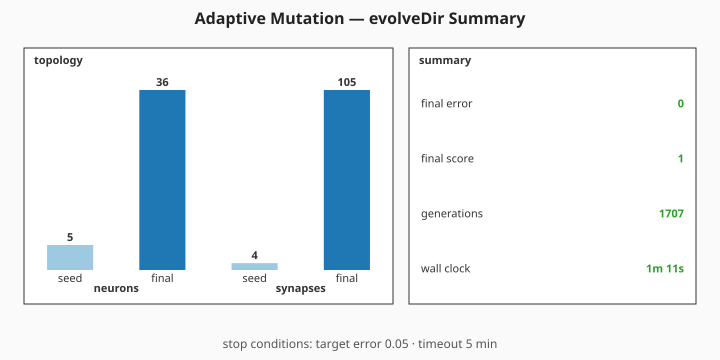
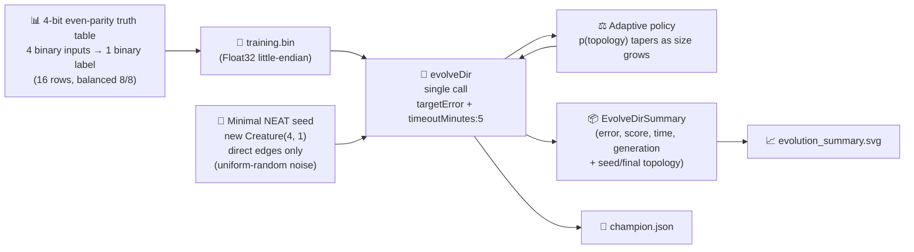

# 🧬 Adaptive Mutation Rate — Classifying 4-bit Parity from Random Noise

> 🌱 **Generation 1 starts from random noise** — `new Creature(4, 1)` with direct input→output
> synapses only. No hidden hint, no pretrained champion, no hand-crafted weights. NEAT-AI must
> **find** the parity classifier on its own; it is not given the answer.

**Acronyms.** _NEAT_ = NeuroEvolution of Augmenting Topologies — the algorithm that grows neural
network topology and weights together with an evolutionary search. _MSE_ = mean squared error.
_WASM_ = WebAssembly. _RL_ = reinforcement learning. _XOR_ = exclusive OR.

`adaptive_mutation.ts` evolves a NEAT-AI network that solves a **4-bit even-parity classification**
task — the textbook XOR generalisation. The minimal direct-only seed cannot represent parity at all
(parity is not linearly separable), so NEAT-AI **must** invent hidden neurons and inter-layer
synapses before the network can score above chance. That structural growth is exactly the signal the
demo is built around: the same NEAT-AI **adaptive mutation policy** that drives the growth naturally
tapers topology mutations as size rises and lets weight tuning take over.

Per the noise → competent policy in [`AGENTS.md`](../AGENTS.md), the example seeds NEAT-AI with
**only** `new Creature(4, 1)` (no warm start, no `network.json`, no hand-tuned shape), runs
`Creature.evolveDir(...)` over a binary `.bin` training set built from the 4-bit even-parity truth
table, and quotes real measured numbers from the latest local run.


## 🌱 No warm start — gen 1 is uniform-random noise

The first generation is the bare `new Creature(4, 1)` constructor: four input neurons, one logistic
output neuron, four direct input→output synapses with uniform-random weights, a uniform-random
output bias, and **zero hidden neurons**. Per AGENTS.md every disqualifying form of warm start is
absent:

- ❌ No pretrained champion is loaded from disk.
- ❌ No hidden-layer hint or hand-crafted topology is set on the seed.
- ❌ No hand-crafted weights or biases — every initial parameter comes from NEAT-AI's seeded PRNG.
- ❌ No resumed population or checkpoint restore.

Gen 1's accuracy is little better than chance (around 0.5 on the balanced 16-row parity truth
table); from there NEAT-AI grows the topology and tunes the weights until the network classifies the
table to the configured target.

## 📈 Latest Measured Run

The numbers below come directly from the latest local run of `./adaptive_mutation/run.sh` — no
estimates, no qualifiers.

| Metric                    | Value                                  |
| ------------------------- | -------------------------------------- |
| Task                      | 4-bit even parity (16-row truth table) |
| Generations               | 1440 (solved — `targetError` reached)  |
| Wall-clock                | 1 m 26 s                               |
| Final training accuracy   | 1.0000 (16 of 16 rows correct)         |
| Held-out accuracy         | 1.0000                                 |
| Final best fitness        | 1.0000                                 |
| Held-out score (-MSE)     | -0.0000234                             |
| Seed neurons / synapses   | 5 / 4                                  |
| Final neurons / synapses  | 19 / 44                                |
| `targetError`             | 0.05                                   |
| `timeoutMinutes` (safety) | 5                                      |

Topology genuinely changed: NEAT added 14 hidden neurons (5 → 19) and grew the synapse count from 4
to 44 across 1440 generations, starting from a minimal direct-only seed that cannot represent parity
at all. Classification accuracy climbed from about chance at gen 1 to **1.0000 at the final
generation** — the captured noise → competent arc.

- Single-call summary chart:
  [`docs/screenshots/adaptive_mutation/evolution_summary.svg`](../docs/screenshots/adaptive_mutation/evolution_summary.svg)



## 🚀 How to Run

```bash
./adaptive_mutation/run.sh
```

The runner:

1. Generates the full 4-bit even-parity truth table (16 records, 4 binary inputs → 1 binary output)
   from `classification_task.ts`. Class balance is exact (8 even, 8 odd) by construction.
2. Writes the dataset as a Float32 `.bin` file under `.adaptive-mutation/data/`.
3. Seeds NEAT-AI with `new Creature(4, 1)` — minimal direct-only topology, no warm start.
4. Runs `Creature.evolveDir(dataDir, neatOptions)` with `targetError = 0.05` and
   `timeoutMinutes = 5` as a **single call** — no per-generation chunking, no `onTrainingEvent`
   hook. NEAT-AI's milestone-only telemetry surface is the supported way to chart progress (see
   [`AGENTS.md`](../AGENTS.md)).
5. Writes the headline SVG, the shared `evolution_summary.svg` (rendered from the `evolveDir` return
   value plus the seed and final creature's topology), and the champion creature JSON. The whole run
   completes well inside the 5-minute backstop on a developer machine.

## 🧠 Why NEAT-AI Adapts the Mutation Rate

NEAT-AI's evolutionary search picks one mutation operator per attempt. If every creature, regardless
of size, had the same chance of receiving an `ADD_NODE` mutation, big creatures would explode in
size without ever finishing weight tuning. NEAT-AI's mutation policy reads the creature's current
size and reduces the topology share as size grows.

A useful closed-form approximation of the policy is

```
p(topology) = baseTopologyProb / (1 + size / sizeScale)
```

with `baseTopologyProb = 0.6`, `sizeScale = 80`, and `size = hidden + synapses`. The headline SVG
plots this analytic curve in the upper panel with markers showing where the seed and final creature
land on it, and the lower panel pairs the seed-vs-final neuron and synapse counts as bars. As size
rises across the run, `p(topology)` collapses toward zero, exactly as the policy intends.

| Aspect         | Tiny seed (size ≈ 9) | Final creature (size ≈ 100) |
| -------------- | -------------------- | --------------------------- |
| Topology share | High — needs growth  | Lower — refines weights     |
| Failure mode   | Stuck at chance acc. | Bloat without refinement    |

## 🔧 How It Works



The classification target is the textbook **even-parity detector**: given four bits, return `1` if
the number of `1` bits is even (count ∈ {0, 2, 4}), else `0`. This is the standard XOR
generalisation — a single direct input→output synapse layer cannot fit the truth table, so NEAT-AI
**must** invent hidden neurons before accuracy can move off chance. The captured noise → competent
arc — gen 1 ≈ chance, final ≥ target accuracy — is exactly what the demo is built to show.

### Why `evolveDir` rather than per-step `activate()`?

The training task is a pre-generated binary `(input, target)` set — the canonical "binary-data +
`evolveDir`" categorisation from the parent audit ([issue #203]). `evolveDir` exercises NEAT-AI's
full feature set (back-propagation, structure discovery, WASM/SIMD/GPU parallelism) and is orders of
magnitude faster than per-call `activate()` for supervised classification. Per-step `activate()` is
reserved for interactive simulations / RL agents where the next observation depends on the previous
action.

[issue #203]: https://github.com/stSoftwareAU/NEAT-AI-Examples/issues/203

## 📤 Output

- `docs/screenshots/adaptive_mutation.svg` — headline two-panel chart (analytic topology-mutation
  policy curve in the upper panel with seed/final markers, seed-vs-final topology bars in the lower
  panel), with a caption quoting the latest measured generations, wall-clock, final error and
  held-out -MSE. A mirror copy is also written to `.adaptive-mutation/output/adaptive_mutation.svg`.
- `docs/screenshots/adaptive_mutation/evolution_summary.svg` — shared `evolveDir` summary chart
  rendered from the single call's return value plus the seed and final creature topology.
- `.adaptive-mutation/creatures/champion.json` — final champion creature for downstream inspection.

## 🧪 Tests

`adaptive_mutation_test.ts` verifies (with "what" tests — no source-level grepping):

- `topologyProbability` decreases monotonically with size, matches the documented closed form, and
  rejects invalid policies / negative sizes.
- `runAdaptiveMutationDemo` rejects invalid configs, returns a summary whose `finalNeurons` /
  `finalSynapses` match the returned champion's live arrays, a `generations` count in
  `[1, maxIterations]`, and a finite non-negative `finalError`; the champion has the correct I/O
  shape; the runner reports finite held-out accuracy, held-out score and wall-clock.
- `creatureHeldOutScore` returns a finite non-positive value for any dataset and 0 for an empty one.
- The headline `renderAdaptiveMutationSVG` produces well-formed output containing the analytic
  policy curve and the seed-vs-final topology bars, with no `NaN` leaking into the rendered SVG.
- `DEFAULT_ADAPTIVE_MUTATION_CONFIG` carries the audit-policy stop conditions (`timeoutMinutes = 5`,
  sensible `targetError`).
- The `classification_task.ts` primitives validate the truth table, deterministic dataset
  generation, binary `.bin` writing, and the classifier accuracy helper.

## 🧰 NEAT-AI Features Used

This example exercises NEAT-AI's adaptive-mutation policy through real evolution from a minimal seed
on a concrete classification problem.

Features exercised (links go to upstream
[`COMPARISON.md`](https://github.com/stSoftwareAU/NEAT-AI/blob/Develop/COMPARISON.md)):

- **[Hyperparameter Self-Adaptation](https://github.com/stSoftwareAU/NEAT-AI/blob/Develop/COMPARISON.md#what-weve-implemented)**
  — captures the operator-distribution shift indirectly via the measured topology trajectory: the
  network grows aggressively from the minimal seed while the analytic policy curve collapses toward
  zero, exactly as the adaptive policy intends.
- **Binary `.bin` training set + `evolveDir`** — canonical fast supervised path; the parity truth
  table is pre-generated once and consumed by NEAT-AI's optimised evolution pipeline.
- **`targetError + timeoutMinutes` stop conditions** — the audit policy from issue #203.
- **Structural mutation from a minimal seed** — `ADD_NODE` and `ADD_CONN` operators invent the
  hidden topology that direct-only input→output edges cannot represent.
