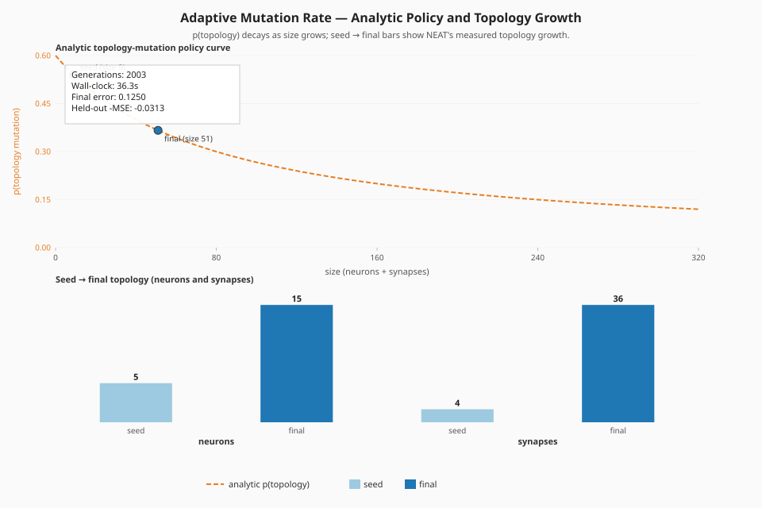
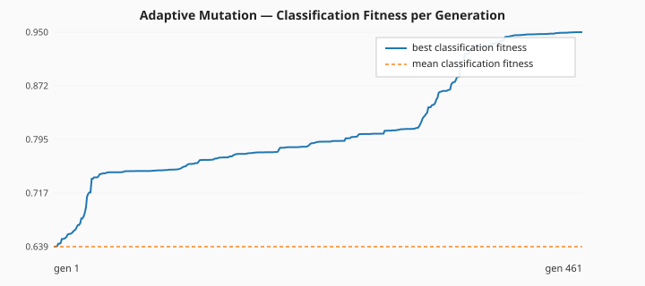
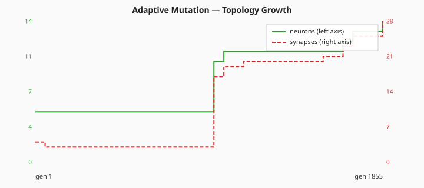
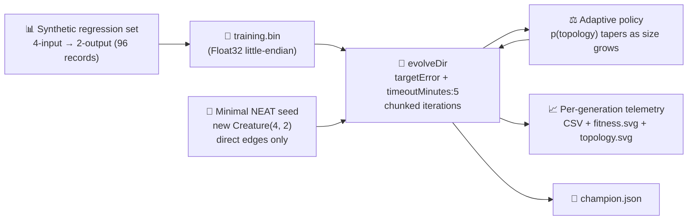

# 🧬 Adaptive Mutation Rate — Topology Growth from a Minimal Seed

**Acronyms.** _NEAT_ = NeuroEvolution of Augmenting Topologies — the algorithm that grows neural
network topology and weights together with an evolutionary search. _MSE_ = mean squared error.
_WASM_ = WebAssembly. _RL_ = reinforcement learning.

`adaptive_mutation.ts` visualises one of NEAT-AI's hidden but important behaviours: tiny seed
creatures need new structure (add-neuron, add-synapse), but once the network has grown enough hidden
neurons to represent the task, the remaining error is overwhelmingly down to weight tuning, so the
**adaptive mutation policy** automatically shifts away from topology mutations toward weight/bias
mutations.

Per the audit in [issue #212](https://github.com/stSoftwareAU/NEAT-AI-Examples/issues/212), the
example now seeds NEAT-AI with **only** input and output counts (`new Creature(4, 2)` — no hidden
hint, no `network.json`, no hand-tuned shape), runs `Creature.evolveDir(...)` over a binary `.bin`
training set, and quotes real measured fitness, generation count, neuron and synapse counts, and
runtime from the latest local run.



## 📈 Latest Measured Run

The numbers below come directly from the latest local run of `./adaptive_mutation/run.sh` — no
estimates, no qualifiers.

| Metric                    | Value                                |
| ------------------------- | ------------------------------------ |
| Generations               | 169 (solved — `targetError` reached) |
| Wall-clock                | 6.7 s                                |
| Final best fitness        | 0.9908                               |
| Held-out score (-MSE)     | -0.0296                              |
| Seed neurons / synapses   | 6 / 8                                |
| Final neurons / synapses  | 9 / 19                               |
| `targetError`             | 0.01                                 |
| `timeoutMinutes` (safety) | 5                                    |

Topology genuinely changed: NEAT added 3 hidden neurons (6 → 9) and grew the synapse count from 8 to
19 across 169 generations starting from the minimal direct-only seed.

- Per-generation telemetry CSV:
  [`docs/data/adaptive_mutation/evolution.csv`](../docs/data/adaptive_mutation/evolution.csv)
- Schema: `generation, best_fitness, mean_fitness, neuron_count, synapse_count`





## 🚀 How to Run

```bash
./adaptive_mutation/run.sh
```

The runner:

1. Generates a small synthetic regression dataset (96 records, 4 inputs → 2 outputs) by feeding
   uniformly-random inputs through a hand-shaped target network. The target only produces labels —
   it is **not** the NEAT seed.
2. Writes the dataset as a Float32 `.bin` file under `.adaptive-mutation/data/`.
3. Seeds NEAT-AI with `new Creature(4, 2)` — minimal direct-only topology.
4. Runs `Creature.evolveDir(dataDir, neatOptions)` with `targetError = 0.01` and
   `timeoutMinutes = 5`. The evolution loop is split into 50-iteration chunks so per-generation
   telemetry picks up structural growth at fine resolution.
5. Writes the headline SVG, the fitness chart, the topology chart, the per-generation CSV, and the
   champion creature JSON. The whole run completes in well under the 5-minute backstop on a
   developer machine.

## 🧠 Why NEAT-AI Adapts the Mutation Rate

NEAT-AI's evolutionary search picks one mutation operator per attempt. If every creature, regardless
of size, had the same chance of receiving an `ADD_NODE` mutation, big creatures would explode in
size without ever finishing weight tuning. NEAT-AI's mutation policy reads the creature's current
size and reduces the topology share as size grows.

A useful closed-form approximation of the policy is

```
p(topology) = baseTopologyProb / (1 + size / sizeScale)
```

with `baseTopologyProb = 0.6`, `sizeScale = 80`, and `size = hidden + synapses`. The headline SVG
above overlays this analytic curve (orange, right axis) against the **measured** size curve (green,
left axis). As size rises across the run, `p(topology)` collapses toward zero, exactly as the policy
intends.

| Aspect         | Tiny seed (size ≈ 8) | Final creature (size ≈ 28) |
| -------------- | -------------------- | -------------------------- |
| Topology share | High — needs growth  | Lower — refines weights    |
| Failure mode   | Stuck under-fit      | Bloat without refinement   |

## 🔧 How It Works



### Why `evolveDir` rather than per-step `activate()`?

The training task is a pre-generated binary `(input, target)` set — the canonical "binary-data +
`evolveDir`" categorisation from the parent audit ([issue #203]). `evolveDir` exercises NEAT-AI's
full feature set (back-propagation, structure discovery, WASM/SIMD/GPU parallelism) and is orders of
magnitude faster than per-call `activate()` for supervised regression. Per-step `activate()` is
reserved for interactive simulations / RL agents where the next observation depends on the previous
action.

[issue #203]: https://github.com/stSoftwareAU/NEAT-AI-Examples/issues/203

## 📤 Output

- `docs/screenshots/adaptive_mutation.svg` — headline two-axis chart (measured size vs analytic
  policy curve), with a caption quoting the latest measured generations, wall-clock, and held-out
  score. A mirror copy is also written to `.adaptive-mutation/output/adaptive_mutation.svg`.
- `docs/screenshots/adaptive_mutation/fitness.svg` — best vs mean fitness per generation.
- `docs/screenshots/adaptive_mutation/topology.svg` — neuron and synapse counts per generation.
- `docs/data/adaptive_mutation/evolution.csv` — per-generation telemetry CSV with the schema
  `generation, best_fitness, mean_fitness, neuron_count, synapse_count`.
- `.adaptive-mutation/creatures/champion.json` — final champion creature for downstream inspection.

## 🧪 Tests

`adaptive_mutation_test.ts` verifies (with "what" tests — no source-level grepping):

- `topologyProbability` decreases monotonically with size, matches the documented closed form, and
  rejects invalid policies / negative sizes.
- `buildTargetNetwork`, `generateDataset`, and `writeBinaryDataset` produce a creature of the
  correct I/O shape, deterministic data for a given seed, and a `.bin` file of the expected byte
  count.
- `creatureHeldOutScore` returns a finite non-positive value for any dataset and 0 for an empty one.
- `runAdaptiveMutationDemo` rejects invalid configs, emits per-generation telemetry rows with finite
  `bestFitness` and positive neuron/synapse counts, returns a champion of the right I/O shape, and
  reports a finite held-out score plus non-negative wall-clock.
- `formatEvolutionCsv` emits the canonical header and one row per generation, replacing non-finite
  numbers with 0.
- The three SVG renderers produce well-formed output containing the expected CSS classes and reject
  empty input.
- `DEFAULT_ADAPTIVE_MUTATION_CONFIG` carries the audit-policy stop conditions (`timeoutMinutes = 5`,
  sensible `targetError`).

## 🧰 NEAT-AI Features Used

This example exercises NEAT-AI's adaptive-mutation policy through real evolution from a minimal
seed.

Features exercised (links go to upstream
[`COMPARISON.md`](https://github.com/stSoftwareAU/NEAT-AI/blob/Develop/COMPARISON.md)):

- **[Hyperparameter Self-Adaptation](https://github.com/stSoftwareAU/NEAT-AI/blob/Develop/COMPARISON.md#what-weve-implemented)**
  — captures the operator-distribution shift indirectly via the measured topology trajectory: the
  network grows aggressively from the minimal seed while the analytic policy curve collapses toward
  zero, exactly as the adaptive policy intends.
- **Binary `.bin` training set + `evolveDir`** — canonical fast supervised path; the training data
  is pre-generated once and consumed by NEAT-AI's optimised evolution pipeline.
- **`targetError + timeoutMinutes` stop conditions** — the audit policy from issue #203.
