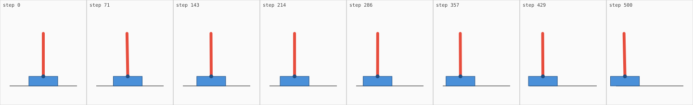
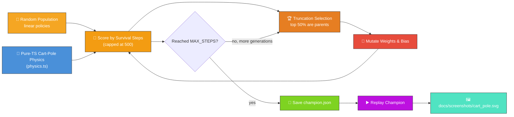
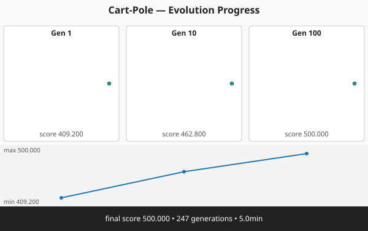
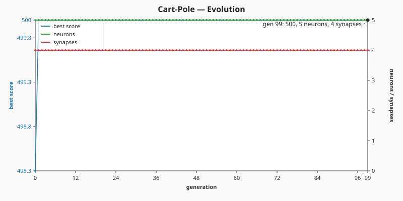

# 🎢 Cart-Pole — Balancing an Inverted Pendulum

`cart_pole.ts` evolves a NEAT-AI controller that balances an inverted pole on a moving cart — the
classic neuroevolution control benchmark. Both the simulator and the evolutionary loop run entirely
in pure TypeScript, with the only external dependency being NEAT-AI's `Creature.activate` to compute
each step's action.



## 🔧 How It Works



## 🎯 Inputs and Outputs

| Channel  | Type       | Symbol  | Meaning                                  |
| -------- | ---------- | ------- | ---------------------------------------- |
| Input 0  | observable | `x`     | Cart position along the track (metres)   |
| Input 1  | observable | `v`     | Cart velocity (m/s)                      |
| Input 2  | observable | `theta` | Pole angle from vertical (radians)       |
| Input 3  | observable | `omega` | Pole angular velocity (rad/s)            |
| Output 0 | action     | —       | `>= 0.5` push right, otherwise push left |

The score is the **mean** number of timesteps the pole stays within ±12° and the cart stays within
±2.4 m across **ten perturbed-start trials**, capped at 500 steps per trial. The task is "solved"
when the champion's mean reaches the cap — i.e. when it survives the full 500 steps from every one
of the ten different starting states.

## 🚀 Running the Example

```bash
./cart_pole/run.sh
```

Artefacts:

- `.synthetic-cart-pole/creatures/champion.json` – the fittest controller from the run
- `.synthetic-cart-pole/snapshots/snapshot-gen-*.json` – running-champion snapshots captured at the
  configured checkpoints
- `docs/screenshots/cart_pole.svg` – an 8-frame strip showing the champion balancing
- `docs/screenshots/cart_pole_evolution.svg` – multi-panel evolution-progression strip rendered from
  the captured snapshots
- `docs/screenshots/cart_pole/evolution.svg` – dual-axis evolution chart plotting best score and
  champion neuron / synapse counts against generation

## Evolution Progress





The runner captures a snapshot of the **running champion** at each of the canonical checkpoint
generations `[1, 10, 100, 500]` (those that fall inside the configured `maxGenerations`).

Every candidate is scored on **ten different perturbed starting states** — each component of the
initial `(x, v, theta, omega)` vector is sampled uniformly from `[-0.1, +0.1]`, mirroring the OpenAI
Gym `CartPole-v1` reset behaviour. The score reported is the mean number of steps the pole stays
upright across all ten trials, so a controller can only reach `MAX_STEPS` by surviving the full 500
steps from every one of the ten launches. This stops a "lucky" linear policy from claiming victory
on the perfectly symmetric `(0, 0, 0, 0)` start (issue #143) — the chart now shows real
generation-by-generation improvement as the search grinds out a controller that generalises.

## 🧠 Tacit Knowledge

A few things that are not obvious from the code alone:

- **Linear is enough.** Cart-pole is solvable by a linear policy `action = sign(w·s + b)` over the
  four observables. The example uses a four-input, one-output network without hidden neurons. This
  keeps the search space small (five floats) so a tiny population finds a controller quickly.
- **Semi-implicit Euler matches OpenAI Gym.** `physics.step` updates velocity before position. This
  is the same scheme as `CartPole-v1`, so behaviour matches the textbook benchmark to floating-point
  precision.
- **Discrete force.** The output is thresholded to ±1 (no zero option). The controller cannot "do
  nothing"; it must commit to a direction every step.
- **Reproducibility.** All randomness flows through `common/deterministic_random.ts`. With a fixed
  seed the same champion is produced on every run.
- **No Python required.** Despite cart-pole being the canonical OpenAI Gym example, the simulator
  here is plain TypeScript so the whole project remains "Deno + JSR" with no extra runtime.
