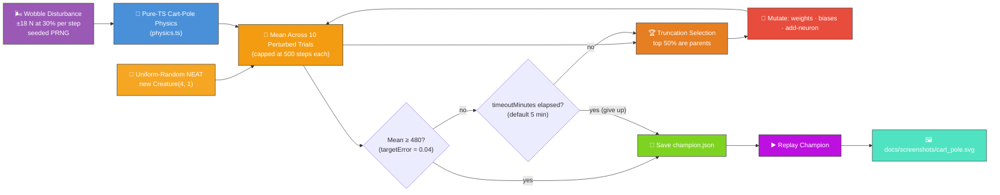
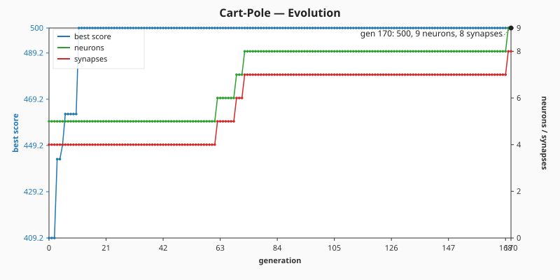
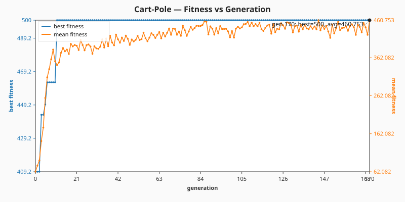
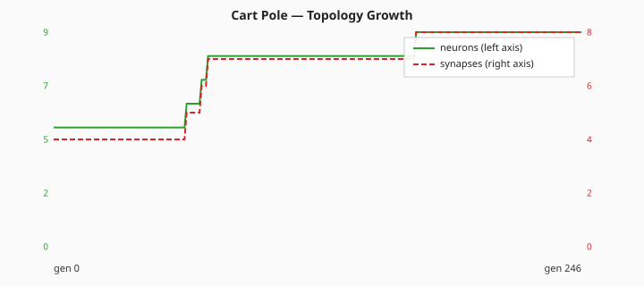

# 🎢 Cart-Pole — Balancing an Inverted Pendulum

> 🌱 **Generation 1 starts from random noise** — the initial population is built by NEAT-AI's
> uniform-random `Creature(4, 1)` constructor, with **no hand-crafted topology and no tuned weight
> init**. Structural mutation grows hidden neurons during evolution; the captured milestones show
> the controller climbing from population-mean noise to a network that balances every perturbed
> trial under wobble.

**Acronyms.** _NEAT_ = NeuroEvolution of Augmenting Topologies. _PRNG_ = pseudorandom number
generator.

`cart_pole.ts` evolves a NEAT-AI controller that balances an inverted pole on a moving cart — the
classic neuroevolution control benchmark. Both the simulator and the evolutionary loop run entirely
in pure TypeScript, with the only external dependency being NEAT-AI's `Creature.activate` to compute
each step's action.

> 🌬️ **Why a wobble disturbance?** Textbook cart-pole is famously trivial for random NEAT — issue
> [#158] reported there was no visible evolution because gen 1 / 10 / 100 snapshots were
> byte-identical at score 500 (the elite from gen 1 had already saturated the cap). Issue [#159]
> added an opt-in disturbance to the physics simulator and issue [#160] turned it on by default so
> the task is genuinely non-trivial: a deterministic per-step ±18 N kick fires with 30% probability,
> knocks the pole around, and forces evolution to actually do work to reach the threshold. The
> wobble seed is held constant per evaluation so reruns with the same seed produce identical
> artefacts.

[#158]: https://github.com/stSoftwareAU/NEAT-AI-Examples/issues/158
[#159]: https://github.com/stSoftwareAU/NEAT-AI-Examples/issues/159
[#160]: https://github.com/stSoftwareAU/NEAT-AI-Examples/issues/160


## 🔧 How It Works



## 🎯 Inputs and Outputs

| Channel  | Type       | Symbol  | Meaning                                |
| -------- | ---------- | ------- | -------------------------------------- |
| Input 0  | observable | `x`     | Cart position along the track (metres) |
| Input 1  | observable | `v`     | Cart velocity (m/s)                    |
| Input 2  | observable | `theta` | Pole angle from vertical (radians)     |
| Input 3  | observable | `omega` | Pole angular velocity (rad/s)          |
| Output 0 | action     | —       | `>= 0` push right, otherwise push left |

The score is the **mean** number of timesteps the pole stays within ±12° and the cart stays within
±2.4 m across **ten perturbed-start trials**, capped at 500 steps per trial. The task is "solved"
when the champion's mean reaches **480** (the `SOLVED_THRESHOLD`) — i.e. the controller balances on
average for at least 96% of the time across the ten different starting states. Audit issue #220
replaced the old `maxGenerations` cap with the standard NEAT-AI stop conditions:

- **`targetError = 0.04`** — halt as soon as the champion's mean balance score reaches
  `MAX_STEPS * (1 - targetError) = 500 × 0.96 = 480`, exactly preserving the historical
  `SOLVED_THRESHOLD` semantics.
- **`timeoutMinutes = 5`** — wall-clock backstop. The default seed reaches the target in well under
  a minute when no evolution-progression snapshots are configured; the runner intentionally pushes
  on past the target hit so the captured snapshot strip captures multiple checkpoint generations,
  and on a commodity laptop the checkpoint cadence consumes the full 5-minute budget.

## 🚀 Running the Example

```bash
./cart_pole/run.sh
```

Artefacts:

- `.synthetic-cart-pole/creatures/champion.json` – the fittest controller from the run
- `.synthetic-cart-pole/snapshots/snapshot-gen-*.json` – running-champion snapshots captured at the
  configured checkpoints
- `docs/screenshots/cart_pole.svg` – animated balance run of the champion
- `docs/screenshots/cart_pole_evolution.svg` – multi-panel evolution-progression strip rendered from
  the captured snapshots
- `docs/screenshots/cart_pole_evolution_chart.svg` – dual-axis evolution chart plotting best score
  and champion neuron / synapse counts against generation
- [`docs/data/cart_pole/evolution.csv`](../docs/data/cart_pole/evolution.csv) – per-generation
  telemetry source-of-truth (`generation,best_fitness,mean_fitness,neuron_count,synapse_count`)
- [`docs/screenshots/cart_pole/fitness.svg`](../docs/screenshots/cart_pole/fitness.svg) – best vs
  mean fitness against generation, rendered by the shared
  [`common/fitness_chart.ts`](../common/fitness_chart.ts) helper
- [`docs/screenshots/cart_pole/topology.svg`](../docs/screenshots/cart_pole/topology.svg) – neuron /
  synapse counts of the running champion against generation, rendered by the
  `renderTopologyChartSvg` helper exported from [`cart_pole.ts`](cart_pole.ts)

## Evolution Progress




### 📊 Per-Generation Telemetry (audit issue #220)

The committed [`docs/data/cart_pole/evolution.csv`](../docs/data/cart_pole/evolution.csv) holds one
row per generation with the canonical
`generation,best_fitness,mean_fitness,neuron_count,synapse_count` schema used by every audited
example. The two SVGs below are rendered from the same CSV:





#### Measured numbers from the latest run (seed `12345`)

| Metric                           | Value                                       |
| -------------------------------- | ------------------------------------------- |
| Generations run                  | **247**                                     |
| Wall-clock duration              | **5 m 1 s** (`timeoutMinutes = 5` backstop) |
| Generation target first met      | **gen 11** (`best_fitness = 500.0`)         |
| Final champion mean score        | **500.0 / 500** (full cap on every trial)   |
| Threshold                        | 480 / 500 (`targetError = 0.04`)            |
| Stop reason                      | `target` (target met within budget)         |
| Generation 0 topology            | **5 neurons, 4 synapses** (minimal seed)    |
| Final champion topology          | **9 neurons, 8 synapses**                   |
| Generation 0 best / mean fitness | **409.2 / 62.1**                            |
| Final-generation mean fitness    | **441.6**                                   |

Topology genuinely changes across the run — gen 0 is the bare minimal seed (4 inputs + 1 output with
direct synapses, zero hidden neurons), and by the time wall-clock runs out the running champion
carries four hidden neurons and four extra synapses. The chart's polyline shows neutral-drift
growth: the elite first hits the 500/500 score cap at gen 11 with no hidden neurons, then
structurally-mutated children that match the cap progressively replace it.

The runner also captures a snapshot of the **running champion** at each of the canonical checkpoint
generations `[1, 10, 100, 500, 1000]` (those that fall inside the wall-clock budget). The cadence is
extended past the original `[1, 10, 100, 500]` because variable-topology evolution from
uniform-random noise typically needs more generations to converge than the old fixed-topology search
did. Numbers above are direct from the latest committed `evolution.csv` — re-run
`./cart_pole/run.sh` to refresh them and the embedded SVGs together.

Generation 1 is the **uniform-random NEAT population** straight from `new Creature(4, 1)` — direct
input → output connections with weights and biases drawn by the library's RNG. The intermediate
milestones at gens 10 / 100 / 500 show the controller growing structure and shifting weights into
the balancing region of the search space; the final captured snapshot meets the threshold.

Every candidate is scored on **ten different perturbed starting states** — each component of the
initial `(x, v, theta, omega)` vector is sampled uniformly from `[-0.1, +0.1]`, mirroring the OpenAI
Gym `CartPole-v1` reset behaviour. The score reported is the mean number of steps the pole stays
upright across all ten trials, so a controller can only reach `SOLVED_THRESHOLD` by balancing for
nearly the full 500 steps from every one of the ten launches. This stops a "lucky" linear policy
from claiming victory on the perfectly symmetric `(0, 0, 0, 0)` start (issue #143) — the chart shows
real generation-by-generation improvement as the search grinds out a controller that generalises.

Each of the ten trials also runs under an **independent wobble pattern** — a deterministic per-trial
PRNG seed derived from the run-wide `disturbanceSeed` ensures every trial faces a different stream
of ±18 N kicks. A controller that survived one lucky wobble pattern still has to handle nine other
patterns to reach `SOLVED_THRESHOLD`, so cart-pole is no longer trivially solved by random NEAT
(issue #160).

## 🧠 Tacit Knowledge

A few things that are not obvious from the code alone:

- **No hand-crafted topology.** `cart_pole.ts` never hard-codes neurons or synapses. The initial
  population is built with `createSeededPopulation({ inputCount: 4, outputCount: 1, ... })` which
  delegates to `new Creature(4, 1)` for every member. Hidden neurons appear only when the add-neuron
  mutation operator splits an existing connection during evolution — structural mutation discovers
  them.
- **HARD_TANH output, threshold at zero.** The library's default output activation is `HARD_TANH`,
  ranging `[-1, 1]`. The natural action threshold is therefore `>= 0` (rather than the legacy
  `>= 0.5` that suited the previous LOGISTIC seed). The controller cannot "do nothing"; it must
  commit to push-left or push-right every step.
- **Wobble keeps random NEAT honest.** Without the wobble disturbance, cart-pole is so easy that
  even a uniform-random linear policy frequently solved it on gen 1 — issue #158 caught this when it
  noticed that the captured `snapshot-gen-1.json`, `snapshot-gen-10.json`, and
  `snapshot-gen-100.json` files were byte-identical at score 500. The default wobble (issue #160)
  applies a ±18 N kick to the cart at 30% per step, ten different patterns across the ten scoring
  trials. Random NEAT cannot survive ten independent wobble streams, so gen-1 mean and best both sit
  well below the threshold and evolution genuinely has work to do.
- **Wobble is deterministic per evaluation.** The disturbance PRNG is reseeded on every
  `scoreController` call from a fixed `disturbanceSeed`, with a deterministic golden-ratio offset
  per trial. Two reruns of the example with the same seed produce byte-identical artefacts — the
  champion JSON, the snapshots, the SVGs.
- **Semi-implicit Euler matches OpenAI Gym.** `physics.step` updates velocity before position. This
  is the same scheme as `CartPole-v1`, so behaviour matches the textbook benchmark to floating-point
  precision.
- **Reproducibility.** The library's global RNG is reseeded at the start of each evolve call via
  `setRandomNumberGenerator(createSeededRng(seed))`, and our local PRNG
  (`common/deterministic_random.ts`) drives mutation. With a fixed seed the same champion is
  produced on every run.
- **`targetError` + `timeoutMinutes` stop conditions.** Audit issue #220 replaced the legacy
  `maxGenerations` cap with the standard NEAT-AI pair: evolution halts as soon as the champion's
  mean balance score reaches `MAX_STEPS * (1 - targetError)` (default `0.04` → 480 / 500) or the
  wall-clock backstop `timeoutMinutes` (default `5`) elapses. `evolveCartPoleController` returns
  `stopReason ∈ { "target", "timeout", "iterations" }` so callers can tell which guarantee fired.
  The `honours the timeoutMinutes wall-clock backstop` unit test exercises the backstop end-to-end.
- **Per-step `activate()` is retained.** Cart-pole is an interactive reinforcement learning
  environment — the agent observes a live simulator and acts at every timestep, so there is no
  pre-generated `.bin` training set to pass to the upstream NEAT-AI training loop. Audit issue #220
  explicitly preserves this choice; the only change is the stop-condition refactor described above.
- **Tie-breaking by structural complexity.** Once the score saturates at `MAX_STEPS`, sorting only
  by `score` would freeze the elite at whatever structure first hit the cap (the minimal linear seed
  is already enough to balance ten wobble patterns). The sort breaks ties by preferring the creature
  with **more synapses**, so structurally-mutated children that _match_ the score-cap progressively
  replace the elite. This is the mechanism that makes the topology chart above show measurable
  growth.
- **No Python required.** Despite cart-pole being the canonical OpenAI Gym example, the simulator
  here is plain TypeScript so the whole project remains "Deno + JSR" with no extra runtime.

## 🧰 NEAT-AI Features Used

Cart-Pole is an evolution-from-noise agent demo, so the demonstrated capability is NEAT-AI's
evolutionary topology search driven by an episode-rollout fitness signal.

> 🔎 **Stripped-down operator subset.** This example deliberately exercises a narrow slice of
> NEAT-AI's full pipeline so the noise → competent story stays uncluttered. The production training
> pipeline (backpropagation, dropout, L1/L2 regularisation, K-fold, binary `.bin` data streams,
> distributed evolution, etc.) is intentionally **not** wired into this demo — see issue
> [#185](https://github.com/stSoftwareAU/NEAT-AI-Examples/issues/185) and the upstream
> production-pipeline notes in
> [`COMPARISON.md`](https://github.com/stSoftwareAU/NEAT-AI/blob/Develop/COMPARISON.md) for the
> wider feature set.

Features exercised (links go to upstream
[`COMPARISON.md`](https://github.com/stSoftwareAU/NEAT-AI/blob/Develop/COMPARISON.md)):

- **[Evolutionary Topology Search](https://github.com/stSoftwareAU/NEAT-AI/blob/Develop/COMPARISON.md#what-weve-implemented)**
  — structural mutation (add/remove neuron, add/remove synapse) co-evolved with weights and biases
  against the pole-balance fitness signal.
- **[Genetic Operators](https://github.com/stSoftwareAU/NEAT-AI/blob/Develop/COMPARISON.md#what-weve-implemented)**
  — weight and bias mutation paired with selection pressure on the episode-return fitness function.
