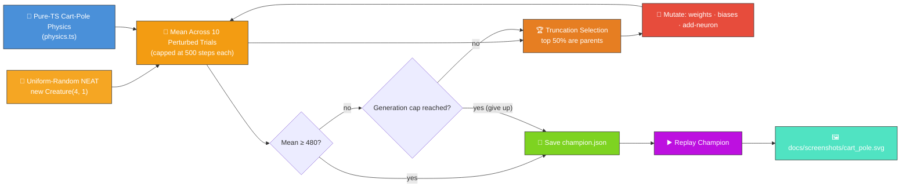

# 🎢 Cart-Pole — Balancing an Inverted Pendulum

> 🌱 **Generation 1 starts from random noise** — the initial population is built by NEAT-AI's
> uniform-random `Creature(4, 1)` constructor, with **no hand-crafted topology and no tuned weight
> init**. Structural mutation grows hidden neurons during evolution; the captured milestones show
> the controller climbing from population-mean noise to a network that balances every perturbed
> trial.

`cart_pole.ts` evolves a NEAT-AI controller that balances an inverted pole on a moving cart — the
classic neuroevolution control benchmark. Both the simulator and the evolutionary loop run entirely
in pure TypeScript, with the only external dependency being NEAT-AI's `Creature.activate` to compute
each step's action.


## 🔧 How It Works



## 🎯 Inputs and Outputs

| Channel  | Type       | Symbol  | Meaning                                |
| -------- | ---------- | ------- | -------------------------------------- |
| Input 0  | observable | `x`     | Cart position along the track (metres) |
| Input 1  | observable | `v`     | Cart velocity (m/s)                    |
| Input 2  | observable | `theta` | Pole angle from vertical (radians)     |
| Input 3  | observable | `omega` | Pole angular velocity (rad/s)          |
| Output 0 | action     | —       | `>= 0` push right, otherwise push left |

The score is the **mean** number of timesteps the pole stays within ±12° and the cart stays within
±2.4 m across **ten perturbed-start trials**, capped at 500 steps per trial. The task is "solved"
when the champion's mean reaches **480** (the `SOLVED_THRESHOLD`) — i.e. the controller balances on
average for at least 96% of the time across the ten different starting states. Evolution stops as
soon as the threshold is met or the **hard generation cap** of 400 is reached, whichever comes
first.

## 🚀 Running the Example

```bash
./cart_pole/run.sh
```

Artefacts:

- `.synthetic-cart-pole/creatures/champion.json` – the fittest controller from the run
- `.synthetic-cart-pole/snapshots/snapshot-gen-*.json` – running-champion snapshots captured at the
  configured checkpoints
- `docs/screenshots/cart_pole.svg` – animated balance run of the champion
- `docs/screenshots/cart_pole_evolution.svg` – multi-panel evolution-progression strip rendered from
  the captured snapshots
- `docs/screenshots/cart_pole_evolution_chart.svg` – dual-axis evolution chart plotting best score
  and champion neuron / synapse counts against generation

## Evolution Progress


The runner captures a snapshot of the **running champion** at each of the canonical checkpoint
generations `[1, 10, 100, 500, 1000]` (those that fall inside the configured `maxGenerations`). The
cadence is extended past the original `[1, 10, 100, 500]` because variable-topology evolution from
uniform-random noise typically needs more generations to converge than the old fixed-topology search
did.

Generation 1 is the **uniform-random NEAT population** straight from `new Creature(4, 1)` — direct
input → output connections with weights and biases drawn by the library's RNG. The intermediate
milestones at gens 10 / 100 / 500 show the controller growing structure and shifting weights into
the balancing region of the search space; the final captured snapshot meets the threshold.

Every candidate is scored on **ten different perturbed starting states** — each component of the
initial `(x, v, theta, omega)` vector is sampled uniformly from `[-0.1, +0.1]`, mirroring the OpenAI
Gym `CartPole-v1` reset behaviour. The score reported is the mean number of steps the pole stays
upright across all ten trials, so a controller can only reach `SOLVED_THRESHOLD` by balancing for
nearly the full 500 steps from every one of the ten launches. This stops a "lucky" linear policy
from claiming victory on the perfectly symmetric `(0, 0, 0, 0)` start (issue #143) — the chart shows
real generation-by-generation improvement as the search grinds out a controller that generalises.

## 🧠 Tacit Knowledge

A few things that are not obvious from the code alone:

- **No hand-crafted topology.** `cart_pole.ts` never hard-codes neurons or synapses. The initial
  population is built with `createSeededPopulation({ inputCount: 4, outputCount: 1, ... })` which
  delegates to `new Creature(4, 1)` for every member. Hidden neurons appear only when the add-neuron
  mutation operator splits an existing connection during evolution — structural mutation discovers
  them.
- **HARD_TANH output, threshold at zero.** The library's default output activation is `HARD_TANH`,
  ranging `[-1, 1]`. The natural action threshold is therefore `>= 0` (rather than the legacy
  `>= 0.5` that suited the previous LOGISTIC seed). The controller cannot "do nothing"; it must
  commit to push-left or push-right every step.
- **Cart-pole is sometimes solvable by random NEAT.** With a uniform-random linear policy, a small
  fraction of random initial creatures already balance the cart-pole — the problem is famously easy.
  The honest "noise" check is therefore the **population mean**, which sits well below the threshold
  even when one or two lucky individuals already hit the cap. The unit tests assert the mean — see
  `cart_pole_test.ts::generation-1 population is noise on average`.
- **Semi-implicit Euler matches OpenAI Gym.** `physics.step` updates velocity before position. This
  is the same scheme as `CartPole-v1`, so behaviour matches the textbook benchmark to floating-point
  precision.
- **Reproducibility.** The library's global RNG is reseeded at the start of each evolve call via
  `setRandomNumberGenerator(createSeededRng(seed))`, and our local PRNG
  (`common/deterministic_random.ts`) drives mutation. With a fixed seed the same champion is
  produced on every run.
- **Hard generation cap.** Evolution stops at `maxGenerations` even if the threshold has not been
  reached, so a stuck run never blocks the example forever. The cap is enforced in
  `evolveCartPoleController` and verified by the `honours the hard generation cap` test.
- **No Python required.** Despite cart-pole being the canonical OpenAI Gym example, the simulator
  here is plain TypeScript so the whole project remains "Deno + JSR" with no extra runtime.
