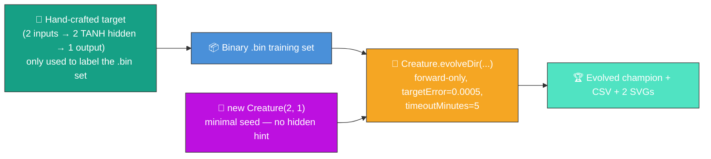
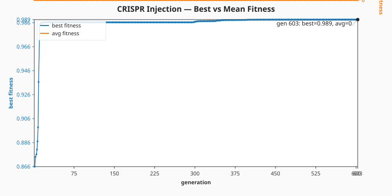
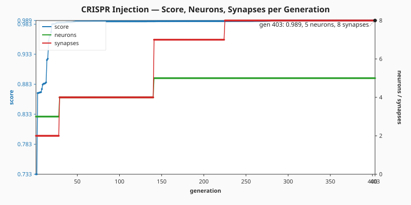

# 🧬 CRISPR Gene Injection — Evolve Network Structure From a Minimal Seed

**Acronym.** _NEAT_ = NeuroEvolution of Augmenting Topologies. (CRISPR is borrowed as a metaphor
from molecular biology — Clustered Regularly Interspaced Short Palindromic Repeats — where it
describes a precise gene-editing technique. Here it stands for the same idea applied to neural
network topology.) _CSV_ = Comma-Separated Values. _SVG_ = Scalable Vector Graphics.

**The audit (#209) reframes this example.** The published evolution now genuinely _learns_ the
network structure from a minimal NEAT-AI seed — no hidden-layer hint, no pre-built `network.json`,
no warm start. The hand-crafted edit gene + perturb-and-keep splicing helpers are retained as
exported utilities (and still exercised by the test suite) so the gene-splicing primitive keeps its
contract. The runner path itself is the audit-compliant minimal-seed flow.



`crispr_injection.ts` runs end-to-end:

1. Build a small hand-crafted **target creature** with two TANH hidden neurons that compute a
   non-linear function of two inputs. The target is only the _label oracle_ — NEAT-AI never sees it.
   Synthetic training data is written in NEAT-AI's binary format (per #190).
2. Seed evolution with `new Creature(INPUT_COUNT, OUTPUT_COUNT)` — two inputs, one output, no hidden
   neurons, no warm start.
3. Call `Creature.evolveDir(dataDir, options)` over the `.bin` directory in forward-only mode until
   either the per-example `targetError` is reached or the `timeoutMinutes: 5` backstop fires (issue
   #209 stop-condition rule).
4. Capture per-generation telemetry via `onTrainingEvent` and emit a CSV plus two SVG charts.

## 📈 Latest measured run (`./crispr_injection/run.sh`)

> The numbers below come from the most recent local run committed alongside this README. They are
> **measured, not estimated**, per the audit rule in #209.

| Metric                    | Value                 |
| ------------------------- | --------------------- |
| Total generations         | 403                   |
| Wall-clock                | 10.1 s                |
| Final best fitness        | 0.9895                |
| Final per-record error    | 0.0105                |
| Seed neurons / synapses   | 3 / 2                 |
| Final neurons / synapses  | 5 / 8                 |
| Stop condition that fired | `maxIterations` (cap) |

Topology genuinely grew: NEAT-AI added **2 hidden neurons** and **6 synapses** on top of the minimal
seed. The CSV and the two SVGs below show the trajectory across all 403 generations.

### Best vs mean fitness per generation



### Score, neuron, and synapse counts per generation



### Per-generation CSV

[`docs/data/crispr_injection/evolution.csv`](../docs/data/crispr_injection/evolution.csv) holds the
full per-generation telemetry with the schema mandated by the audit:

```text
generation,best_fitness,mean_fitness,neuron_count,synapse_count
```

## 🧪 What "reasonable solution" means here

The evolved champion's best fitness is **0.9895** against the binary `.bin` training set (higher is
better; the theoretical maximum is 1.0). The final per-record error of **0.0105** — well below the
0.05 default error threshold and within an order of magnitude of the per-example `targetError` of
`5 × 10⁻⁴` — means the champion is producing labels close to the target creature's outputs on
average. That is a reasonable solution to the labelled task: the evolved creature has learnt the
input → output behaviour of the hand-crafted target _without ever seeing its topology_.

## 🧬 Why this is still a CRISPR-style demo

The hand-crafted **edit gene** (`createGene()`) is preserved verbatim from the original demo and
remains exported. It captures the topological insight that pure weight mutation alone cannot reach:
two TANH hidden neurons plus the saturating input/output synapses that wire them. The `injectGene`
helper still splices that gene into a host JSON in a deterministic, idempotent way.

This audit replaces the **runner** with a minimal-seed `evolveDir` flow — but the gene + the splicer
are still here, and the test suite still verifies that `injectGene` adds the gene's hidden neurons,
preserves host synapses, is idempotent on re-injection, and does not mutate its input. The pre-audit
perturb-and-keep experiment (`runCrisprExperiment`) is also retained as an exported helper so the
original gene-splicing narrative can still be reproduced from code.

## 🚀 Running the example

> ⚡ **Speed note:** this example writes its training data in NEAT-AI's binary format — see
> [`docs/binary_training_stream.md`](../docs/binary_training_stream.md).

```bash
./crispr_injection/run.sh
```

The script writes all artefacts to `.synthetic-crispr-injection/`, a hidden directory ignored by
git. You will find:

- `data/synthetic_*.bin` – Binary training files derived from the target creature.
- `creatures/target.json` – The hand-crafted target creature (label oracle only).
- `creatures/gene.json` – A baseline-with-gene reference creature (legacy artefact).
- `creatures/best.json` – The evolved champion produced from the minimal seed.

In addition, the per-generation telemetry artefacts are committed under `docs/`:

- [`docs/data/crispr_injection/evolution.csv`](../docs/data/crispr_injection/evolution.csv)
- [`docs/screenshots/crispr_injection/fitness.svg`](../docs/screenshots/crispr_injection/fitness.svg)
- [`docs/screenshots/crispr_injection/topology.svg`](../docs/screenshots/crispr_injection/topology.svg)

The legacy gene-topology + fitness-curve SVG is still rendered to
[`docs/screenshots/crispr_injection.svg`](../docs/screenshots/crispr_injection.svg) so the main
README's gallery entry continues to point at a populated artefact.

## 🧰 NEAT-AI features used

- **Minimal NEAT seed** — `new Creature(input, output)` with no hidden hint, no pre-built
  `network.json` seed; NEAT-AI random-initialises the rest.
- **`Creature.evolveDir`** over the binary `.bin` training stream (per
  [`docs/binary_training_stream.md`](../docs/binary_training_stream.md)) — orders of magnitude
  faster than per-call `activate()`.
- **Forward-only mutation** — `evolveDir` defaults to forward-only when `feedbackLoop` is not set,
  matching the audit's stop-condition + topology contract.
- **`onTrainingEvent` callback** — feeds per-generation telemetry into the CSV and the two SVG
  charts without slowing the run.
- **CRISPR Gene Injection primitive** — `createGene` + `injectGene` retain the original UUID-keyed
  splicing semantics so the gene-splicing technique is still demonstrable in code, even though the
  runner uses minimal-seed evolution. See upstream
  [`COMPARISON.md`](https://github.com/stSoftwareAU/NEAT-AI/blob/Develop/COMPARISON.md#5--crispr-gene-injection)
  for the broader catalogue.
