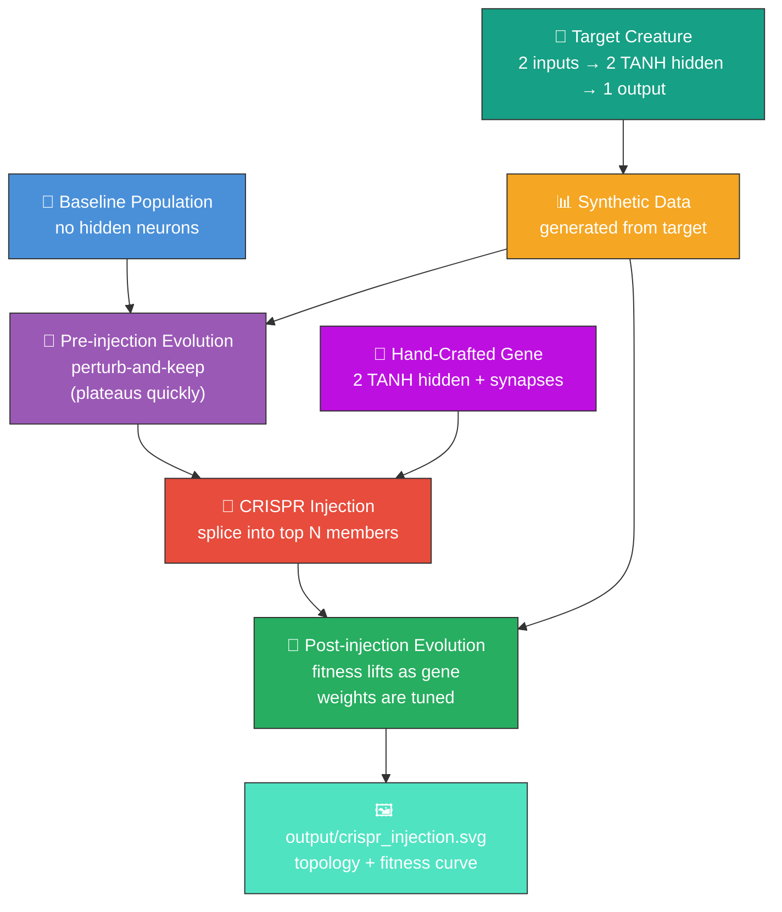

# 🧬 CRISPR Gene Injection — Hand-Crafted Subgraph Splicing

**Acronym.** _NEAT_ = NeuroEvolution of Augmenting Topologies. (CRISPR is borrowed as a metaphor
from molecular biology — Clustered Regularly Interspaced Short Palindromic Repeats — where it
describes a precise gene-editing technique. Here it stands for the same idea applied to neural
network topology.)

`crispr_injection.ts` demonstrates a structural intervention that is unique to NEAT-style
neuroevolution: a hand-crafted **edit gene** — a small subgraph of neurons and synapses with
known-good behaviour — is spliced directly into a stalled population, then evolution continues.
Random weight mutation alone cannot construct this structure because the missing topology has no
gradient to follow; CRISPR-style injection bypasses that obstacle by inserting the structure
wholesale.

## 🔧 How It Works



1. Build a target creature with two TANH hidden neurons that compute a non-linear function of two
   inputs. This pair of hidden neurons is the **gene**.
2. Generate synthetic training data from the target — every record is `(input₀, input₁, target_y)`.
3. Build a baseline population whose members have **no hidden neurons** — they cannot capture the
   non-linearity, so a perturb-and-keep evolution loop quickly plateaus.
4. Inject the hand-crafted gene into the top N members of the stalled population, replacing them
   with gene-bearing variants.
5. Resume the same evolution loop. Fitness lifts sharply because the gene has the structure needed
   to fit the target; the loop merely tunes its incoming weights.

## 🔬 Why CRISPR-Style Injection Matters

Pure random mutation explores the structural space one connection at a time, which is fine for local
refinements but very slow when the missing topology requires several coordinated additions
(neurons + their synapses) before any fitness improvement is realised. NEAT-AI's UUID-keyed neurons
make a structural splice well-defined and reversible:

- **Gene identity is portable.** Each gene neuron has a UUID, so the same gene can be injected into
  multiple population members and tracked across generations.
- **Splicing is non-destructive.** Host weights are preserved; the gene's prescribed edges are added
  to the existing graph rather than replacing it.
- **The lift is attributable.** Because the gene is added all at once, the post-injection fitness
  jump is causally tied to the splice — making this a useful debugging and ablation tool.

## 🚀 Running the Example

```bash
./crispr_injection/run.sh
```

The script writes all artefacts to `.synthetic-crispr-injection/`, a hidden directory ignored by
git. You will find:

- `data/` – binary training data generated from the target creature
- `creatures/target.json` – the creature whose outputs define the synthetic task
- `creatures/gene.json` – a baseline-with-gene reference creature
- `creatures/best.json` – the best post-injection creature from the experiment
- `output/crispr_injection.svg` – the rendered topology + fitness chart

A copy of the chart is also written to `docs/screenshots/crispr_injection.svg` for the main README.

## 🧰 NEAT-AI Features Used

CRISPR injection is one of NEAT-AI's gene-level structural operators. This example splices a
hand-crafted edit gene into a stalled population.

Features exercised (links go to upstream
[`COMPARISON.md`](https://github.com/stSoftwareAU/NEAT-AI/blob/Develop/COMPARISON.md)):

- **[CRISPR Gene Injection](https://github.com/stSoftwareAU/NEAT-AI/blob/Develop/COMPARISON.md#5--crispr-gene-injection)**
  — splices a hand-crafted gene (a small sub-network) into evolved descendants by neuron UUID — the
  central technique this example demonstrates.
- **[UUID-Based Extensible Observations](https://github.com/stSoftwareAU/NEAT-AI/blob/Develop/COMPARISON.md#3--uuid-based-extensible-observations)**
  — neuron UUIDs make the splice cleanly addressable across crossovers and mutations — without
  UUIDs, gene injection would not survive evolution.
