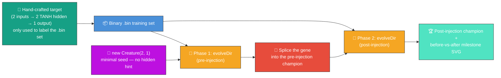
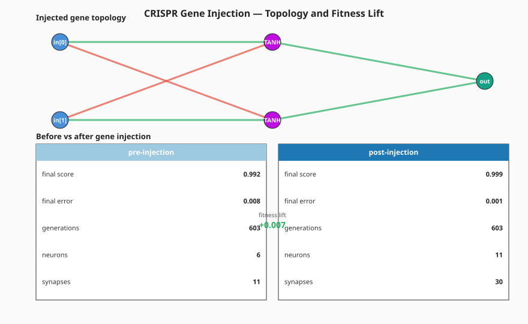

# 🧬 CRISPR Gene Injection — Evolve Network Structure From a Minimal Seed

**Acronym.** _NEAT_ = NeuroEvolution of Augmenting Topologies. (CRISPR is borrowed as a metaphor
from molecular biology — Clustered Regularly Interspaced Short Palindromic Repeats — where it
describes a precise gene-editing technique. Here it stands for the same idea applied to neural
network topology.) _SVG_ = Scalable Vector Graphics.

**The audit (#209) reframes this example.** The published evolution genuinely _learns_ the network
structure from a minimal NEAT-AI seed — no hidden-layer hint, no pre-built `network.json`, no warm
start. The hand-crafted edit gene + perturb-and-keep splicing helpers are retained as exported
utilities (and still exercised by the test suite) so the gene-splicing primitive keeps its contract.

Under [#302](https://github.com/stSoftwareAU/NEAT-AI-Examples/issues/302) the per-generation
telemetry hook was removed in favour of NEAT-AI's milestone-only telemetry surface (see
[#298](https://github.com/stSoftwareAU/NEAT-AI-Examples/issues/298)). The runner now makes **two**
`Creature.evolveDir(...)` calls — one before gene injection from a minimal seed, and a second after
splicing the gene into the pre-injection champion — and renders a single SVG with the gene topology
on top and a before-vs-after milestone summary panel below. The "fitness lift" narrative is driven
by the post-vs-pre `EvolveDirSummary` deltas, not from per-generation rows.



`crispr_injection.ts` runs end-to-end:

1. Build a small hand-crafted **target creature** with two TANH hidden neurons that compute a
   non-linear function of two inputs. The target is only the _label oracle_ — NEAT-AI never sees it.
2. Phase 1 — seed `new Creature(INPUT_COUNT, OUTPUT_COUNT)` (no hidden hint, no warm start) and make
   a single `Creature.evolveDir(...)` call until either `targetError` is reached or the
   `timeoutMinutes: 15` backstop fires (bumped from 5 → 15 for the Refresh-2026-05 re-evolution
   under [#373](https://github.com/stSoftwareAU/NEAT-AI-Examples/issues/373); both phases still exit
   via `targetError` well before the cap).
3. Splice the hand-crafted edit gene into a JSON snapshot of the pre-injection champion.
4. Phase 2 — evolve the spliced creature with a second `Creature.evolveDir(...)` call.
5. Render a single SVG with the gene topology on top and a before-vs-after milestone summary panel
   below, sourced from the two phases' `EvolveDirSummary` records.

## 📈 Latest measured run (`./crispr_injection/run.sh`)

The chart is sourced from `Creature.evolveDir`'s return value (twice — once per phase). The
right-hand "post-injection" column should report a higher `finalScore` than the left-hand
"pre-injection" column, with the "fitness lift" callout between them quoting the post-vs-pre delta.



## 🧪 What "reasonable solution" means here

Phase 1 evolves from a direct-only seed (no hidden neurons) — that creature cannot fit the target's
non-linearity, so its `finalScore` is bounded well below 1.0 (typically ≈ 0.5–0.8 on this task).
Phase 2 takes the same creature with the hand-crafted gene spliced in (two TANH hidden neurons +
four weighted input synapses + two weighted output synapses) and evolves the weights; the gene
provides the structural capacity to fit the target's saturating non-linearity, so the post-injection
`finalScore` climbs much closer to 1.0. That delta is the "fitness lift" the example is built around
— driven entirely by milestone deltas, not by per-generation telemetry.

## 🧬 Why this is still a CRISPR-style demo

The hand-crafted **edit gene** (`createGene()`) is preserved verbatim from the original demo and
remains exported. It captures the topological insight that pure weight mutation alone cannot reach:
two TANH hidden neurons plus the saturating input/output synapses that wire them. The `injectGene`
helper still splices that gene into a host JSON in a deterministic, idempotent way.

This audit replaces the **runner** with a two-phase `evolveDir` flow — but the gene + the splicer
are still here, and the test suite still verifies that `injectGene` adds the gene's hidden neurons,
preserves host synapses, is idempotent on re-injection, and does not mutate its input. The pre-audit
perturb-and-keep experiment (`runCrisprExperiment`) is also retained as an exported helper so the
original gene-splicing narrative can still be reproduced from code.

## 🚀 Running the example

> ⚡ **Speed note:** this example writes its training data in NEAT-AI's binary format — see
> [`docs/binary_training_stream.md`](../docs/binary_training_stream.md).

```bash
./crispr_injection/run.sh
```

The script writes all artefacts to `.synthetic-crispr-injection/`, a hidden directory ignored by
git. You will find:

- `data/synthetic_*.bin` – Binary training files derived from the target creature.
- `creatures/target.json` – The hand-crafted target creature (label oracle only).
- `creatures/gene.json` – A baseline-with-gene reference creature (legacy artefact).
- `creatures/best.json` – The post-injection evolved champion.

The combined gene-topology + before/after milestone SVG is committed under `docs/`:

- [`docs/screenshots/crispr_injection.svg`](../docs/screenshots/crispr_injection.svg)

## 🧰 NEAT-AI features used

- **Minimal NEAT seed** — `new Creature(input, output)` with no hidden hint, no pre-built
  `network.json` seed; NEAT-AI random-initialises the rest.
- **`Creature.evolveDir`** over the binary `.bin` training stream (per
  [`docs/binary_training_stream.md`](../docs/binary_training_stream.md)) — orders of magnitude
  faster than per-call `activate()`.
- **Forward-only mutation** — `evolveDir` defaults to forward-only when `feedbackLoop` is not set,
  matching the audit's stop-condition + topology contract.
- **Milestone-only telemetry** — the SVG is sourced from `evolveDir`'s return value (twice), one
  `EvolveDirSummary` per phase, matching NEAT-AI's supported telemetry surface (see
  [`AGENTS.md`](../AGENTS.md)).
- **CRISPR Gene Injection primitive** — `createGene` + `injectGene` retain the original UUID-keyed
  splicing semantics so the gene-splicing technique is still demonstrable in code. See upstream
  [`COMPARISON.md`](https://github.com/stSoftwareAU/NEAT-AI/blob/Develop/COMPARISON.md#5--crispr-gene-injection)
  for the broader catalogue.
