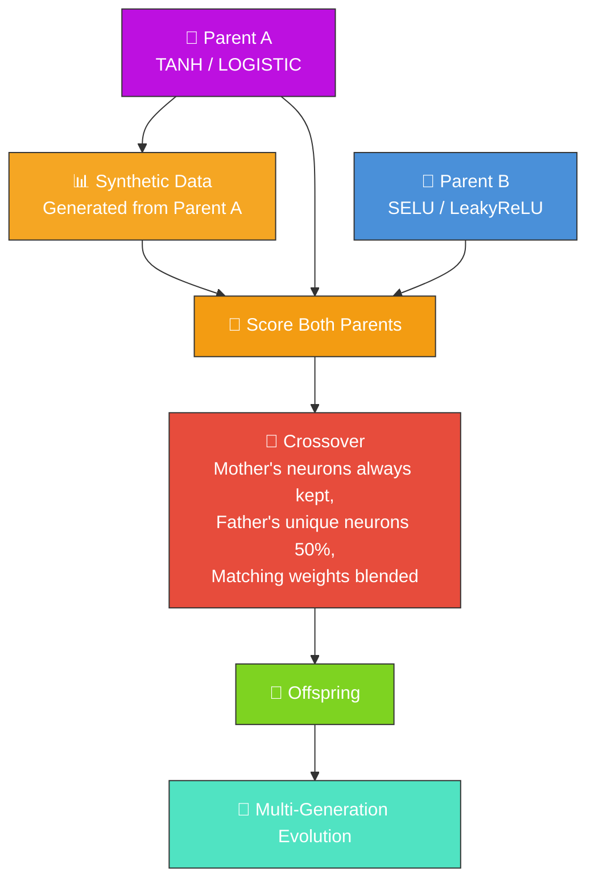

# 🔀 Crossover — Breeding Two Creatures

`crossover_example.ts` demonstrates how to breed two parent creatures with different neural network
architectures to produce offspring. Crossover is a fundamental neuroevolution operation where traits
from both parents are combined into a child creature.

## 🔧 How It Works



1. Creates two parent creatures with different activation functions (TANH/LOGISTIC vs
   SELU/LeakyReLU)
2. Generates synthetic training data based on parent A's behaviour
3. Scores both parents against the training data
4. Performs crossover — the mother's neurons are always included, the father's unique neurons have a
   50% chance of inclusion, and matching weights/biases are blended (averaged)
5. Scores the offspring and compares performance to both parents
6. Optionally evolves the offspring for several generations to demonstrate multi-generation
   improvement

## 🚀 Running the Example

> ⚡ **Speed note:** this example writes its training data in NEAT-AI's binary format — see
> [`docs/binary_training_stream.md`](../docs/binary_training_stream.md).

```bash
./crossover/run.sh
```

The script writes all artefacts to `.synthetic-crossover/`, a hidden directory ignored by git. You
will find:

- `data/` – Binary training data for scoring
- `creatures/parent_a.json` – The first parent creature
- `creatures/parent_b.json` – The second parent creature
- `creatures/offspring.json` – The crossover offspring
- `creatures/evolved.json` – The offspring after multi-generation evolution
- `output/` – Additional offspring from repeated crossover

## 🧰 NEAT-AI Features Used

**Acronym.** _NEAT_ = NeuroEvolution of Augmenting Topologies (the Stanley & Miikkulainen 2002
algorithm).

Crossover demonstrates NEAT-AI's basic mother-keep + father-50% breeding operator (one of several
breeding strategies in NEAT-AI).

Features exercised (links go to upstream
[`COMPARISON.md`](https://github.com/stSoftwareAU/NEAT-AI/blob/Develop/COMPARISON.md)):

- **[Advanced Breeding Strategies](https://github.com/stSoftwareAU/NEAT-AI/blob/Develop/COMPARISON.md#10--advanced-breeding-strategies)**
  — mother-keep + father-50% blending — the simplest of NEAT-AI's breeding strategies (subgraph
  transplantation, cosine-similarity alignment, and diversity-driven cross-population pairing all
  live upstream).
- **[Historical Marking](https://github.com/stSoftwareAU/NEAT-AI/blob/Develop/COMPARISON.md#what-weve-implemented)**
  — gene history (a standard-NEAT primitive) makes compatible crossover possible across topologies.
