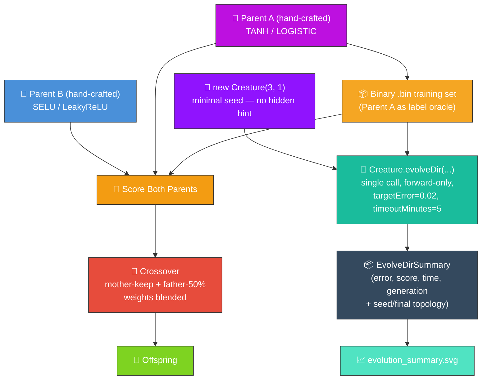
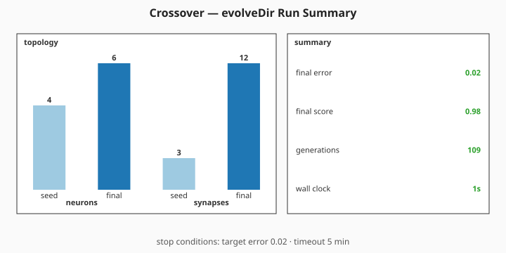

# 🔀 Crossover — Breeding Two Creatures + Minimal-Seed Evolution

**The audit (#213) reframes this example.** The breeding demo (parents A and B → offspring) is
preserved because parents are exempt hand-crafted state per `AGENTS.md` — they are the demo's whole
point. On top of that, the example runs a **minimal-seed** `evolveDir` against the same `.bin`
training set so the published evolution genuinely _learns_ the network structure with no hidden hint
and no warm start.

Under [#302](https://github.com/stSoftwareAU/NEAT-AI-Examples/issues/302) the per-generation
telemetry hook was removed in favour of NEAT-AI's milestone-only telemetry surface (see
[#298](https://github.com/stSoftwareAU/NEAT-AI-Examples/issues/298)). The README now references a
single milestone summary SVG sourced from `Creature.evolveDir`'s return value via the shared
[`renderEvolveDirSummarySvg`](../common/evolve_dir_summary.ts) helper.



**Acronyms.** _NEAT_ = NeuroEvolution of Augmenting Topologies (Stanley & Miikkulainen 2002). _SVG_
= Scalable Vector Graphics.

`crossover_example.ts` runs end-to-end:

1. Build two hand-crafted parent creatures with different activation lineages (TANH/LOGISTIC vs
   SELU/LeakyReLU). Parents are deliberately hand-crafted — that is the breeding demo's exempt state
   per `AGENTS.md`.
2. Generate a binary `.bin` training set from Parent A as label oracle.
3. Score both parents against the `.bin` set.
4. Run `performCrossover(parentA, parentB)` — mother's neurons are always kept, father's unique
   neurons are included with 50% probability, matching weights/biases are blended (averaged).
5. Run **minimal-seed** evolution: seed `new Creature(INPUT_COUNT, OUTPUT_COUNT)` (no hidden hint,
   no pre-built `network.json`, no warm start) and make a **single** `Creature.evolveDir(...)` call
   in forward-only mode until either `targetError` is reached or the `timeoutMinutes: 5` backstop
   fires.
6. Render a milestone summary SVG from the `evolveDir` return value plus the seed and final creature
   topology via `renderEvolveDirSummarySvg`.

## ⚙️ Why `evolveDir` (not per-step `activate()`)

The training labels are fully pre-generated as a binary `.bin` file from Parent A's deterministic
outputs — there is no per-step interactive simulation. That puts the example squarely in the
"binary-data → `evolveDir({"forward-only": true})`" category mandated by issue #213, so the runner
uses `Creature.evolveDir(dataDir, options)` (which defaults to forward-only when `feedbackLoop` is
not set) for orders-of-magnitude faster training than per-call `activate()`.

## 📈 Latest measured run (`./crossover/run.sh`)

The chart is sourced from `Creature.evolveDir`'s return value plus the seed and final creature's
topology — no per-generation telemetry hook.



### Crossover comparison

| Creature                          | Score    |
| --------------------------------- | -------- |
| Parent A (label oracle)           | 1.000000 |
| Parent B (different lineage)      | varies\* |
| Crossover offspring               | varies\* |
| **Minimal-seed evolved champion** | varies\* |

\*See the runner's "Comparison" section for the latest measurement.

## 🧪 What "reasonable solution" means here

The minimal-seed evolved champion's score on the binary `.bin` training set should approach Parent
A's score (higher is better; theoretical maximum is 1.0). The final per-record error satisfies the
`targetError = 0.02` stop condition when the run succeeds — the champion is producing labels within
`2 × 10⁻²` of Parent A's outputs on average. That is a reasonable solution to the labelled task: a
creature that started as 4 neurons and 3 synapses (no hidden layer at all) has evolved into a
network that approximates Parent A's nonlinear sigmoid-of-sigmoids behaviour _without ever seeing
Parent A's topology_.

## 🚀 Running the Example

```bash
./crossover/run.sh
```

The script writes all artefacts to `.synthetic-crossover/`, a hidden directory ignored by git. You
will find:

- `data/` — Binary training data for scoring (Parent A as label oracle).
- `creatures/parent_a.json` — The first parent creature (hand-crafted demo state).
- `creatures/parent_b.json` — The second parent creature (hand-crafted demo state).
- `creatures/offspring.json` — The crossover offspring.
- `creatures/evolved.json` — The minimal-seed evolved champion (audit deliverable).
- `output/` — Additional offspring from repeated crossover for inspection.

The milestone summary SVG is committed under `docs/`:

- [`docs/screenshots/crossover/evolution_summary.svg`](../docs/screenshots/crossover/evolution_summary.svg)

## 🧰 NEAT-AI Features Used

**Acronym.** _NEAT_ = NeuroEvolution of Augmenting Topologies (the Stanley & Miikkulainen 2002
algorithm).

The audit rolls two things into one example:

- **The breeding demo** — `performCrossover` shows NEAT-AI's mother-keep + father-50% blending — the
  simplest of NEAT-AI's breeding strategies (subgraph transplantation, cosine-similarity alignment,
  and diversity-driven cross-population pairing all live upstream).
- **Minimal-seed evolution** — `new Creature(input, output)` with no hidden hint, fed to
  `Creature.evolveDir(...)` over the binary `.bin` training stream (per
  [`docs/binary_training_stream.md`](../docs/binary_training_stream.md)).

Features exercised (links go to upstream
[`COMPARISON.md`](https://github.com/stSoftwareAU/NEAT-AI/blob/Develop/COMPARISON.md)):

- **[Advanced Breeding Strategies](https://github.com/stSoftwareAU/NEAT-AI/blob/Develop/COMPARISON.md#10--advanced-breeding-strategies)**
  — mother-keep + father-50% blending — the simplest of NEAT-AI's breeding strategies.
- **[Historical Marking](https://github.com/stSoftwareAU/NEAT-AI/blob/Develop/COMPARISON.md#what-weve-implemented)**
  — gene history (a standard-NEAT primitive) makes compatible crossover possible across topologies.
- **`Creature.evolveDir`** — orders of magnitude faster than per-call `activate()` for any problem
  whose labels can be pre-generated as a binary `.bin` stream.
- **Forward-only mutation** — `evolveDir` defaults to forward-only when `feedbackLoop` is not set,
  matching the audit's stop-condition + topology contract.
- **Milestone-only telemetry** — the chart is sourced from `evolveDir`'s return value via the shared
  `renderEvolveDirSummarySvg` helper, matching NEAT-AI's supported telemetry surface (see
  [`AGENTS.md`](../AGENTS.md)).
