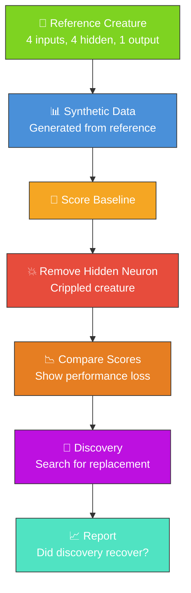

# 🔍 Discovery — Recover a Missing Neuron

**Acronyms.** _NEAT_ = NeuroEvolution of Augmenting Topologies. _FFI_ = Foreign Function Interface
(Deno's mechanism for calling native libraries from TypeScript).

`discover_missing_neuron.ts` demonstrates the neuron discovery workflow. It creates a simple
creature, generates synthetic training data, removes a hidden neuron to "cripple" the creature, and
then runs discovery to attempt to recover the missing functionality.

## 🔧 How It Works



1. Creates a reference creature with 4 inputs, 4 hidden neurons, and 1 output
2. Generates synthetic training data based on the creature's behaviour
3. Removes a hidden neuron (LeakyReLU) to create a "crippled" creature
4. Compares baseline and crippled scores to show the performance loss
5. Runs `Creature.discoveryDir()` to search for improvements
6. Reports whether discovery found a way to recover performance

## 📋 Prerequisites

> [!WARNING]
> The Discovery example requires a native Rust FFI library. Make sure you have it installed before
> running this example.

- The NEAT-AI-Discovery Rust library must be installed. Build it via `cargo build --release` in the
  NEAT-AI-Discovery repository and copy the resulting library to `~/.cargo/lib/`.
- Deno with FFI permissions enabled.

## 🚀 Running the Example

```bash
./discovery/run.sh
```

The script writes all artefacts to `.synthetic-discovery/`, a hidden directory ignored by git. You
will find:

- `data/` – Binary training data containing the synthetic observations
- `creatures/baseline.json` – The untouched reference creature
- `creatures/crippled.json` – The creature with the target neuron removed
- `creatures/discovered.json` – The best candidate returned by discovery (when available)
