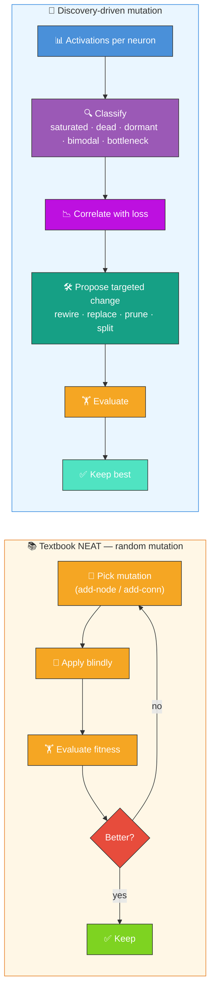
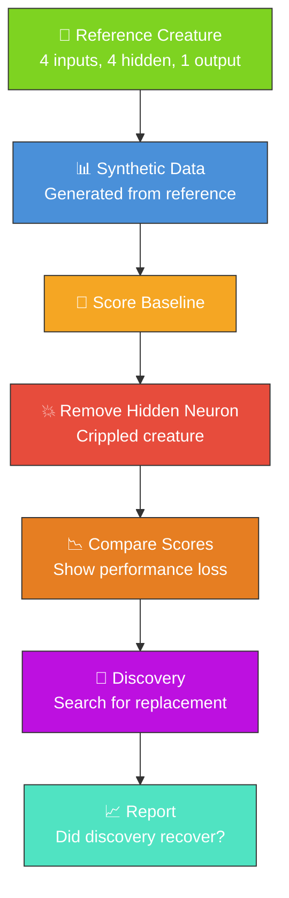

# 🔍 Discovery — Recover a Missing Neuron

**Science-driven structural mutation, not random search.** Textbook NEAT searches network structure
with **random** add-node and add-connection mutations and evaluates the result blindly through
fitness. NEAT-AI-Discovery is **error-driven**: it analyses each neuron's activation distribution
across the dataset — flagging **saturated**, **dead**, **dormant**, **bimodal**, and **bottleneck**
neurons — correlates those signals with the loss, and proposes targeted structural changes (rewire,
replace, prune, split) backed by a GPU-accelerated Rust pipeline. See
[`COMPARISON.md` Feature 2](https://github.com/stSoftwareAU/NEAT-AI/blob/Develop/COMPARISON.md)
(error-driven structural mutation) and
[`COMPARISON.md` Feature 8](https://github.com/stSoftwareAU/NEAT-AI/blob/Develop/COMPARISON.md)
(discovery caching) for the upstream definitions. This example is the simplest possible window onto
that pipeline: remove one neuron, ask Discovery to find a replacement, and watch it recover the lost
behaviour — a contrast you cannot make with random mutation alone.



**Acronyms.** _NEAT_ = NeuroEvolution of Augmenting Topologies. _FFI_ = Foreign Function Interface
(Deno's mechanism for calling native libraries from TypeScript).

`discover_missing_neuron.ts` demonstrates the neuron discovery workflow. It creates a simple
creature, generates synthetic training data, removes a hidden neuron to "cripple" the creature, and
then runs discovery to attempt to recover the missing functionality.

## 🔧 How It Works



1. Creates a reference creature with 4 inputs, 4 hidden neurons, and 1 output
2. Generates synthetic training data based on the creature's behaviour
3. Removes a hidden neuron (LeakyReLU) to create a "crippled" creature
4. Compares baseline and crippled scores to show the performance loss
5. Runs `Creature.discoveryDir()` to search for improvements
6. Reports whether discovery found a way to recover performance

## 📋 Prerequisites

> [!WARNING]
> The Discovery example requires a native Rust FFI library. Make sure you have it installed before
> running this example.

- The NEAT-AI-Discovery Rust library must be installed. Build it via `cargo build --release` in the
  NEAT-AI-Discovery repository and copy the resulting library to `~/.cargo/lib/`.
- Deno with FFI permissions enabled.

## 🚀 Running the Example

> ⚡ **Speed note:** this example writes its training data in NEAT-AI's binary format — see
> [`docs/binary_training_stream.md`](../docs/binary_training_stream.md).

```bash
./discovery/run.sh
```

The script writes all artefacts to `.synthetic-discovery/`, a hidden directory ignored by git. You
will find:

- `data/` – Binary training data containing the synthetic observations
- `creatures/baseline.json` – The untouched reference creature
- `creatures/crippled.json` – The creature with the target neuron removed
- `creatures/discovered.json` – The best candidate returned by discovery (when available)

## 🧰 NEAT-AI Features Used

Discovery is NEAT-AI's science-driven structural operator: rather than mutating randomly, it
analyses activations to target the changes worth making.

Features exercised (links go to upstream
[`COMPARISON.md`](https://github.com/stSoftwareAU/NEAT-AI/blob/Develop/COMPARISON.md)):

- **[Error-Guided Structural Evolution](https://github.com/stSoftwareAU/NEAT-AI/blob/Develop/COMPARISON.md#2--error-guided-structural-evolution)**
  — GPU-accelerated discovery of beneficial structural changes
  (saturated/dead/dormant/bottleneck-neuron analysis) — the core capability this example exercises.
