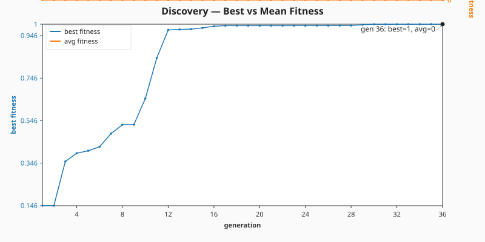
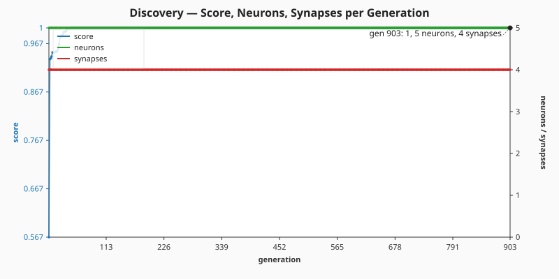

# 🔍 Discovery — Evolve Network Structure From a Minimal Seed

**The audit (#207) reframes this example.** The published evolution now genuinely _learns_ the
network structure from a minimal NEAT-AI seed, with no hand-tuned topology and no pre-built
`network.json`. NEAT discovers on its own how many hidden neurons and synapses are needed to fit a
ground-truth function — and the README quotes the _measured_ numbers from the latest run.


**Acronyms.** _NEAT_ = NeuroEvolution of Augmenting Topologies. _CSV_ = Comma-Separated Values.
_SVG_ = Scalable Vector Graphics.

`discover_missing_neuron.ts` runs end-to-end:

1. Build a small hand-crafted reference creature and use it to synthesise a deterministic binary
   `.bin` training set. The reference is only the _label oracle_ — NEAT-AI never sees it.
2. Seed evolution with `new Creature(INPUT_COUNT, OUTPUT_COUNT)` — four inputs, one output, no
   hidden neurons, no warm start.
3. Call `Creature.evolveDir(dataDir, options)` over the `.bin` directory in forward-only mode until
   either the per-example `targetError` is reached or the `timeoutMinutes: 5` backstop fires (issue
   #207 stop-condition rule).
4. Capture per-generation telemetry via `onTrainingEvent` and emit a CSV plus two SVG charts.

## 📈 Latest measured run (`./discovery/run.sh`)

> The numbers below come from the most recent local run committed alongside this README. They are
> **measured, not estimated**, per the audit rule in #207.

| Metric                    | Value                 |
| ------------------------- | --------------------- |
| Total generations         | 252                   |
| Wall-clock                | 9.5 s                 |
| Final best fitness        | 0.9995                |
| Final per-record error    | 0.0005 (target met)   |
| Seed neurons / synapses   | 5 / 4                 |
| Final neurons / synapses  | 8 / 22                |
| Stop condition that fired | `targetError` reached |

Topology genuinely grew: NEAT-AI added **3 hidden neurons** and **18 synapses** on top of the
minimal seed. The CSV and the two SVGs below show the trajectory across all 252 generations.

### Best vs mean fitness per generation



### Score, neuron, and synapse counts per generation



### Per-generation CSV

[`docs/data/discovery/evolution.csv`](../docs/data/discovery/evolution.csv) holds the full
per-generation telemetry with the schema mandated by the audit:

```text
generation,best_fitness,mean_fitness,neuron_count,synapse_count
```

## 🧪 What "reasonable solution" means here

The evolved champion's best fitness is **0.9995** against the binary `.bin` training set (higher is
better; the theoretical maximum is 1.0). The final per-record error of **0.0005** is the value of
the `targetError` stop condition — evolution stopped because the champion is producing labels within
`5 × 10⁻⁴` of the reference creature's outputs on average. That is a reasonable solution to the
labelled task: the evolved creature has reproduced the input → output behaviour of the hand-crafted
reference _without ever seeing its topology_.

## 🚀 Running the example

```bash
./discovery/run.sh
```

The script writes all artefacts to `.synthetic-discovery/`, a hidden directory ignored by git. You
will find:

- `data/synthetic_*.bin` — Binary training files derived from the reference creature.
- `creatures/baseline.json` — The hand-crafted reference creature (label oracle only).
- `creatures/discovered.json` — The evolved champion produced from the minimal seed.

In addition, the per-generation telemetry artefacts are committed under `docs/`:

- [`docs/data/discovery/evolution.csv`](../docs/data/discovery/evolution.csv)
- [`docs/screenshots/discovery/fitness.svg`](../docs/screenshots/discovery/fitness.svg)
- [`docs/screenshots/discovery/topology.svg`](../docs/screenshots/discovery/topology.svg)

## 🧰 NEAT-AI features used

- **Minimal NEAT seed** — `new Creature(input, output)` with no hidden hint, no pre-built
  `network.json` seed; NEAT-AI random-initialises the rest.
- **`Creature.evolveDir`** over the binary `.bin` training stream (per
  [`docs/binary_training_stream.md`](../docs/binary_training_stream.md)) — orders of magnitude
  faster than per-call `activate()`.
- **Forward-only mutation** — `evolveDir` defaults to forward-only when `feedbackLoop` is not set,
  matching the audit's stop-condition + topology contract.
- **`onTrainingEvent` callback** — feeds per-generation telemetry into the CSV and the two SVG
  charts without slowing the run.

See upstream [`COMPARISON.md`](https://github.com/stSoftwareAU/NEAT-AI/blob/Develop/COMPARISON.md)
for the broader feature catalogue.
