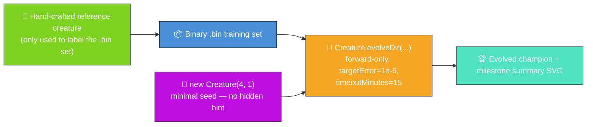
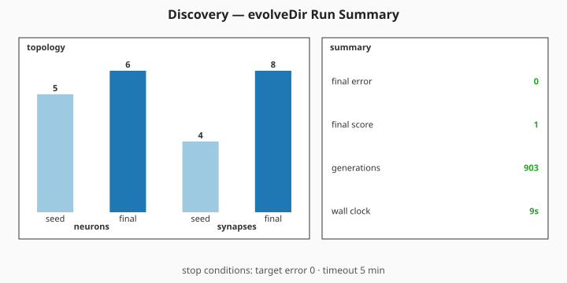

# 🔍 Discovery — Evolve Network Structure From a Minimal Seed

**The audit (#207) reframes this example; #304 trims its telemetry surface.** The published
evolution genuinely _learns_ the network structure from a minimal NEAT-AI seed, with no hand-tuned
topology and no pre-built `network.json`. NEAT discovers on its own how many hidden neurons and
synapses are needed to fit a ground-truth function — and the README quotes the _measured_ numbers
from the latest run via a single milestone-summary SVG.



**Acronyms.** _NEAT_ = NeuroEvolution of Augmenting Topologies. _SVG_ = Scalable Vector Graphics.

`discover_missing_neuron.ts` runs end-to-end:

1. Build a small hand-crafted reference creature and use it to synthesise a deterministic binary
   `.bin` training set. The reference is only the _label oracle_ — NEAT-AI never sees it.
2. Seed evolution with `new Creature(INPUT_COUNT, OUTPUT_COUNT)` — four inputs, one output, no
   hidden neurons, no warm start.
3. Call `Creature.evolveDir(dataDir, options)` over the `.bin` directory in forward-only mode until
   either the per-example `targetError` is reached or the `timeoutMinutes: 15` backstop fires (issue
   #207 introduced a 5-minute backstop; #375 bumped it to 15 for the Refresh-2026-05 re-evolution).
4. Capture the milestone-summary fields from `evolveDir`'s return value and render them via the
   shared `common/evolve_dir_summary.ts` helper (#284) — seed-vs-final topology bars plus numeric
   callouts for `finalError`, `finalScore`, `generations`, and wall-clock duration.

## 📈 Latest measured run (`./discovery/run.sh`)

> The numbers below come from the most recent local run committed alongside this README. They are
> **measured, not estimated**, per the audit rule in #207.

### Milestone summary



Topology genuinely grew: NEAT-AI added hidden neurons and synapses on top of the minimal seed, as
the seed-vs-final bars in the summary above show. The numeric callouts cover the four milestone
fields returned by `evolveDir` (`finalError`, `finalScore`, `generations`, wall-clock).

## 🧪 What "reasonable solution" means here

The final per-record error reported in the milestone summary above is below the `targetError` stop
condition — evolution stopped because the champion is producing labels within that tolerance of the
reference creature's outputs on average. That is a reasonable solution to the labelled task: the
evolved creature has reproduced the input → output behaviour of the hand-crafted reference _without
ever seeing its topology_.

## 🚀 Running the example

```bash
./discovery/run.sh
```

The script writes all artefacts to `.synthetic-discovery/`, a hidden directory ignored by git. You
will find:

- `data/synthetic_*.bin` — Binary training files derived from the reference creature.
- `creatures/baseline.json` — The hand-crafted reference creature (label oracle only).
- `creatures/discovered.json` — The evolved champion produced from the minimal seed.

In addition, the milestone summary SVG is committed under `docs/`:

- [`docs/screenshots/discovery/evolution_summary.svg`](../docs/screenshots/discovery/evolution_summary.svg)

## 🧰 NEAT-AI features used

- **Minimal NEAT seed** — `new Creature(input, output)` with no hidden hint, no pre-built
  `network.json` seed; NEAT-AI random-initialises the rest.
- **`Creature.evolveDir`** over the binary `.bin` training stream (per
  [`docs/binary_training_stream.md`](../docs/binary_training_stream.md)) — orders of magnitude
  faster than per-call `activate()`.
- **Forward-only mutation** — `evolveDir` defaults to forward-only when `feedbackLoop` is not set,
  matching the audit's stop-condition + topology contract.
- **Milestone summary** — the demo consumes `evolveDir`'s return value
  (`{ error, score, time,
  generation }`) directly and renders it via
  `common/evolve_dir_summary.ts` (#284). No per-generation telemetry is captured (#304).

See upstream [`COMPARISON.md`](https://github.com/stSoftwareAU/NEAT-AI/blob/Develop/COMPARISON.md)
for the broader feature catalogue.
