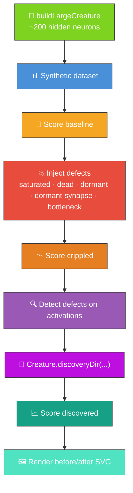

# 🔬 Discovery at Scale — Multi-Defect Detection on Large Creatures

**Acronyms.** _NEAT_ = NeuroEvolution of Augmenting Topologies. _FFI_ = Foreign Function Interface
(Deno's mechanism for calling native libraries from TypeScript).

`discovery_at_scale.ts` is the flagship demo for the "discovering structures at size and speed"
thesis (parent issue [#75](https://github.com/stSoftwareAU/NEAT-AI-Examples/issues/75)).

It runs the NEAT-AI Discovery pipeline against a creature large enough that random mutation alone
cannot recover from injected damage (~200 hidden neurons, ~1 k synapses), and visualises the
structural defects detected — saturated activations, dead neurons, dormant neurons, dormant
synapses, and a bottleneck — both **before** and **after** a discovery iteration.

## 🔧 How It Works



## 🎨 Defect Categories

| Colour      | Category        | Detection rule                                                 |
| ----------- | --------------- | -------------------------------------------------------------- |
| 🟩 Green    | `healthy`       | All neurons that fall through the rules below.                 |
| 🟥 Red      | `saturated`     | Variance below `1e-3` AND \|mean\| ≥ 0.9 across the dataset.   |
| ⚫ Charcoal | `dead`          | Variance below `1e-3` AND \|mean\| ≤ 0.05 across the dataset.  |
| ⚪ Grey     | `dormant`       | Variance below `1e-3` but neither saturated nor dead.          |
| 🟪 Purple   | `bimodal`       | ≤ 3 distinct rounded activations across the dataset.           |
| 🟧 Orange   | `bottleneck`    | Outgoing degree ≥ 6 (structural — many edges from one neuron). |
| ⚪ Dashed   | dormant synapse | \|weight\| < 1e-4 — drawn as a dashed light-grey line.         |

The detection rules are intentionally simple so the demo is self-contained and the SVG output is
trivially explainable. The full taxonomy of 40+ scenarios lives in the
[NEAT-AI-Discovery](https://github.com/stSoftwareAU/NEAT-AI-Discovery) Rust library which the
production discovery pipeline calls into.

## 📋 Prerequisites

> [!WARNING]
> Discovery requires a native Rust FFI library. The demo wraps the call in a try/catch so the rest
> of the pipeline (scoring, defect detection, SVG rendering) still runs when the library is missing
> — you will see a "discovery unavailable" note in the output instead of a discovered score.

- Optional: build [NEAT-AI-Discovery](https://github.com/stSoftwareAU/NEAT-AI-Discovery) via
  `cargo build --release` and copy the resulting library to `~/.cargo/lib/`.
- Deno with FFI permissions enabled.

## 🚀 Running the Example

```bash
./discovery_at_scale/run.sh
```

The script writes all artefacts to `.discovery-at-scale/`, a hidden directory ignored by git:

- `data/` — Binary training data containing the synthetic observations
- `output/discovery_at_scale.svg` — The before/after topology SVG (also mirrored to
  `docs/screenshots/discovery_at_scale.svg`)

Console output reports baseline, crippled, and (when available) discovered scores, the wall-clock
time of the discovery step, and a per-category defect tally before vs after.

## 🧪 Running the Tests

```bash
deno test --allow-read --allow-write --allow-env --allow-net --allow-ffi \
  discovery_at_scale/
```

The tests cover defect injection, defect detection statistics, dataset loading, SVG rendering
(including byte-determinism), and the end-to-end demo pipeline using a small, fast configuration.
