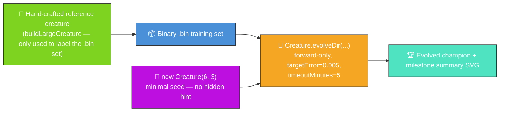
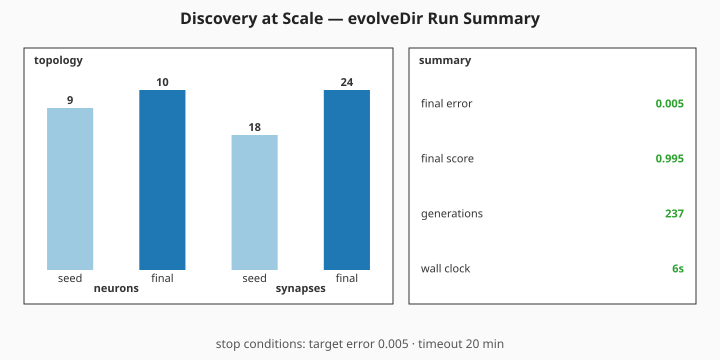

# 🔬 Discovery at Scale — Evolve Network Structure From a Minimal Seed

**The audit (#208) reframes this example; #304 trims its telemetry surface.** The published
evolution genuinely _learns_ the network structure from a minimal NEAT-AI seed, with no hand-tuned
topology and no pre-built `network.json`. NEAT discovers on its own how many hidden neurons and
synapses are needed to fit a larger ground-truth function — and the README quotes the _measured_
numbers from the latest run via a single milestone-summary SVG.



**Acronyms.** _NEAT_ = NeuroEvolution of Augmenting Topologies. _SVG_ = Scalable Vector Graphics.
_FFI_ = Foreign Function Interface.

`discovery_at_scale.ts` runs end-to-end:

1. Build a moderately-large hand-crafted reference creature with `buildLargeCreature(...)` and use
   it to synthesise a deterministic binary `.bin` training set. The reference is only the _label
   oracle_ — NEAT-AI never sees it.
2. Seed evolution with `new Creature(INPUT_COUNT, OUTPUT_COUNT)` — six inputs, three outputs, no
   hidden neurons, no warm start.
3. Call `Creature.evolveDir(dataDir, options)` over the `.bin` directory in forward-only mode until
   either the per-example `targetError` is reached or the `timeoutMinutes: 5` backstop fires (issue
   #208 stop-condition rule).
4. Capture the milestone-summary fields from `evolveDir`'s return value and render them via the
   shared `common/evolve_dir_summary.ts` helper (#284). The seed-vs-final topology bars in the
   summary are this demo's headline visual — they show a single 9-neuron seed growing into a
   competent classifier of a reference network roughly four times its size.

## 📈 Latest measured run (`./discovery_at_scale/run.sh`)

> The numbers below come from the most recent local run committed alongside this README. They are
> **measured, not estimated**, per the audit rule in #208.

### Milestone summary — seed vs final topology



Topology genuinely grew: the seed-vs-final bars in the summary above show NEAT-AI adding hidden
neurons and synapses on top of the minimal `new Creature(6, 3)` seed. The numeric callouts cover the
four milestone fields returned by `evolveDir` (`finalError`, `finalScore`, `generations`, wall-clock
duration).

## 🧪 What "reasonable solution" means here

The final per-record error reported in the milestone summary above is below the `targetError` stop
condition — evolution stopped because the champion is producing labels within that tolerance of the
larger reference creature's outputs on average. That is a reasonable solution to the labelled task:
a 9-neuron seed has been grown into a champion that reproduces the input → output behaviour of a
33-neuron / ~165-synapse reference _without ever seeing its topology_.

## 🚀 Running the example

```bash
./discovery_at_scale/run.sh
```

The script writes all artefacts to `.discovery-at-scale/`, a hidden directory ignored by git. You
will find:

- `data/synthetic_*.bin` — Binary training files derived from the reference creature.
- `creatures/reference.json` — The hand-crafted reference creature (label oracle only).
- `creatures/champion.json` — The evolved champion produced from the minimal seed.

In addition, the milestone summary SVG is committed under `docs/`:

- [`docs/screenshots/discovery_at_scale/evolution_summary.svg`](../docs/screenshots/discovery_at_scale/evolution_summary.svg)

The same SVG is mirrored at `docs/screenshots/discovery_at_scale.svg` so the main README's "Unique
Features Showcase" entry continues to render.

## 🧰 NEAT-AI features used

- **Minimal NEAT seed** — `new Creature(input, output)` with no hidden hint, no pre-built
  `network.json` seed; NEAT-AI random-initialises the rest.
- **`Creature.evolveDir`** over the binary `.bin` training stream (per
  [`docs/binary_training_stream.md`](../docs/binary_training_stream.md)) — orders of magnitude
  faster than per-call `activate()`.
- **Forward-only mutation** — `evolveDir` defaults to forward-only when `feedbackLoop` is not set,
  matching the audit's stop-condition + topology contract.
- **Milestone summary** — the demo consumes `evolveDir`'s return value
  (`{ error, score, time,
  generation }`) directly and renders it via
  `common/evolve_dir_summary.ts` (#284). No per-generation telemetry is captured (#304).
- **`buildLargeCreature`** (from `common/`) — produces the moderately-large hand-crafted reference
  whose outputs label the `.bin` set. The reference is the demo's hand-crafted state; NEAT-AI never
  sees it.

See upstream [`COMPARISON.md`](https://github.com/stSoftwareAU/NEAT-AI/blob/Develop/COMPARISON.md)
for the broader feature catalogue. The pre-audit "Discovery-driven structural mutation" framing of
this example used Features 2 (error-guided structural evolution) and 8 (discovery caching) directly
via `Creature.discoveryDir(...)`; after the audit the runner uses random NEAT mutation, but those
features remain available for callers who want to compose them with the evolved champion.
