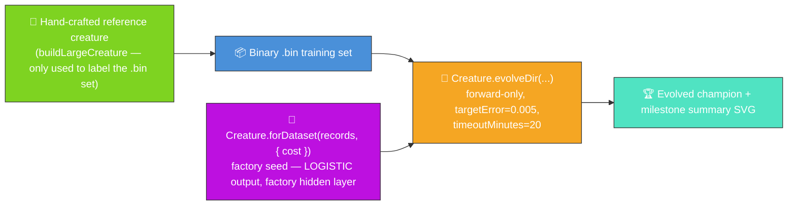

# 🔬 Discovery at Scale — Evolve Network Structure From a Minimal Seed

**The audit (#208) reframes this example; #304 trims its telemetry surface.** The published
evolution genuinely _learns_ the network structure from a minimal NEAT-AI seed, with no hand-tuned
topology and no pre-built `network.json`. NEAT discovers on its own how many hidden neurons and
synapses are needed to fit a larger ground-truth function — and the README quotes the _measured_
numbers from the latest run via a single milestone-summary SVG.



**Acronyms.** _NEAT_ = NeuroEvolution of Augmenting Topologies. _SVG_ = Scalable Vector Graphics.
_FFI_ = Foreign Function Interface.

`discovery_at_scale.ts` runs end-to-end:

1. Build a moderately-large hand-crafted reference creature with `buildLargeCreature(...)` and use
   it to synthesise a deterministic binary `.bin` training set. The reference is only the _label
   oracle_ — NEAT-AI never sees it.
2. Seed evolution with the **data-derived NEAT-AI factory**
   `Creature.forDataset(records, { cost: "BINARY_CROSS_ENTROPY" })` (issue #535) — six inputs, three
   outputs. The factory scans the same `.bin` records `evolveDir` trains on and derives, from
   problem-intrinsic facts only, a **LOGISTIC** output (coupled to the cost), a conservative
   factory-sized hidden layer (Heaton's rule), and He/Xavier weight-init scaling. Seed weights and
   biases stay random — only the topology and scaling are factory-derived. See
   [the deliberate-departure note](#-deliberate-departure-from-the-no-warm-start-policy-517) below.
3. Call `Creature.evolveDir(dataDir, options)` over the `.bin` directory in forward-only mode until
   either the per-example `targetError` is reached or the `timeoutMinutes: 20` backstop fires (issue
   #208 stop-condition rule, with the longer wall-clock budget documented in #376).
4. Capture the milestone-summary fields from `evolveDir`'s return value and render them via the
   shared `common/evolve_dir_summary.ts` helper (#284). The seed-vs-final topology bars in the
   summary are this demo's headline visual — they show the factory seed growing into a competent
   classifier of a reference network of comparable size.

## 🏭 Deliberate departure from the no-warm-start policy (#517)

`AGENTS.md` lists `discovery_at_scale` among the **exempt** examples: the hand-crafted reference
creature that labels the `.bin` set is the demo's protected state, while the NEAT seed itself was a
bare `new Creature(input, output)`. Under the factory-adoption tracker
([#517](https://github.com/stSoftwareAU/NEAT-AI-Examples/issues/517), this issue #535) that seed now
comes from the data-derived factory
`Creature.forDataset(records, { cost: "BINARY_CROSS_ENTROPY" })`.

- **Cost / activation coupling.** The reference creature labels the `.bin` set through a
  **LOGISTIC** output, so every target lives in `(0, 1)`. `BINARY_CROSS_ENTROPY` couples the
  factory's output activation to a LOGISTIC sigmoid (NEAT-AI #2793) across all three outputs — the
  exact activation the labelled targets assume. Same cost / activation pairing as the XOR (#520) and
  `adaptive_mutation` (#533) adoptions.
- **What the factory derives.** A LOGISTIC output (from the cost), a conservative factory-sized
  hidden layer (Heaton's rule → a small RELU layer), and per-activation He/Xavier weight-init
  scaling — from problem-intrinsic facts only.
- **What stays random.** Seed weights and biases are still drawn from the seeded PRNG; only the
  topology and scaling are factory-derived, and all structural growth beyond the seed still comes
  from `evolveDir`'s unchanged mutation operators. `evolveDir` keeps its default scoring, so
  evolution is untouched.
- **Baseline retained.** The bare-constructor seed lives on as `buildRandomSeedCreature` for test /
  resume fixtures.

## 📈 Latest measured run (`./discovery_at_scale/run.sh`)

> The numbers below come from the most recent local run committed alongside this README. They are
> **measured, not estimated**, per the audit rule in #208.

### Milestone summary — seed vs final topology


Topology genuinely grew: the seed-vs-final bars in the summary above show NEAT-AI adding hidden
neurons on top of the factory seed. The numeric callouts cover the four milestone fields returned by
`evolveDir` (`finalError`, `finalScore`, `generations`, wall-clock duration).

### Measured run (factory seed, issue #535)

| Metric                   | Value                                                            |
| ------------------------ | ---------------------------------------------------------------- |
| Seed                     | `Creature.forDataset(records, { cost: "BINARY_CROSS_ENTROPY" })` |
| Generations              | 83                                                               |
| Wall-clock               | 5.1 s                                                            |
| Final per-record error   | 0.0049                                                           |
| Final score              | 0.9951                                                           |
| Seed neurons / synapses  | 16 / 63 (7 factory-sized hidden)                                 |
| Final neurons / synapses | 19 / 61                                                          |
| `targetError` / timeout  | 0.005 / 20 min                                                   |

The factory seed converges **far faster than before**: it reaches the `targetError` (0.005) bound in
83 generations / ~5 s, where the previous bare `new Creature(6, 3)` seed never reached it inside the
full 20-minute backstop (it stalled around error 0.075 — see git history for the `Refresh-2026-05`
numbers). The better-scaled, hidden-bearing factory seed lets `evolveDir` reach the same tight
target in seconds, and structural growth on top of the seed (16 → 19 neurons) still comes purely
from the unchanged mutation operators.

## 🧪 What "reasonable solution" means here

The run exits on whichever of the two stop conditions fires first. The `targetError` (0.005) bound
is tight enough that the seed must carry real hidden structure to satisfy it — the factory seed
reaches it in 83 generations: a 16-neuron factory seed grown into a 19-neuron / 61-synapse champion
that approximates the input → output behaviour of the reference creature _without ever seeing its
topology_. The topology bars in the summary above are the demo's headline — they show NEAT-AI
_learning_ the network's shape on top of a sensibly-seeded start, not just its weights.

## 🚀 Running the example

```bash
./discovery_at_scale/run.sh
```

The script writes all artefacts to `.discovery-at-scale/`, a hidden directory ignored by git. You
will find:

- `data/synthetic_*.bin` — Binary training files derived from the reference creature.
- `creatures/reference.json` — The hand-crafted reference creature (label oracle only).
- `creatures/champion.json` — The evolved champion produced from the factory seed.

In addition, the milestone summary SVG is committed under `docs/`:

- [`docs/screenshots/discovery_at_scale/evolution_summary.svg`](../docs/screenshots/discovery_at_scale/evolution_summary.svg)

The same SVG is mirrored at `docs/screenshots/discovery_at_scale.svg` so the main README's "Unique
Features Showcase" entry continues to render.

## 🧰 NEAT-AI features used

- **Data-derived factory seed** — `Creature.forDataset(records, { cost: "BINARY_CROSS_ENTROPY" })`
  (issue #535) derives a LOGISTIC output, a conservative hidden layer, and He/Xavier weight-init
  scaling from the `.bin` records; weights and biases stay random. The bare
  `new Creature(input,
  output)` baseline is retained as `buildRandomSeedCreature` for test /
  resume fixtures.
- **`Creature.evolveDir`** over the binary `.bin` training stream (per
  [`docs/binary_training_stream.md`](../docs/binary_training_stream.md)) — orders of magnitude
  faster than per-call `activate()`.
- **Forward-only mutation** — `evolveDir` defaults to forward-only when `feedbackLoop` is not set,
  matching the audit's stop-condition + topology contract.
- **Milestone summary** — the demo consumes `evolveDir`'s return value
  (`{ error, score, time,
  generation }`) directly and renders it via
  `common/evolve_dir_summary.ts` (#284). No per-generation telemetry is captured (#304).
- **`buildLargeCreature`** (from `common/`) — produces the moderately-large hand-crafted reference
  whose outputs label the `.bin` set. The reference is the demo's hand-crafted state; NEAT-AI never
  sees it.

See upstream [`COMPARISON.md`](https://github.com/stSoftwareAU/NEAT-AI/blob/Develop/COMPARISON.md)
for the broader feature catalogue. The pre-audit "Discovery-driven structural mutation" framing of
this example used Features 2 (error-guided structural evolution) and 8 (discovery caching) directly
via `Creature.discoveryDir(...)`; after the audit the runner uses random NEAT mutation, but those
features remain available for callers who want to compose them with the evolved champion.
