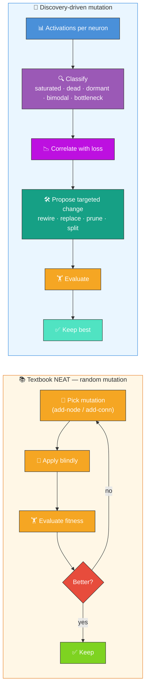
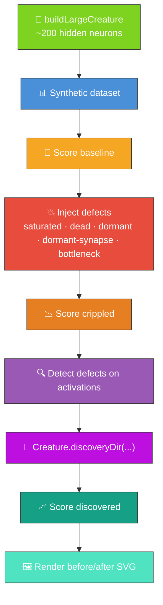

# 🔬 Discovery at Scale — Multi-Defect Detection on Large Creatures

**Science-driven structural mutation, not random search.** Textbook NEAT searches network structure
with **random** add-node and add-connection mutations and evaluates the result blindly through
fitness — at this scale (~200 hidden neurons, ~1 k synapses) the random walk is hopeless.
NEAT-AI-Discovery is **error-driven**: it analyses each neuron's activation distribution across the
dataset — flagging **saturated**, **dead**, **dormant**, **bimodal**, and **bottleneck** neurons —
correlates those signals with the loss, and proposes targeted structural changes (rewire, replace,
prune, split) backed by a GPU-accelerated Rust pipeline. See
[`COMPARISON.md` Feature 2](https://github.com/stSoftwareAU/NEAT-AI/blob/Develop/COMPARISON.md)
(error-driven structural mutation) and
[`COMPARISON.md` Feature 8](https://github.com/stSoftwareAU/NEAT-AI/blob/Develop/COMPARISON.md)
(discovery caching) for the upstream definitions. This demo deliberately injects defects into a
creature too large for random mutation to repair, then lets Discovery's structural surgery walk it
back — exactly the contrast textbook NEAT cannot make.



**Acronyms.** _NEAT_ = NeuroEvolution of Augmenting Topologies. _FFI_ = Foreign Function Interface
(Deno's mechanism for calling native libraries from TypeScript).

`discovery_at_scale.ts` is the flagship demo for the "discovering structures at size and speed"
thesis (parent issue [#75](https://github.com/stSoftwareAU/NEAT-AI-Examples/issues/75)).

It runs the NEAT-AI Discovery pipeline against a creature large enough that random mutation alone
cannot recover from injected damage (~200 hidden neurons, ~1 k synapses), and visualises the
structural defects detected — saturated activations, dead neurons, dormant neurons, dormant
synapses, and a bottleneck — both **before** and **after** a discovery iteration.

## 🔧 How It Works



## 🎨 Defect Categories

Each row lists the detection rule **and** the structural intervention Discovery would propose for
that defect class — the targeted, error-driven response that random NEAT mutation cannot make.

| Colour      | Category        | Detection rule                                                 | Discovery intervention                                                                      |
| ----------- | --------------- | -------------------------------------------------------------- | ------------------------------------------------------------------------------------------- |
| 🟩 Green    | `healthy`       | All neurons that fall through the rules below.                 | Leave alone — no structural change proposed.                                                |
| 🟥 Red      | `saturated`     | Variance below `1e-3` AND \|mean\| ≥ 0.9 across the dataset.   | **Rewire** — adjust incoming weights / bias or swap squash to break saturation.             |
| ⚫ Charcoal | `dead`          | Variance below `1e-3` AND \|mean\| ≤ 0.05 across the dataset.  | **Replace** — substitute neuron with a fresh activation/squash that responds to the inputs. |
| ⚪ Grey     | `dormant`       | Variance below `1e-3` but neither saturated nor dead.          | **Prune** — remove the neuron and rewire its successors.                                    |
| 🟪 Purple   | `bimodal`       | ≤ 3 distinct rounded activations across the dataset.           | **Split** — duplicate the neuron and specialise each copy to one mode.                      |
| 🟧 Orange   | `bottleneck`    | Outgoing degree ≥ 6 (structural — many edges from one neuron). | **Rewire** — insert a relay neuron to break the fan-out and decompose the load.             |
| ⚪ Dashed   | dormant synapse | \|weight\| < 1e-4 — drawn as a dashed light-grey line.         | **Prune** — remove the synapse so the discovery cache focuses on live edges.                |

The detection rules are intentionally simple so the demo is self-contained and the SVG output is
trivially explainable. The full taxonomy of 40+ scenarios lives in the
[NEAT-AI-Discovery](https://github.com/stSoftwareAU/NEAT-AI-Discovery) Rust library which the
production discovery pipeline calls into.

## 📋 Prerequisites

> [!WARNING]
> Discovery requires a native Rust FFI library. The demo wraps the call in a try/catch so the rest
> of the pipeline (scoring, defect detection, SVG rendering) still runs when the library is missing
> — you will see a "discovery unavailable" note in the output instead of a discovered score.

- Optional: build [NEAT-AI-Discovery](https://github.com/stSoftwareAU/NEAT-AI-Discovery) via
  `cargo build --release` and copy the resulting library to `~/.cargo/lib/`.
- Deno with FFI permissions enabled.

## 🚀 Running the Example

```bash
./discovery_at_scale/run.sh
```

The script writes all artefacts to `.discovery-at-scale/`, a hidden directory ignored by git:

- `data/` — Binary training data containing the synthetic observations
- `output/discovery_at_scale.svg` — The before/after topology SVG (also mirrored to
  `docs/screenshots/discovery_at_scale.svg`)

Console output reports baseline, crippled, and (when available) discovered scores, the wall-clock
time of the discovery step, and a per-category defect tally before vs after.

## 🧪 Running the Tests

```bash
deno test --allow-read --allow-write --allow-env --allow-net --allow-ffi \
  discovery_at_scale/
```

The tests cover defect injection, defect detection statistics, dataset loading, SVG rendering
(including byte-determinism), and the end-to-end demo pipeline using a small, fast configuration.

## 🧰 NEAT-AI Features Used

The at-scale variant reuses the same Discovery operator on a large pre-built creature, so it also
exercises the disk-cache subsystem.

Features exercised (links go to upstream
[`COMPARISON.md`](https://github.com/stSoftwareAU/NEAT-AI/blob/Develop/COMPARISON.md)):

- **[Error-Guided Structural Evolution](https://github.com/stSoftwareAU/NEAT-AI/blob/Develop/COMPARISON.md#2--error-guided-structural-evolution)**
  — applied to a large pre-built creature so the science-driven framing is visible at
  production-scale topology sizes.
- **[Discovery Caching and Disk Space Management](https://github.com/stSoftwareAU/NEAT-AI/blob/Develop/COMPARISON.md#8--discovery-caching-and-disk-space-management)**
  — Discovery results are cached to disk so repeat runs against the same large creature stay
  tractable.
