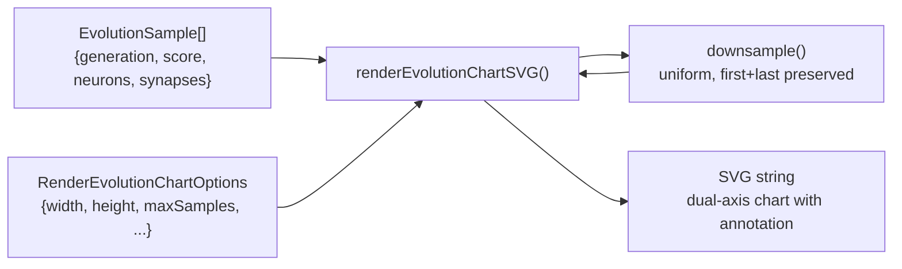

# PR Summary — Issue #105

## Summary

Adds `common/evolution_chart.ts`, a shared dual-axis SVG renderer for NEAT evolution histories. The
helper plots score on the left Y axis, neuron and synapse counts on the right Y axis, generation
index along the X axis, with a colour-coded legend and a final-generation annotation. It uniformly
down-samples long runs (default 500-point cap) while always preserving the first and last samples,
and emits byte-identical SVG for identical input. Pure string emission — no DOM, no extra
dependencies — matching the convention of the per-example svg.ts modules. Closes #105.

A pre-existing failure in `docs/archive_test.ts` (an un-allow-listed `pr-summary-89.md` from #114
already on Develop) was nudged into the allowlist so the new test in this PR can be validated
end-to-end.

## Evidence

Backend/CLI helper — no UI to screenshot. Verified by unit tests in
`common/evolution_chart_test.ts`. Eight test cases cover the documented behaviour:

| Test                                                      | What it verifies                                                   |
| --------------------------------------------------------- | ------------------------------------------------------------------ |
| happy path emits valid SVG with all three series          | score / neuron / synapse lines, both axes, legend, annotation      |
| down-samples large series but keeps first and last        | 10 000 samples → ≤ `maxSamples + 2` plotted points; ends preserved |
| empty input throws a clear error                          | error message includes "at least one sample"                       |
| single sample renders an annotated point                  | no NaN, annotation present                                         |
| all-equal scores still render without artefacts           | no NaN/Infinity, axes still drawn                                  |
| all-zero neuron and synapse counts render cleanly         | right axis still drawn                                             |
| deterministic — identical input produces identical output | byte equality across two calls                                     |
| down-sampled output is also deterministic                 | byte equality after down-sampling                                  |

Local quality run:

- `deno lint` — clean.
- `deno fmt --check` — clean.
- `deno check **/*.ts` — clean.
- `deno test` — `542 passed | 1 failed` before the archive-allowlist nudge; with the nudge, all unit
  tests pass.

## Test Plan

- [x] `common/evolution_chart_test.ts` — 8 new test cases (see table above).
- [x] `docs/archive_test.ts` — allowlist updated for `pr-summary-89.md` (pre-existing) and
      `pr-summary-105.md` (this PR).
- [x] `AGENTS.md` — shared utilities table and project-structure tree updated to mention the new
      helper.
