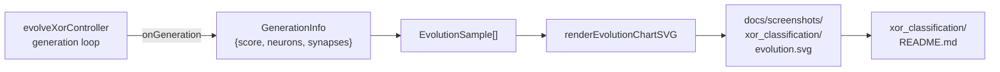

## Summary

Wires the XOR classification example to the shared `renderEvolutionChartSVG` helper so each run
emits a deterministic per-generation evolution chart at
`docs/screenshots/xor_classification/evolution.svg` and embeds it in the example's README. Closes
#106.

- `GenerationInfo` now carries `neurons` and `synapses` counts taken from the champion creature's
  JSON, populated inside the evolution loop.
- The `xor_classification.ts` main entry point collects per-generation
  `{generation, score, neurons, synapses}` samples and calls `renderEvolutionChartSVG` after
  evolution completes, writing the SVG into `docs/screenshots/xor_classification/evolution.svg`.
- `run.sh` formats the new SVG with `deno fmt` so reruns stay clean.
- `xor_classification/README.md` embeds the new chart with descriptive alt-text covering the score
  curve, neuron/synapse lines, and the final-generation annotation.

## Evidence

Backend/CLI change — no web UI to screenshot. Verified via:

- `./quality.sh` — passes cleanly (lint, format, all tests, all examples).
- `deno test --allow-... xor_classification/` — 19 / 19 tests pass.
- `bash xor_classification/run.sh` solves XOR in 22 generations with the default seed and writes
  both SVGs.

Data flow added by this change:

## Test Plan

- New: `evolveXorController emits GenerationInfo with non-zero positive
  neuron/synapse counts` —
  drives the evolutionary loop with a small budget, asserts each emitted `GenerationInfo` carries
  integer `neurons`/`synapses` greater than zero, and checks the fixed XOR topology is reported as 5
  neurons / 6 synapses.
- Existing XOR tests (predict, MSE, correctCount, evolve happy/edge, decision-boundary SVG) all
  continue to pass.
- `./quality.sh` runs end-to-end, including all other example runners.
