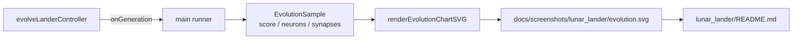

## Summary

Wired the lunar lander example to the shared dual-axis evolution chart. Closes #108.

`GenerationInfo` in `lunar_lander/lunar_lander.ts` now includes `neurons` and `synapses`, populated
from the per-generation champion's JSON. The runner accumulates an `EvolutionSample` for each
generation event and renders a deterministic `docs/screenshots/lunar_lander/evolution.svg` via
`renderEvolutionChartSVG` from `common/evolution_chart.ts`. The lunar-lander README embeds the new
SVG with descriptive alt-text and the runner script formats it after each run so subsequent
`deno fmt --check` runs stay clean.

The lunar-lander genome is currently a fixed linear topology (seven inputs feeding three logistic
outputs), so neuron / synapse counts are constant across the run. The chart still adds value as the
score line rises with evolution and the wiring is in place to surface real growth as soon as
structural mutation lands here.

## Evidence



The lunar-lander runner produced:

```
📈 Wrote evolution chart docs/screenshots/lunar_lander/evolution.svg
```

`./quality.sh < /dev/null` passes (lint, fmt, type check, unit tests, all example runners).

## Test Plan

- Added `evolveLanderController emits neurons and synapses on each generation event` in
  `lunar_lander/lunar_lander_test.ts`, asserting `info.neurons === INPUT_COUNT + OUTPUT_COUNT` and
  `info.synapses === INPUT_COUNT * OUTPUT_COUNT` for every emitted `GenerationInfo`.
- All existing lunar-lander tests continue to pass (22 tests, 0 failures).
- Verified the runner writes a non-empty `docs/screenshots/lunar_lander/evolution.svg`.
