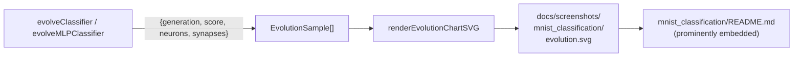

## Summary

Wired the MNIST classification example to the dual-axis evolution chart and prominently embedded the
chart in `mnist_classification/README.md`. The chart is now emitted to
`docs/screenshots/mnist_classification/evolution.svg`, matching the per-example subdirectory layout
already used by `lunar_lander`, `snake_game`, `xor_classification`, and `mountain_car`. Closes #111.

The `GenerationInfo` payload was already extended to carry `neurons` and `synapses` for the champion
creature; this PR adds an explicit test asserting that shape, moves the chart write to the new path
(with `ensureDirSync` for the subdirectory), updates the README's alt-text and artefact list, and
teaches `run.sh` to `deno fmt` the regenerated chart so subsequent `deno fmt --check` runs stay
clean.

## Evidence

CLI / artefact change — no UI to screenshot. The MNIST runner output confirms the chart is written
to the new path:

```
🖼️  Wrote screenshot docs/screenshots/mnist_classification.svg
📈 Wrote evolution chart docs/screenshots/mnist_classification/evolution.svg

🏁 Example completed in 18s 716ms
```



## Test Plan

- Added `evolveClassifier — onGeneration emits neurons and synapses for the champion` in
  `mnist_classification/mnist_classification_test.ts`. The test runs one generation on synthetic IDX
  data and asserts that the gen-0 `GenerationInfo` payload reports `neurons === inputs + outputs`
  and `synapses === inputs * outputs` (the library's uniform-random direct-wired topology), plus
  integer / positive sanity checks. This covers the new `GenerationInfo` shape end-to-end.
- Verified the full repo unit-test suite still passes (`deno test --no-check ...`):
  `ok | 801 passed | 0 failed`.
- Verified `deno lint`, `deno fmt --check`, and `deno check` are clean.
- Verified the MLP runner (default mode) writes a deterministic
  `docs/screenshots/mnist_classification/evolution.svg` and the runner's `deno fmt` post-step keeps
  the regenerated SVG within the formatter's expectations.
