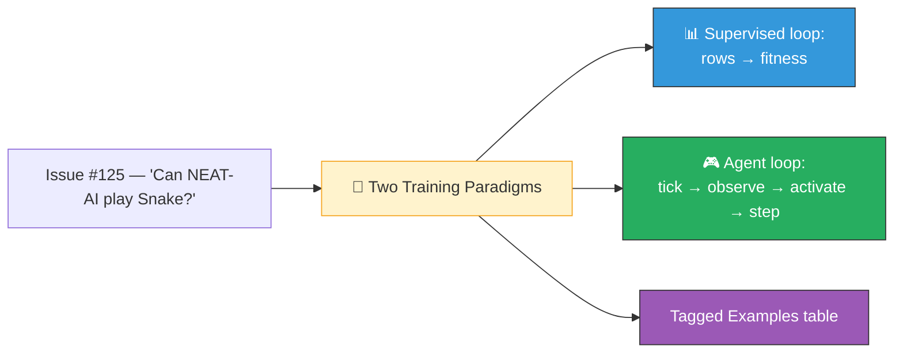

## Summary

Adds a top-level **🧭 Two Training Paradigms — Supervised vs Agent Evolution** section to
`README.md` so readers can answer "does NEAT-AI handle stream-of- observation games like Snake?"
without trawling every example. The new section contrasts batch supervised evolution (XOR, MNIST,
Stock Market, Evolution Showcase) with episode-based agent evolution (Snake, Cart-Pole, Lunar
Lander, Mountain Car, Maze Navigation), explains why population × episode-length still parallelises
trivially, and includes a side-by-side Mermaid diagram of both loops. Every row in the existing
**Examples at a Glance** table now carries a paradigm badge — `📊 supervised`, `🎮 agent`, or
`🛠 technique` — so readers can sort. Closes #126.

## Evidence

This is a documentation-only change — no UI to screenshot. The structural requirements are verified
by tests in `readme_paradigms_test.ts` (see Test Plan below). The new section sits between the noise
→ competent callout and the Examples at a Glance table:

## Test Plan

- New test file `readme_paradigms_test.ts` covers:
  - The `Two Training Paradigms` heading exists and sits before `Examples at a Glance`.
  - The section names XOR / MNIST / Stock Market on the supervised side and Snake / Cart-Pole /
    Lunar Lander / Maze Navigation on the agent side.
  - The pointer paragraph links to `snake_game/README.md`.
  - At least one Mermaid diagram inside the section, covering both `dataset` (supervised) and
    `observe` / `activate` / `step` (agent).
  - Every example row in the `Examples at a Glance` table carries the correct emoji-prefixed badge
    (`📊 supervised`, `🎮 agent`, or `🛠 technique`).
- Existing `readme_structure_test.ts` and `mermaid_diagrams_test.ts` continue to pass — the new
  section adds a fourth Mermaid diagram and the example links / screenshots are preserved.
- `docs/archive_test.ts` updated to allowlist the new `pr-summary-126.md` and the pre-existing
  `pr-summary-111.md`, which had been merged without an archive-allowlist update.
- `deno lint`, `deno fmt --check`, and `deno check **/*.ts` pass cleanly.
