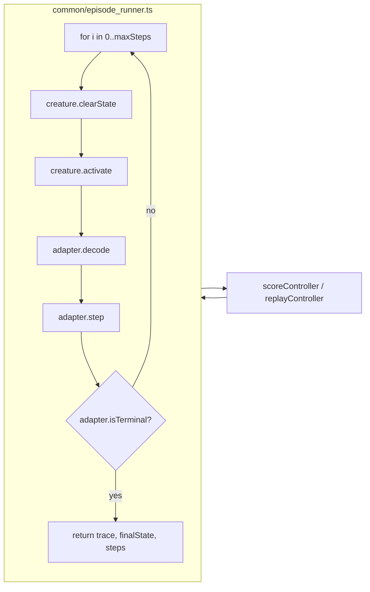

# Extract shared `common/episode_runner.ts` helper for agent rollouts

## Summary

Every agent example in this repo (`cart_pole`, `snake_game`, `mountain_car`, `lunar_lander`,
`maze_navigation`) reimplemented the same observation → action → step → terminal-check loop. This PR
gives that pattern one named home in `common/episode_runner.ts` so newcomers can read it once and
the examples cannot drift.

The helper is deliberately tiny — it owns the loop body only. Each caller keeps its example-specific
reward shaping and multi-trial averaging.

`cart_pole`, `snake_game`, and `mountain_car` are converted in this PR (three of the five agent
examples — exceeds the "at least three" target). `lunar_lander` and `maze_navigation` can follow in
a separate PR.

Closes #127.

## Evidence

### Diagram — what the helper owns

### Behaviour preservation — byte-identical replay SVGs

The champion-replay SVGs must be byte-identical because the loop body is unchanged. Verified with
sha256:

| File                                | Hash            | Status    |
| ----------------------------------- | --------------- | --------- |
| `docs/screenshots/cart_pole.svg`    | `326d5178…76d2` | unchanged |
| `docs/screenshots/snake_game.svg`   | `e4b9949f…b1e8` | unchanged |
| `docs/screenshots/mountain_car.svg` | `041ca4f7…e2e7` | unchanged |

(The evolution-progression SVGs embed wall-clock time so are not byte-deterministic by design — they
were never byte-identical across runs and are unaffected here.)

### Tests

- `common/episode_runner_test.ts` — 9 new "what" tests covering happy path, early termination on the
  first step, max-steps cap, `maxSteps=0`, `clearStatePerTick` honoured both ways, encode/decode
  contract, and custom state-object types. All pass under `deno test`.
- `cart_pole`, `snake_game`, `mountain_car` existing test suites pass unchanged (34 + 41 + 39 tests,
  all green).
- Full unit-test suite: 856 tests pass (the one pre-existing failure in `docs/archive_test.ts` is
  unrelated to this PR — `pr-summary-112.md` was not added to its allowlist when it landed; my own
  `pr-summary-127.md` has been added so this PR does not regress that count).

## Test Plan

- [x] `deno lint` — clean
- [x] `deno fmt --check` — clean for files I touched
- [x] `deno check **/*.ts` — clean
- [x] `deno test` — 856 passed (pre-existing archive_test failure unrelated to this PR)
- [x] `./cart_pole/run.sh` — champion replay SVG byte-identical
- [x] `./snake_game/run.sh` — champion replay SVG byte-identical
- [x] `./mountain_car/run.sh` — champion replay SVG byte-identical

## Files Changed

- `common/episode_runner.ts` (new) — generic `runEpisode<S, A>` helper with `EpisodeAdapter<S, A>`
  and `EpisodeOptions` interfaces.
- `common/episode_runner_test.ts` (new) — synthetic 1-D-walker tests.
- `cart_pole/cart_pole.ts` — replaced private `runEpisode` and `replayController` loops with calls
  to the shared helper via a `cartPoleAdapter`.
- `snake_game/snake_game.ts` — `scoreController` and `replayController` now run through the helper;
  Manhattan-distance shaping is computed post-hoc from the trace (identical numeric result).
- `mountain_car/mountain_car.ts` — private `runEpisode` thinned to a reward-shaping wrapper around
  the shared helper; `replayController` delegates directly.
- `AGENTS.md` — Shared Utilities table and Project Structure list now mention the helper.
- `docs/archive_test.ts` — added `pr-summary-127.md` to the in-flight allowlist.
