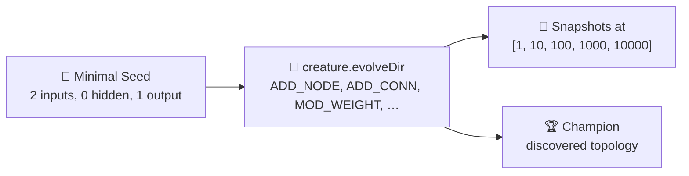

# XOR — Real NEAT Structural Evolution from a Minimal Seed

## Summary

Replaces the XOR example's hand-rolled, weight-only evolution loop with real NEAT structural
evolution. Evolution now starts from a **minimal seed** (two inputs, zero hidden neurons, one
output, with direct input → output synapses) and delegates add-neuron / add-synapse / weight-tune
mutation to the library via `creature.evolveDir(...)`. NEAT must invent at least one hidden neuron
to solve XOR — the new tests verify that this happens. Closes #131.

Key changes in `xor_classification/xor_classification.ts`:

- New `buildMinimalSeedCreature()` returning a 2-input, 0-hidden, 1-output topology. The legacy
  `buildInitialCreatureJSON` / `mutateCreatureJSON` weight-only helpers have been removed.
- `evolveXorController` now writes the four XOR samples to a temporary directory as a Float32 binary
  file and calls `creature.evolveDir(dataDir, NeatOptions)` for each segment of the run. Snapshots
  are captured between segments so the running champion (and its discovered topology) is recorded at
  each checkpoint.
- `EVOLUTION_CHECKPOINTS` now uses the canonical `[1, 10, 100, 1000, 10000]` from
  `common/evolution_snapshot.ts::DEFAULT_CHECKPOINTS`.
- `EvolveOptions` exposes `mutationRate` (default `0.6`) and `mutationAmount` (default `3`); the
  library defaults (0.3 / 1) are too conservative to bootstrap a hidden neuron from a degenerate
  seed within a tight generation budget.
- Determinism is preserved by threading `seed` through `NeatOptions.seed` — two runs with the same
  seed produce byte-identical champion JSON (verified by a new unit test).

## Evidence

End-to-end run (`./xor_classification/run.sh`):

```
🧬 Evolving classifier (NEAT structural mutation from a minimal seed)...
   Gen   10  bestFitness=0.7580  bestError=0.2420  neurons=3  synapses=2
   Gen   20  bestFitness=0.9105  bestError=0.0895  neurons=4  synapses=5
   Gen   24  bestFitness=1.0000  bestError=0.0000  neurons=4  synapses=5
✅ Solved after 24 generations (error=0.0000, fitness=1.0000).
🏁 Example completed in 864ms
```

The seed reports 3 neurons / 2 synapses (the minimal 2-input + 1-output, no hidden) and grows to 4
neurons / 5 synapses by generation 20 — the picture of NEAT topology discovery the issue asked for.



Decision boundary and progression strip are regenerated by the runner:

- `docs/screenshots/xor_decision_boundary.svg`
- `docs/screenshots/xor_classification_evolution.svg`
- `docs/screenshots/xor_classification/evolution.svg`

## Test Plan

`xor_classification/xor_classification_test.ts` — replaced the legacy weight-only tests with
behavioural tests against the new evolution path:

- `buildMinimalSeedCreature has 2 inputs, 0 hidden, 1 output` — verifies the seed is minimal.
- `buildMinimalSeedCreature produces a valid creature` — confirms `Creature.fromJSON` accepts it and
  activation is finite.
- `writeXorDataset emits a binary file with exactly four records` — Float32 encoding of the truth
  table.
- `planSegments inserts every in-budget checkpoint and ends at maxGenerations` — segment scheduling
  for snapshot capture.
- `evolveXorController solves XOR and grows hidden neurons (happy path)` — runs with population 30 /
  200 generations and asserts `solved`, all four samples classified correctly, and at least one
  hidden neuron in the champion (NEAT topology growth proven).
- `evolveXorController emits GenerationInfo whose seed reflects the minimal topology` — first
  reported generation reports `neurons === 3, synapses === 2`, the minimal seed counts. Replaces the
  legacy `samples[0].neurons === 5 && synapses === 6` assertion.
- `evolveXorController is deterministic for a fixed seed` — two runs with the same seed produce
  byte-identical champion JSON.
- Existing snapshot / SVG tests updated to use the minimal seed; all 19 file-level tests pass under
  `./quality.sh`.

`docs/archive_test.ts` — added `pr-summary-84.md` (committed previously without an allowlist entry —
pre-existing failure) and `pr-summary-131.md` (this PR) to the recognised list.

`./quality.sh` passes locally: lint, format, type-check, all 689 unit tests, and every example
runner.
