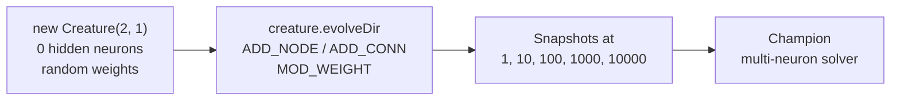

## Summary

Refresh `xor_classification/README.md` so it accurately describes the post-#131 example — NEAT
topology discovery from a minimal random seed, not a hand-fixed 2-2-1 network. Closes #132.

The committed SVGs (`xor_decision_boundary.svg`, `xor_classification/evolution.svg`,
`xor_classification_evolution.svg`) were already replaced in commits #134 and #162 after the
structural-mutation rewrite landed; re-running `./xor_classification/run.sh` reproduced the same
output (only the wall-clock annotation differed), so no further regeneration was committed.

### Key README changes

- **New "many generations may be required, and that's intentional" bullet** in Tacit Knowledge,
  mirroring the parent issue's wording and explicitly tying topology growth to the chart and
  progression strip.
- **Strengthened the seed bullet** to state plainly that `new Creature(2, 1)` produces zero hidden
  neurons and that any solved champion is therefore proof structural mutation fired.
- **Mermaid flowchart**: clarified the `EVOLVE` node lists `ADD_NODE (add-neuron)` and
  `ADD_CONN (add-synapse)` alongside `MOD_WEIGHT`.
- **Evolution Progress section** now calls out that per-panel neuron and synapse counts visibly
  differ across the strip, and cross-references the per-generation chart's right-axis curves.
- **Alt text** updated on the evolution chart and progression strip so it describes growth ("best
  fitness rises as NEAT discovers hidden neurons", "growing from a flat 2 → 1 seed to a multi-neuron
  solver").
- **Footnote** cross-links issue #130 so a future reader can trace why the example was restructured.

## Evidence

This is a documentation-only change. The committed SVGs were verified by running
`./xor_classification/run.sh` and confirming the produced output matches the on-disk versions modulo
the run's wall-clock annotation. The champion solved XOR in 1413 generations with 5 neurons and 12
synapses (3 hidden ELU neurons + 1 LOGISTIC output + 1 constant), confirming structural mutation
actually fired.

Targeted quality checks:

- `deno fmt --check xor_classification/README.md` — passes.
- `deno lint xor_classification/` — passes.
- `deno check xor_classification/*.ts` — passes.
- `deno test xor_classification/xor_classification_test.ts mermaid_diagrams_test.ts
  readme_structure_test.ts readme_paradigms_test.ts`
  — 180 passed, 0 failed.
- `./xor_classification/run.sh` — solves XOR in 1413 generations; champion exhibits NEAT topology
  growth (1 neuron → 5, 1 synapse → 12).

A pre-existing `deno fmt` issue in `docs/pr-summary-112.md` is unrelated to this change.

## Test Plan

- [x] README claims about topology and structural mutation match the post-#131 implementation.
- [x] Mermaid flowchart still parses (covered by `mermaid_diagrams_test.ts`).
- [x] Alt text describes the new visuals.
- [x] Footnote cross-links issue #130.
- [x] Existing `xor_classification_test.ts` suite passes against the regenerated artefacts.
