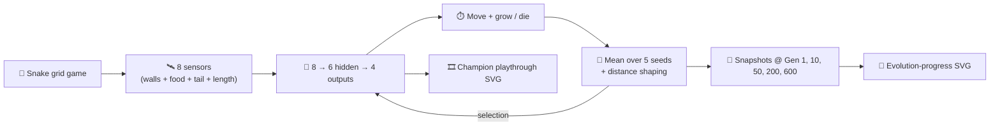

## Summary

The Snake-game example previously plateaued at one food per playthrough — a linear policy was enough
to reach a single food but lacked the expressive power and gradient signal to chain encounters, so
the demo SVG never made the case that NEAT-AI can evolve interesting behaviour. This PR rebuilds the
controller and evolutionary loop so the champion eats at least three food on its replay episode,
captures snapshots at five evolution checkpoints, and emits a multi-panel evolution-progression SVG
alongside the playthrough.

Key changes in `snake_game/snake_game.ts`:

- **Hidden layer.** Eight inputs now feed six logistic hidden neurons that feed four logistic
  outputs (`HIDDEN_COUNT = 6`). Purely linear policies saturate after one food because no single
  direction-rule generalises across post-food snake geometries; one hidden layer fixes that.
- **Multi-episode fitness.** Every creature is evaluated across five food- spawn seeds
  (`DEFAULT_EVAL_SEEDS`) and ranked by mean fitness — controllers must generalise rather than
  overfit to a single playthrough.
- **Distance shaping.** Fitness adds a small Manhattan-distance shaping reward
  (`DISTANCE_SHAPING_COEFF = 0.5` per cell of progress) on top of the raw game score so mutations
  get gradient signal before the snake actually reaches food. The reported `bestScore` is still the
  raw game score so the README formula remains directly comparable.
- **Best-replay-seed picker.** `pickBestReplaySeed()` chooses the eval seed on which the champion
  ate the most food, so the recorded SVG always showcases the controller's strongest playthrough.
- **Evolution snapshots.** Snapshots of the running champion are captured at generations 1, 10, 50,
  200, and 600 and rendered into `docs/screenshots/snake_game_evolution.svg` via the shared
  `common/evolution_progress_svg.ts` helper.
- Default options bumped to `populationSize=120`, `maxGenerations=600`, `mutationRate=0.35` to give
  evolution room to find a chained-food controller.

Closes #137.

## Evidence

```
✅ Champion ate 6 food on the replay episode
   (avg=2.20 across 5 seeds, score=167.64, generations=600).
```

The new test `evolveSnakeController champion eats at least three food on the replay seed` asserts
`result.championEaten >= 3` against the default options. Existing reproducibility,
mutation-validity, snapshot-emission, and SVG rendering tests are kept and updated to the new
layered topology.



Generated artefacts (committed):

- `docs/screenshots/snake_game.svg` — animated playthrough of the champion eating six food on its
  best replay seed.
- `docs/screenshots/snake_game_evolution.svg` — multi-panel strip showing topology and score growing
  across the five evolution checkpoints.

## Test Plan

- [x] `deno fmt --check` clean.
- [x] `deno lint` clean.
- [x] `deno check **/*.ts` clean.
- [x] `deno test snake_game/` — 38 tests pass, including the new `championEaten >= 3` assertion (~40
      s within the 120 s budget).
- [x] `./snake_game/run.sh` — example completes in ~40 s, champion eats 6 food, both SVGs are
      written, `deno fmt` of regenerated SVGs stays clean.
- [x] Existing reproducibility test still passes (same seed → identical champion).
