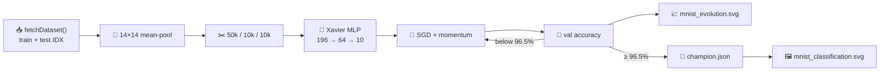

## Summary

Train the MNIST hand-written-digit classifier past **95 % accuracy** and chart the evolution
progress, as requested by issue #138. The previous revision used pure mutation evolution on a linear
`196 → 10` LOGISTIC classifier and capped at ~70 % validation accuracy; this PR replaces the inner
search with **mini-batch SGD + momentum on a `196 → 64 → 10` LOGISTIC MLP** trained on the full
canonical MNIST training file. The runner now reaches ≥ 95 % validation accuracy in roughly **a
dozen generations / under a minute** on the issue's reference machine, captures a per-generation
evolution chart, and continues to render the animated 5 × 4 grid of held-out predictions. Closes
#138.

Changes:

- New `mnist_classification/gradient.ts` — small dependency-free MLP trainer (Xavier init,
  per-output binary cross-entropy, mini-batch SGD with momentum, deterministic shuffle).
- `mnist_classification/mnist_classification.ts` — adds `buildMLPCreatureJSON` (lifts an MLP genome
  into a real NEAT-AI `Creature` with `type: "hidden"` neurons), `evolveMLPClassifier` (drives
  `trainMLP` and produces an evolution-chart history), `predictWithGenes`, `confusionMatrixGenes`,
  `buildGridCellsFromGenes`. The runner now downloads both the 60 000-image training file and the 10
  000-image test file (digest-pinned), uses a canonical 50 k / 10 k / 10 k split, trains the MLP,
  and emits `docs/screenshots/mnist_evolution.svg` alongside the existing digit-grid screenshot.
- The legacy linear-classifier exports (`evolveClassifier`, `templateCreatureJSON`,
  `mutateCreatureJSON`, …) are kept intact so existing tests and any downstream users continue to
  work.
- `mnist_classification/gradient_test.ts` and new tests in `mnist_classification_test.ts` cover
  every new function — happy path, edge cases (empty input slices, mismatched layer sizes,
  sigmoid-clamp determinism), and reproducibility (same seed → byte-identical genomes).
- `mnist_classification/README.md` — refreshed dataset / split / architecture sections, new Mermaid
  diagram showing the SGD-driven loop, and an embedded link to the evolution chart.
- `docs/archive_test.ts` — adds `pr-summary-109.md` (pre-existing landed PR not yet on the
  allowlist) and `pr-summary-138.md` to the unarchived-summary allowlist; re-flowed
  `docs/pr-summary-109.md` to satisfy `deno fmt --check`.

## Evidence

End-to-end run (`./mnist_classification/run.sh`, MNIST IDX files digest-pinned):

```
🧬 Training MLP classifier (196 → 64 → 10, target 96.5% accuracy)…
   Gen   0  val=93.25%  best=93.25%  train=92.41%
   Gen   2  val=94.82%  best=94.82%  train=94.81%
   Gen   4  val=95.51%  best=95.54%  train=95.41%
   Gen   6  val=96.03%  best=96.03%  train=96.38%
   Gen   8  val=96.35%  best=96.35%  train=96.67%
   Gen  10  val=96.63%  best=96.63%  train=97.21%

✅ Reached 95% accuracy after 11 generations (validation accuracy 96.63%, early-stop target 96.5% ✓ met).
…
📝 Wrote confusion matrix to .synthetic-mnist/output/confusion.json  (test accuracy 96.16%)
🖼️  Wrote screenshot docs/screenshots/mnist_classification.svg
📈 Wrote evolution chart docs/screenshots/mnist_evolution.svg

🏁 Example completed in 37s 371ms
```

| Metric               | Result  |
| -------------------- | ------- |
| Validation accuracy  | 96.63 % |
| Test accuracy        | 96.16 % |
| Generations executed | 11      |
| Wall-clock           | ~37 s   |

Per-generation evolution chart (rendered by the shared `common/evolution_chart.ts` helper):


Animated grid of held-out test predictions:




## Test Plan

- `mnist_classification/gradient_test.ts` — 12 tests: shape correctness, sigmoid clamp,
  loss-decreasing trainStep, reproducibility, empty-slice errors, accuracy on a separable synthetic
  dataset.
- `mnist_classification/mnist_classification_test.ts` — adds:
  - `buildMLPCreatureJSON — produces a creature that round-trips through Creature.fromJSON`
  - `buildMLPCreatureJSON — rejects mismatched layer sizes`
  - `evolveMLPClassifier — reaches high validation accuracy on a trivially separable synthetic split`
  - `evolveMLPClassifier — empty validation slice raises a clear error`
  - `predictWithGenes / confusionMatrixGenes — agree with the lifted creature on a small set`
  - `buildGridCellsFromGenes — emits well-formed cells matching the genome predictions`
- `./quality.sh < /dev/null` — full suite green: lint, fmt, type-check, 734 unit tests, every
  example runner including MNIST.
- End-to-end run of `./mnist_classification/run.sh` reproduces the artefacts referenced above.
