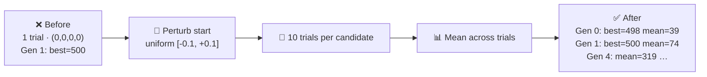

## Summary

The cart-pole example was scoring controllers from a single, perfectly symmetric initial state
`(x, v, theta, omega) = (0, 0, 0, 0)`. With a five-parameter linear policy and a thirty-strong
random initial population, a "lucky" controller almost always claimed `MAX_STEPS` in **generation
1** — making the evolution chart a dead-flat horizontal line and giving the (entirely reasonable)
impression that no learning was happening (#143).

This change borrows the OpenAI Gym `CartPole-v1` fix: every candidate is now scored on **ten
different perturbed starts**, with each component of the initial state drawn uniformly from
`[-0.1, +0.1]`. The score reported is the **mean** survival count across the ten trials, so a
controller can only achieve `MAX_STEPS` by surviving the full 500 steps from every one of the ten
launches — not just from the perfectly symmetric origin. The set of ten initial states is held fixed
(via `trialSeed`) for the entire run so candidates and generations are scored on the same batch.

Closes #143.

## Evidence

End-to-end runner output (`./cart_pole/run.sh`) — generation 0 now genuinely below `MAX_STEPS`,
followed by visible mean improvement as the search converges:

```
🧬 Evolving controller...
   Gen   0  best=498.3  mean=  39.4
   Gen   1  best=500    mean=  74.0
   Gen   2  best=500    mean= 162.5
   Gen   3  best=500    mean= 218.0
   Gen   4  best=500    mean= 319.0
   ...
   Gen  92  best=500    mean= 474.7
   Gen  96  best=500    mean= 485.9

✅ Solved after 2 generations (best=500).
```




## Test Plan

New tests verify the honest-evaluation contract end-to-end — no greps or implementation peeking:

- `cart_pole/physics_test.ts`
  - `perturbedInitialState samples each component within ±magnitude` — distribution bound check.
  - `perturbedInitialState is deterministic for the same seed` — reproducibility.
  - `perturbedInitialState produces a non-zero starting state with a non-zero magnitude` — proves
    the helper actually breaks the perfect symmetry.
- `cart_pole/cart_pole_test.ts`
  - `scoreController with perturbed multi-trial evaluation rejects degenerate zero-genome
    controllers`
    — the all-zero linear policy can no longer score `MAX_STEPS`.
  - `scoreController with multiple trials returns the mean across trials` — same `trialSeed` yields
    identical mean scores (deterministic evaluation).
  - `evolveCartPoleController under multi-trial evaluation requires more than one generation` — the
    Gen-1-cheat is closed under default options.
  - `evolveCartPoleController champion generalises to unseen perturbed initial states` — the
    champion still hits `MAX_STEPS` on a freshly-seeded batch of perturbed starts, proving it learnt
    to balance rather than memorising one lucky launch.

All 746 unit tests pass under `./quality.sh`.
