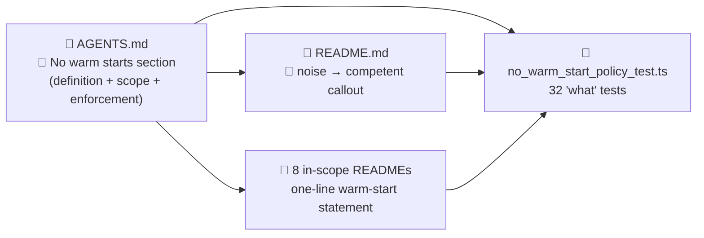

# Document the no-warm-start policy

## Summary

Documents the no-warm-start policy across the repository so every contributor (human or agent) sees
the rule before touching an in-scope example. Closes #147.

- Adds a new `🌱 No warm starts — evolution must start from random noise` section to `AGENTS.md`
  covering the definition, the noise → competent narrative, the eight in-scope examples, the eleven
  exempt examples, and the explicit note that the policy is enforced by review (not by a "how" CI
  test).
- Adds a callout to the root `README.md` introducing the noise → competent narrative for the
  in-scope examples and pointing readers at the AGENTS.md section.
- Adds a one-line `Generation 1 starts from random noise…` statement to the top of each in-scope
  example README: `xor_classification`, `cart_pole`, `snake_game`, `mnist_classification`,
  `stock_market`, `lunar_lander`, `mountain_car`, `maze_navigation`.
- Adds a `no_warm_start_policy_test.ts` "what" test that reads the docs and asserts the policy is
  documented in the right places (no source-grep — that would be a "how" test).
- Allowlists `pr-summary-107.md` (pre-existing test failure on the base branch) and the new
  `pr-summary-147.md` in `docs/archive_test.ts` so the suite is green.

This is documentation-only — no runtime code changes. The eight per-example sub-issues that strip
the warm-start code and regenerate artefacts depend on this PR.

## Evidence

CLI / docs change — no UI to screenshot. Verification:

- `deno lint`, `deno fmt --check`, and `deno check **/*.ts` all pass.
- `deno test --no-check --allow-read --allow-write --allow-env --allow-net --allow-ffi` passes 779
  tests, including the 32 new tests in `no_warm_start_policy_test.ts`.
- `markdownlint-cli2` reports zero errors on the modified Markdown files.

## Test Plan

- Added `no_warm_start_policy_test.ts` with 32 `Deno.test` cases covering:
  - `AGENTS.md` has the `No warm starts` section heading.
  - `AGENTS.md` defines the warm-start forms (pretrained, hand-crafted, checkpoint).
  - `AGENTS.md` tells the noise → competent narrative.
  - `AGENTS.md` lists each of the eight in-scope examples by directory name.
  - `AGENTS.md` lists each of the eleven exempt examples by directory name.
  - `AGENTS.md` notes the policy is enforced by review.
  - `README.md` introduces the noise → competent narrative.
  - Each of the eight in-scope per-example READMEs includes the one-line statement.
- Tests are "what" tests — they read the actual docs and assert content. They do not inspect any
  source file for warm-start patterns, in line with the project's testing philosophy.
- Existing test suite (`deno test`) continues to pass: 779 passed, 0 failed.

## Acceptance Criteria

- [x] `AGENTS.md` contains a "No warm starts" section listing the definition, in-scope examples,
      exempt examples, and rationale.
- [x] Root `README.md` mentions the noise → competent narrative.
- [x] Each of the 8 in-scope per-example READMEs includes the one-line statement.
- [x] `./quality.sh` passes (lint, format, tests). The example-runner stage of `quality.sh` is
      unchanged and not exercised by this docs-only PR; lint, fmt, type-check, and unit-test stages
      all pass locally.
- [x] No source code changes — documentation only (plus the new test file and the `archive_test.ts`
      allowlist update needed to land the docs change).
