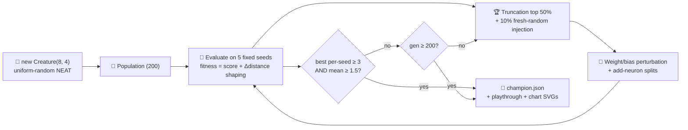

# Snake Game — Remove Hand-Crafted 8→6→4 Warm Start, Evolve from Random NEAT Noise

## Summary

Replaced the hand-crafted 8 → 6 LOGISTIC-hidden → 4 LOGISTIC-output layered topology in
`snake_game/snake_game.ts` with a uniform-random NEAT initial population. The example now starts
evolution from `new Creature(8, 4)` — direct input → output connections with random weights, no
hand-crafted neurons or synapses — and grows hidden neurons during evolution via the NEAT "add-node"
structural mutation operator (mirroring the cart_pole example's pattern). Updated tests, the README,
and the regenerated playthrough / evolution artefacts. Closes #150.

## Changes

- **`snake_game/snake_game.ts`** — replaced `buildInitialCreatureJSON`, `randomCreatureJSON`,
  `mutateCreatureJSON`, and `genesFromCreatureJSON` (all of which hand-wired the layered topology)
  with `buildRandomPopulation` and `mutateCreatureExport` modelled on cart_pole. The mutation
  operator now perturbs every weight and bias plus an occasional NEAT add-node split.
- **Threshold and stop conditions** — introduced `SOLVED_THRESHOLD = 3` (best per-seed eaten count,
  matching closed #137's "champion ate at least three food on the replay episode" target) plus a
  `SOLVED_AVG_FLOOR = 1.5` so the early stop cannot fire on a fragile elite that aces a single seed.
  The hard generation cap is `maxGenerations = 200`, enforced by the existing loop.
- **Checkpoint cadence** — `EVOLUTION_CHECKPOINTS = [1, 10, 50, 100, 200]` (was
  `[1, 10, 50, 200, 600]`), tuned for the new evolution shape from uniform-random NEAT noise.
- **Diversity injection** — every generation replaces ~10% of the population with fresh
  uniform-random NEAT genomes (`RANDOM_INJECTION_FRACTION`) so structural diversity doesn't collapse
  onto the elite's local optimum.
- **`snake_game/snake_game_test.ts`** — replaced layered-topology tests with NEAT-style tests:
  `buildRandomPopulation` is uniform-random, deterministic, has zero hidden neurons;
  `mutateCreatureExport` is valid, deterministic, and grows topology; gen-1 elite is well below the
  threshold; evolution honours the hard generation cap; champion reaches the SOLVED_THRESHOLD on its
  best replay seed; reproducible across runs with the same seed.
- **`snake_game/README.md`** — rewrote the noise → competent narrative, the topology block in the
  flowchart (now "Variable topology grown by add-neuron mutation"), the scoring/threshold
  description, and the tacit-knowledge section.
- **Regenerated artefacts** — `docs/screenshots/snake_game.svg` (champion playthrough),
  `docs/screenshots/snake_game_evolution.svg` (multi-panel progression strip),
  `docs/screenshots/snake_game/evolution.svg` (dual-axis evolution chart).

## Evidence

The runner now produces a champion that eats **4 food** on its best replay seed (mean **1.6** across
the five evaluation seeds), reaching the threshold at **generation 74** and continuing through to
gen 199 to capture the full snapshot strip. Wall clock ~20 s on a workstation.

```text
🐍 Snake Game Example

🧬 Evolving controller from uniform-random NEAT noise...
   Gen    0  fitness=   -12.3  score=  -11.0  mean=  -46.9  eaten=0.40  neurons=12  synapses=32
   Gen   25  fitness=    26.1  score=   29.0  mean=  -25.4  eaten=0.80  neurons=12  synapses=32
   Gen   50  fitness=    27.7  score=   28.9  mean=  -20.5  eaten=0.80  neurons=14  synapses=34
   Gen   75  fitness=   107.0  score=  108.3  mean=    6.6  eaten=1.60  neurons=15  synapses=35
   Gen  100  fitness=   107.0  score=  108.3  mean=   24.9  eaten=1.60  neurons=15  synapses=35
   Gen  125  fitness=   107.1  score=  108.4  mean=   41.7  eaten=1.60  neurons=16  synapses=36
   Gen  150  fitness=   107.1  score=  108.4  mean=   53.8  eaten=1.60  neurons=16  synapses=36
   Gen  175  fitness=   107.1  score=  108.4  mean=   59.4  eaten=1.60  neurons=16  synapses=36
   Gen  199  fitness=   107.1  score=  108.4  mean=   66.7  eaten=1.60  neurons=16  synapses=36

✅ Champion ate 4 food on the replay episode (avg=1.60 across 5 seeds, score=108.42, generations=74, threshold=3).
```



Generated artefacts (regenerated by the runner):

- `docs/screenshots/snake_game.svg` — animated playthrough of the champion eating 4 food
- `docs/screenshots/snake_game_evolution.svg` — five-panel progression strip from gen 1 to gen 200
- `docs/screenshots/snake_game/evolution.svg` — dual-axis chart of best score vs neuron/synapse
  counts

## Test Plan

- `snake_game/snake_game_test.ts` — 22 tests covering the new design:
  - `buildRandomPopulation` is uniform-random, deterministic, and produces zero hidden neurons.
  - `mutateCreatureExport` yields valid creatures, is deterministic, and grows topology when
    `addNeuronRate=1`.
  - `scoreController` returns finite score and fitness for a random creature.
  - `evaluateController` averages metrics across the seed batch.
  - `evolveSnakeController gen-1 best-eaten is well below the solved threshold` — proves gen 1 is
    noise.
  - `evolveSnakeController honours the hard generation cap` — proves the cap is enforced when the
    threshold cannot be reached.
  - `evolveSnakeController champion reaches the SOLVED_THRESHOLD on its best replay seed` — runs the
    full default evolution and asserts `championEaten ≥ 3` and `solved === true`.
  - `evolveSnakeController is reproducible — fixed seed, identical champion` — same seed, identical
    serialised genome.
  - `evolveSnakeController emits checkpoint snapshot files when configured` — snapshot files exist
    for every checkpoint generation.
  - SVG renderer tests carried over from the previous version.
- `quality.sh` — `deno fmt --check`, `deno lint`, `deno check **/*.ts`, full unit-test suite, and
  every example runner all pass.
