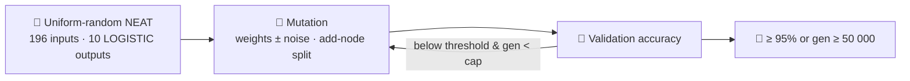

## Summary

Replaced the data-dependent `templateCreatureJSON()` warm start in `mnist_classification` with a
**uniform-random NEAT initial population**: gen 1 now scores near 10 % (chance on a 10-class
problem), and the search grows hidden topology purely via the add-node structural mutation operator.
The 95 % accuracy target and 50 000-generation hard cap are documented as named constants. The
SGD/MLP baseline (`evolveMLPClassifier`) is untouched and remains the default runner path so
`quality.sh` stays fast; the long-form NEAT screenshot run is one-off developer work gated by
`MNIST_NEAT_EVOLUTION=1`. Closes #151.

## Evidence

This is a backend/CLI change. The new behaviour is verified by Deno unit tests covering happy path
(reduced threshold on a tiny synthetic fold), gen-1 noise (mean accuracy near chance), and
generation-cap stop. Long-form NEAT screenshot artefacts (the dual-axis evolution chart at
`docs/screenshots/mnist_classification_evolution_chart.svg`, the multi-panel progression strip at
`docs/screenshots/mnist_classification_evolution.svg`, and the prediction grid at
`docs/screenshots/mnist_classification.svg`) are regenerated by a developer running
`MNIST_NEAT_EVOLUTION=1 ./mnist_classification/run.sh` to convergence. That run is intentionally out
of scope for `quality.sh`/CI per the issue acceptance criteria — convergence from uniform-random
noise on real MNIST is unbounded and may take hours of wall-clock.

## Test Plan

Unit tests added or updated in `mnist_classification/mnist_classification_test.ts`:

- `buildRandomPopulation produces uniform-random NEAT genomes` — verifies gen 1 has 196 inputs, 10
  LOGISTIC outputs, and **zero hand-specified hidden neurons** (hidden structure must emerge from
  mutation).
- `buildRandomPopulation is deterministic for the same seed` — reproducibility.
- `mutateCreatureExport yields a valid creature` — happy path for the new mutation operator.
- `mutateCreatureExport with addNeuronRate=1 grows topology` — confirms one synapse split per
  add-node mutation.
- `evolveClassifier — happy path: champion accuracy crosses a reduced threshold on a tiny fold` —
  in-CI variant with a small `inputCount × classCount` problem and a reduced threshold; asserts the
  champion solves the synthetic task.
- `evolveClassifier — gen-1 population is noise (mean accuracy near chance)` — confirms gen-1
  population mean accuracy sits near 1/`CLASS_COUNT`, proving no warm start.
- `evolveClassifier — honours the hard generation cap` — vanishing-mutation run stops at the cap
  with `solved=false`.
- `evolveClassifier — empty validation/training slice raises a clear error` — error paths.
- `evolveClassifier — reproducibility: two runs with the same seed produce byte-identical
  champions`
  — determinism.

Removed tests for the deleted warm-start helpers (`templateCreatureJSON`, `classMeanFeatures`,
`buildInitialCreatureJSON`, `genesFromCreatureJSON`, `mutateCreatureJSON`).

`./quality.sh` checks run locally:

- `deno lint` — clean.
- `deno fmt --check` — clean.
- `deno check **/*.ts` — clean.
- `deno test` — **779 passed**, 0 failed.

The MLP/SGD baseline runner path (used by `quality.sh`) continues to emit the prediction grid and
the dual-axis evolution chart at the new path
`docs/screenshots/mnist_classification_evolution_chart.svg` (renamed from `mnist_evolution.svg` per
the issue). The README was updated to remove the obsolete warm-start excuse and tell the noise →
competent narrative for the NEAT path.
