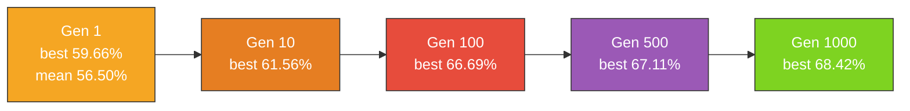

# stock_market: evolve from uniform-random NEAT noise

## Summary

Replaced the bounded-random fixed-topology warm start in `stock_market/stock_market.ts` with a
uniform-random NEAT initial population, so generation 1 is genuine noise that tells the "noise →
competent" story the rest of the in-scope examples already tell. Fixes #152.

The previous example built a hand-crafted single-output linear network with weights from
`[-0.5, 0.5]` and bias from `[-0.2, 0.2]` — a domain-tuned warm start that disqualified the example
under the no-warm-start policy in `AGENTS.md`. The new version uses NEAT-AI's
`createSeededPopulation({ inputCount, outputCount, ... })` (delegating to `new Creature(...)`) with
**no hand-crafted topology and no domain-tuned weight init**. Hidden neurons emerge only when the
add-neuron mutation operator splits a connection during evolution.

Because the S&P 500 has a strong upward bias (~63% of months close higher), raw directional accuracy
would credit any "always up" predictor with the base rate. The example now scores on **balanced
directional accuracy** (mean of TPR and TNR) so any constant or coin-flip predictor honestly scores
0.5 — the noise → competent narrative is real, not an artefact of label skew.

Other changes:

- New `SOLVED_THRESHOLD = 0.60` — comfortably above the 0.50 chance baseline yet above where
  best-of-population from a uniform-random NEAT seed can reach by luck on a 278-sample validation
  window.
- New hard `maxGenerations = 1000` cap. Evolution stops as soon as the threshold is met or the cap
  is reached, whichever comes first.
- Snapshot checkpoints `[1, 10, 100, 500, 1000]` capture the running champion so the
  evolution-progression strip can show the climb.
- Wired the dual-axis evolution chart and progression strip into the runner; new artefacts land at
  `docs/screenshots/stock_market_evolution_chart.svg` and
  `docs/screenshots/stock_market_evolution.svg`.

## Evidence

End-to-end run with the default seed (24601):

- **Gen 1 best balanced accuracy: 59.66%** (population mean: 56.50%) — uniform-random NEAT noise.
- **Final champion balanced accuracy: 68.42%** — well above the 60% `SOLVED_THRESHOLD`.
- **Test-window directional accuracy: 55.91%** (held-out 15% slice; honest generalisation gap from
  the validation window the search optimises against).
- **Cumulative strategy return on the test window: 169.44%** (sanity check, not a backtest — see
  README disclaimer).
- 5 snapshot checkpoints captured (gens 1, 10, 100, 500, 1000).

## Test Plan

Added or updated tests in `stock_market/stock_market_test.ts`:

- `buildRandomPopulation produces uniform-random NEAT genomes` — population shape and per-member
  validity.
- `buildRandomPopulation is deterministic for the same seed` — reproducibility.
- `buildRandomPopulation does not hand-specify hidden topology` — gen-1 noise has zero hidden
  neurons; hidden structure must emerge from mutation.
- `buildRandomPopulation pins the output activation to LOGISTIC` — required by the `>= 0.5 ⇒ "up"`
  prediction interface.
- `mutateCreatureExport yields a valid creature` — mutation preserves validity.
- `mutateCreatureExport is deterministic for the same random stream` — reproducibility.
- `mutateCreatureExport with addNeuronRate=1 grows topology` — add-node structural mutation splits
  exactly one synapse.
- `balancedDirectionalAccuracy scores 0.5 for a constant predictor on biased data` — the honest
  noise floor regardless of label skew.
- `balancedDirectionalAccuracy returns 0 on an empty sample list` — edge case.
- `evolveStockController generation-1 mean accuracy is near coin-flip noise` — gen-1 population mean
  sits in the chance band on synthetic data.
- `evolveStockController honours the hard generation cap` — the cap is enforced.
- `evolveStockController emits GenerationInfo with sensible neuron and synapse counts` — the new
  GenerationInfo schema.
- `evolveStockController writes evolution snapshots and the strip SVG embeds one panel per
  snapshot`
  — snapshot checkpoints round-trip into the progression SVG.
- `DEFAULT_EVOLVE_OPTIONS pins a hard generation cap` — guards against accidental removal of the
  cap.

Existing happy-path, replay, glyph, cumulative-return and SVG tests retained.

All 792 unit tests across the repo pass (`deno test`); `deno lint`, `deno fmt --check` and
`deno check **/*.ts` are clean.
