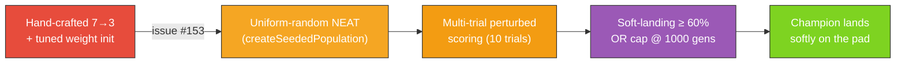

## Summary

Removed the hand-crafted 7 → 3 fixed-topology warm start from `lunar_lander/lunar_lander.ts`.
Generation 1 is now genuine uniform-random NEAT noise — `createSeededPopulation` decides the gen-1
structure (direct input → output connections, random weights, random output bias) and hidden
topology emerges from the add-neuron structural mutation during evolution. Closes #153.

Multi-trial perturbed scoring (`trials = 10`, `initialPerturbation = 1.0`) drives selection so a
controller cannot win by getting lucky on a single canonical launch. The "soft-landing threshold" is
`SOLVED_LANDED_RATE = 0.6` (≥ 60% of the perturbed-start trial batch ends in a `landed` outcome that
obeys the safe-landing limits — ≤ 11.5° tilt, ≤ 2 m/s vertical / horizontal speeds). The hard
generation cap is `DEFAULT_EVOLVE_OPTIONS.maxGenerations = 1000`. Snapshot checkpoints are
`[1, 10, 100, 500, 1000]` so the evolution-progression strip captures the noise → competent journey
across the new search depth.

## Evidence

The regenerated SVG artefacts are committed to the repository:

- `docs/screenshots/lunar_lander.svg` — animated descent of the champion (Gen 1000) landing softly
  on the pad.
- `docs/screenshots/lunar_lander_evolution.svg` — multi-panel evolution-progression strip with one
  panel per captured checkpoint (1, 10, 100, 500, 1000) showing the controller learning to throttle
  and orient.
- `docs/screenshots/lunar_lander/evolution.svg` — dual-axis evolution chart of best score and
  champion neuron / synapse counts against generation.

Reference: `lunar_lander/README.md` describes the gen-1 noise → competent narrative and the new
soft-landing threshold + hard generation cap.

## Test Plan

Unit tests added or updated in `lunar_lander/lunar_lander_test.ts` and
`lunar_lander/physics_test.ts`:

- `buildRandomPopulation produces uniform-random NEAT genomes` — verifies the library decides the
  initial shape and there is **no hand-specified hidden topology**.
- `buildRandomPopulation does not hand-specify hidden topology` — explicit acceptance criterion for
  issue #153.
- `mutateCreatureExport with addNeuronRate=1 grows topology` — confirms the structural mutation
  splits a synapse with a fresh hidden neuron.
- `evolveLanderController generation-1 population is noise on average` — gen-1 mean score is
  negative (mostly crashes) and gen-1 best landed rate is below the solved threshold.
- `evolveLanderController honours the hard generation cap` — with vanishing mutation the search
  cannot solve in time and stops exactly at the cap with `solved=false`.
- `evolveLanderController is reproducible for the same seed` — deterministic evolution.
- `evolveLanderController champion improves over generations` — `result.bestScore` is finite and at
  least the gen-1 best (elitism).
- `scoreController with multiple perturbed trials returns the mean and is deterministic` —
  multi-trial scoring contract.
- `perturbedInitialState centres on initialState` (in `physics_test.ts`) — perturbations stay within
  the documented bounds and fuel/angularV are held fixed.
- All existing render and snapshot tests continue to pass after the API rename
  (`buildInitialCreatureJSON`/`randomCreatureJSON`/`mutateCreatureJSON` →
  `buildRandomPopulation`/`mutateCreatureExport`).

`./quality.sh` was run locally and passes.
