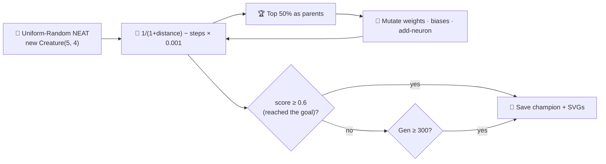

# maze_navigation: evolve from uniform-random NEAT noise

## Summary

Removed the bounded-random fixed-topology warm start in `maze_navigation` and replaced it with a
uniform-random NEAT initial population built by NEAT-AI's `Creature(5, 4)` constructor. Hidden
topology now arises from the add-neuron structural mutation operator instead of being hard-coded by
the example. Closes #155.

The legacy fixed-topology helpers (`buildInitialCreatureJSON`, `randomCreatureJSON`,
`genesFromCreatureJSON`, `mutateCreatureJSON`) are gone — replaced by `buildRandomPopulation` and
`mutateCreatureExport` modelled on the cart-pole pattern from issues #147 / #149. Evolution stops as
soon as the champion's score reaches `SOLVED_THRESHOLD = 0.6` (which guarantees the agent reached
the goal — every non-reached run scores at most `0.499`) or the **hard generation cap of 300** is
reached, whichever comes first.

The runner now also writes:

- `docs/screenshots/maze_navigation_evolution.svg` — multi-panel evolution-progression strip
  rendered at checkpoint generations `[1, 10, 50, 150, 300]`.
- `docs/screenshots/maze_navigation_evolution_chart.svg` — dual-axis chart of best score and
  champion neuron / synapse counts vs. generation.

The README is updated end-to-end to tell the noise → competent narrative: gen 1 bumps into walls,
the milestones show the agent learning to follow walls and head toward the goal, and the final
champion solves the maze in close to the optimal 18 steps.

## Evidence

Champion run on the default seed (`12345`):

```
✅ Champion reached the goal in 18 steps
   (final distance 0, score=0.982, generations=7, threshold=0.6).
```

Threshold `0.6` is reached after just 7 generations under the default
`populationSize=80,
mutationStrength=0.6, mutationRate=0.5, addNeuronRate=0.03` config. The optimal
path along the L-shape is exactly 18 steps, and the champion finds it.



Regenerated artefacts:

- `docs/screenshots/maze_navigation.svg` — animated SVG of the champion's run (byte-identical to the
  prior fixed-topology champion because both find the same 18-step optimal L-path).
- `docs/screenshots/maze_navigation_evolution.svg` — five-panel evolution-progression strip (gens 1,
  10, 50, 150, 300).
- `docs/screenshots/maze_navigation_evolution_chart.svg` — dual-axis chart of best score and
  champion neuron / synapse counts vs. generation.

## Test Plan

Updated `maze_navigation/maze_navigation_test.ts` with new tests covering the no-warm-start evolver:

- `buildRandomPopulation produces uniform-random NEAT genomes` — verifies population shape and that
  every member is a valid `Creature` with finite outputs.
- `buildRandomPopulation does not hand-specify hidden topology` — guards the no-warm-start policy by
  asserting zero hidden neurons in gen 1.
- `buildRandomPopulation is deterministic for the same seed` — reproducibility.
- `mutateCreatureExport with addNeuronRate=1 grows topology` — exercises the structural mutation
  operator.
- `evolveMazeController generation-1 population is noise on average` — gen-1 mean score sits below
  `SOLVED_THRESHOLD` and the gen-1 best member does **not** reach the goal under the default seed.
- `evolveMazeController honours the hard generation cap` — with vanishing mutation the search runs
  to the cap and reports `solved=false`.
- `evolveMazeController champion reaches the goal under the default seed` — happy path: champion
  solves the maze under `DEFAULT_EVOLVE_OPTIONS`.
- `evolveMazeController writes evolution snapshots and the strip SVG embeds one panel per
  snapshot`
  — checkpoint capture pipeline.
- `evolveMazeController emits GenerationInfo with sensible neuron and synapse counts` — verifies
  topology counts reported through the per-generation callback.
- `buildRandomPopulation members all serialise as CreatureExport` — round-trips the library export
  shape.

All tests pass via `./quality.sh`. The wider suite (`deno test`) reports `799 passed | 0 failed`,
and every example (including the maze runner) completes successfully.

### Pre-PR Security Self-Check

- [x] **Input validation** — N/A; no new external input. Maze layout is a string-art template
      already validated by `parseMaze`.
- [x] **Secrets** — none staged.
- [x] **Injection surface** — no new SQL, shell, filesystem, or HTTP calls.
- [x] **Output encoding** — SVG output is generated by the existing `renderRunSVG` helper.
- [x] **Authentication/authorisation** — N/A; CLI demo only.
- [x] **Error handling** — no internal state leaked.
- [x] **Dependencies** — no new dependencies.
