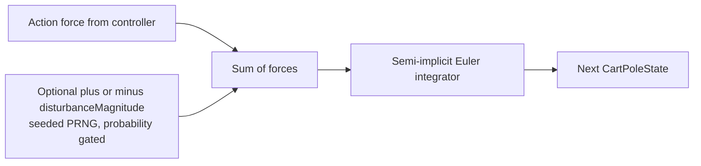

## Summary

Added an optional in-episode wobble disturbance to the cart-pole physics simulator so the task can
be made harder than the trivial CartPole-v1 baseline. The mechanism is fully opt-in:
`disturbanceMagnitude` and `disturbanceProbability` both default to `0`, and `step()` ignores the
new optional `random` argument unless the magnitude is positive — so the no-PRNG/no-disturbance path
is byte-identical to the previous implementation. No callers of `step()` are changed in this PR; the
mechanism is added in isolation and `cart_pole.ts` defaults, screenshots, README, and the evolution
chart are untouched. Closes #159.

## Evidence

This is a pure-physics/CLI change — no UI to screenshot. Behaviour is verified by deterministic unit
tests (see Test Plan).

## Test Plan

- All thirteen existing tests in `cart_pole/physics_test.ts` continue to pass without modification.
- New `step with disturbanceMagnitude=0 ignores the PRNG and matches the
  no-PRNG path` —
  regression cover for the byte-identical default path.
- New `step with a fixed PRNG and disturbance is deterministic across
  runs` — two independent runs
  from the same seed produce identical state sequences.
- New `a sustained disturbance perturbs an otherwise-zero-action upright
  pole` — with gravity and
  action force disabled, the baseline cart stays at `x = 0` while a probability-1 disturbance run
  drifts away from the centre, demonstrating the disturbance actually does something.
- `./quality.sh` passes (lint, format, type check, unit tests, all example programs).
