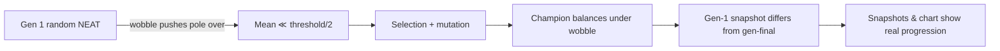

## Summary

Enables the in-episode wobble disturbance (added in #159) by default in `cart_pole`'s
`DEFAULT_EVOLVE_OPTIONS`, so the cart-pole example shows real generation-by-generation evolution
instead of producing byte-identical snapshots at score 500. Closes #160.

Before this change, `snapshot-gen-1.json` / `snapshot-gen-10.json` / `snapshot-gen-100.json` were
byte-identical at score 500 — the elite from a uniform-random NEAT generation 1 had already
saturated the cap, leaving nothing for evolution to improve. With the wobble enabled (±18 N at 30%
per step, ten independent per-trial PRNG streams), gen-1 best and mean both sit well below
`SOLVED_THRESHOLD`, the gen-1 snapshot now differs in score and weights from the gen-final snapshot,
and the captured progression genuinely shows the controller climbing to a balancing solution.

## Evidence

CLI evidence — gen-1 vs gen-final snapshot diff (extracted from `.synthetic-cart-pole/snapshots`):

| Snapshot                 | Score |
| ------------------------ | ----- |
| `snapshot-gen-1.json`    | 409.2 |
| `snapshot-gen-10.json`   | 462.8 |
| `snapshot-gen-100.json`  | 500.0 |
| `snapshot-gen-500.json`  | 500.0 |
| `snapshot-gen-1000.json` | 500.0 |

The gen-1 (409.2) → gen-10 (462.8) → gen-100 (500.0) progression shows **three distinct score
levels**, so the captured progression strip and the evolution chart genuinely depict evolution
climbing from random noise to a competent controller — not byte-identical panels at 500 as in the
bug report from #158.

Regenerated artefacts:

- `docs/screenshots/cart_pole.svg` — animated champion run under the same wobble regime it was
  trained on.
- `docs/screenshots/cart_pole_evolution.svg` — multi-panel evolution-progression strip rendered from
  the captured snapshots.
- `docs/screenshots/cart_pole_evolution_chart.svg` — dual-axis chart of best score and champion
  neuron / synapse counts against generation.

## Test Plan

- Tightened `evolveCartPoleController generation-1 population is noise on average` — the gen-1 mean
  must now sit below `SOLVED_THRESHOLD / 4` (was `/ 2`) AND the gen-1 best must sit below
  `SOLVED_THRESHOLD` (asserted for the first time). Catches a regression that re-trivialises the
  task.
- Added `evolveCartPoleController shows real generation-1-vs-gen-N improvement` — asserts the gen-20
  mean improves by at least 30 steps over the gen-1 mean.
- Added `evolveCartPoleController gen-1 and gen-final snapshots differ in score or
  topology` —
  captures snapshots at gens 1 and 30 and asserts they differ in score or in topology JSON. Direct
  cover for the historical bug from issue #158.
- Updated `champion generalises to unseen perturbed initial states` — re-evaluates the champion
  under a fresh `disturbanceSeed` (different from training) so the test now proves robustness to
  unseen wobble patterns as well as unseen perturbed starts.
- All 22 cart_pole tests pass locally.
