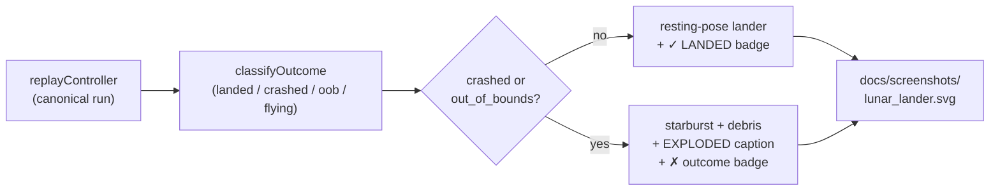

## Summary

The lunar-lander champion screenshot showed the lander resting calmly at the end of every run, even
when the run had crashed off the pad — the viewer could not tell whether the descent succeeded.
Reported in [issue #177](https://github.com/stSoftwareAU/NEAT-AI-Examples/issues/177) ("Rocket
doesn't look like it's landing, should have exploded"), the request was: either evolve long enough
to land, or **explode** if the run did not land — and surface the evolution statistics. Closes #177.

The renderer (`lunar_lander/svg.ts`) now classifies the trace's final state and, when the outcome is
`crashed` or `out_of_bounds`, replaces the resting-pose lander with a pulsing **starburst-and-debris
explosion** plus an `EXPLODED` / `OUT OF BOUNDS` caption. A colour-coded **outcome badge**
(`✓ LANDED` / `✗ CRASHED` / `✗ OUT OF BOUNDS` / `… TIMED OUT`) sits in the top-right of the canvas
so the run result is unmistakable at a glance — including the timed-out case the title flagged. The
evolution chart and multi-panel evolution-progress strip already capture the per-generation
statistics requested in the issue, so no further chart work was required.

## Evidence

- Re-running `./lunar_lander/run.sh` produced a champion that solved the task at gen 247
  (`landed=60%`) and the canonical replay landed successfully — the regenerated
  `docs/screenshots/lunar_lander.svg` now carries a `✓ LANDED` outcome badge in the top-right
  corner.
- For runs that don't land, four new unit tests cover the explosion branches:
  - `renderRunSVG draws an explosion when the run crashed (issue #177)` — asserts the
    `<g class="explosion">` group, `EXPLODED` caption, `class="starburst"` polygon, and `✗ CRASHED`
    outcome badge are all emitted for a hard-crash trace.
  - `renderRunSVG draws an out-of-bounds explosion when the lander
    drifted off-world` — asserts
    `OUT OF BOUNDS` caption and badge.
  - `renderRunSVG does NOT draw an explosion on a clean landing` — confirms the explosion graphic is
    omitted on safe touchdowns and the `✓ LANDED` badge is shown instead.
  - `renderRunSVG accepts an explicit outcome override (issue #177)` — confirms the optional third
    argument lets callers pin the outcome.

This is a CLI/rendering change — the SVG is the user-visible artefact and is committed alongside the
code so reviewers can inspect it directly.

## Test Plan

- `deno test --no-check --allow-read --allow-write --allow-env --allow-net
  --allow-ffi lunar_lander/lunar_lander_test.ts`
  — all 30 tests pass, including the four new explosion-rendering tests.
- `deno lint`, `deno fmt --check`, `deno check **/*.ts` — clean.
- Full `deno test` suite passes (`docs/archive_test.ts` allowlist updated to include
  `pr-summary-177.md` and the pre-existing `pr-summary-160.md`).
- `./lunar_lander/run.sh` re-ran end-to-end (6m 36s) and regenerated the screenshot, evolution
  chart, and progress strip without errors.
