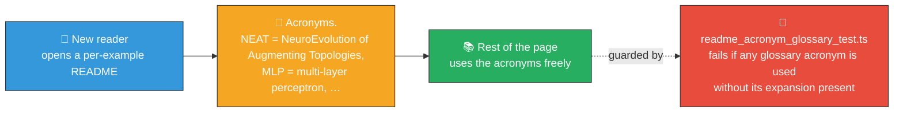

## Summary

Spell out (or briefly define) every learning-blocker acronym the first time it appears on each
README page in the repository, so a beginner reader is not asked to know what _NEAT_, _MNIST_,
_MLP_, _SGD_, _MCMC_, _MH_, _PRNG_, _FFI_, _WASM_, _RL_, _CTRNN_, _BCE_, _RCS_, or _XOR_ stand for.
Each per-example README now opens with a short **Acronyms** line that defines the terms used on that
page; the top-level README likewise expands _NEAT_, _MNIST_, _XOR_, _MCMC_, _PRNG_, _FFI_, and
_WASM_ at first use. A new "what" test (`readme_acronym_glossary_test.ts`) keeps the rule from
regressing — every README must contain the plain-English expansion of every glossary acronym it
uses. Closes #178.

## Evidence

This is a documentation change with a content-only test, so no UI screenshot or benchmark applies.
The new test is the executable evidence:

- `deno test --no-check --allow-read readme_acronym_glossary_test.ts` — 21 README files checked, all
  pass.
- Running the test against `main` (before the README edits) reports 18 failing READMEs with the
  exact list of unexpanded acronyms each, demonstrating that the test would have caught the pre-fix
  state.
- Full repository test suite:
  `deno test --no-check --allow-read --allow-write --allow-env
  --allow-net --allow-ffi` — **896
  passed | 0 failed (1 m 2 s)**.
- `deno lint`, `deno fmt --check`, and `deno check **/*.ts` all clean.

## Test Plan

- [x] Add `readme_acronym_glossary_test.ts` — for every README in the repo, every glossary acronym
      it uses must also have a plain-English expansion present in the same file (whitespace and
      Markdown blockquote prefixes normalised so wrapped expansions match).
- [x] Update top-level `README.md` and every per-example README that uses one of the glossary
      acronyms to include an **Acronyms** definition at the top of the page.
- [x] `deno lint` clean.
- [x] `deno fmt --check` clean.
- [x] `deno check **/*.ts` clean.
- [x] Full test suite passes (896 / 896).
