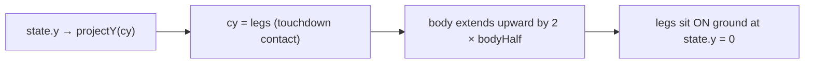

## Summary

The lunar-lander SVG rendered the lander's body around its centre at the projected `state.y`.
Because physics treats `state.y == groundY` as touchdown, half the body was drawn below the terrain
silhouette — the lander appeared buried in the moonscape. Fixed by treating the projected
`(state.x, state.y)` as the lander's contact point (legs) and extending the body upward from there,
in both the static pose markers and the animated lander icon. Closes #181.

## Evidence

Bug-fix to a generated screenshot. The regression test asserts that no part of the lander body
geometry — static resting pose or final animated keyframe — extends below the projected ground line
when `state.y == 0`. The regenerated `docs/screenshots/lunar_lander.svg` now shows the lander
resting on the pad rather than half-buried.

## Test Plan

- Added `renderRunSVG keeps the lander body above the ground at
  touchdown (issue #181)` in
  `lunar_lander/lunar_lander_test.ts` — fails on the unfixed renderer (`lowest=382, ground=370`) and
  passes after the fix.
- Verifies both the static resting-pose body lines and the final animated-lander translate keyframe
  stay at or above the projected ground line.
- All existing lunar-lander tests continue to pass (54 tests in `lunar_lander/`).
