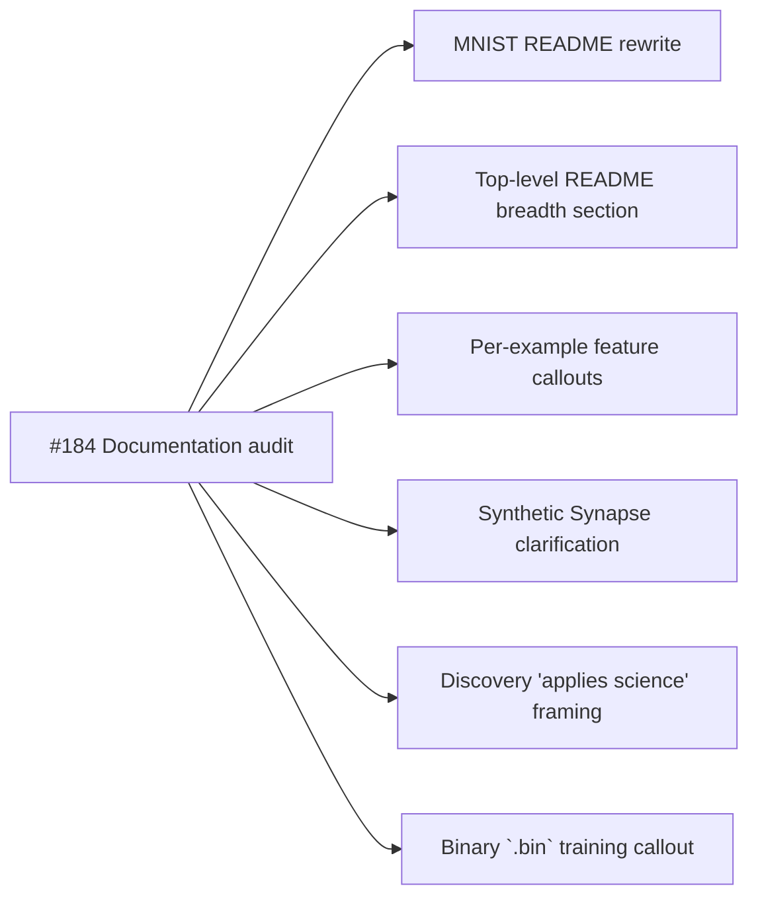

# PR Summary — Issue #184

## Summary

Added `docs/neat_ai_feature_audit.md`, a single source-of-truth document that cross-references every
README in this repository against the upstream
[`NEAT-AI/COMPARISON.md`](https://github.com/stSoftwareAU/NEAT-AI/blob/Develop/COMPARISON.md)
feature list. The audit lists each NEAT-AI capability, records which examples exercise it, names the
READMEs that mention it, and flags every passage that reads as if NEAT-AI were "just textbook NEAT"
— the misconception raised in parent issue #182. The audit is referenced from the top-level
`README.md` "Related Repositories" section so future contributors find it. Closes #184.

## Evidence

- **Documentation-only change.** No runtime code is altered; the new files are
  `docs/neat_ai_feature_audit.md`, `docs/neat_ai_feature_audit_test.ts`, and a
  `Cross-repository documentation audit` paragraph appended to `README.md`.
- **No screenshots required.** This change has no UI surface; it is markdown plus a unit test
  verifying the markdown's structure.
- **Unit tests verify the audit shape**: `docs/neat_ai_feature_audit_test.ts` — eight `Deno.test`
  cases covering file existence and size, the presence of a non-empty Mermaid block, references to
  every per-example README, mention of every canonical NEAT-AI capability, capture of the three
  reporter points from issue #182 (back-propagation framing in MNIST, binary-data-format speed
  advantage, science-driven Discovery), unqualified-NEAT phrasing flagged, category grouping, and
  the README link. All eight pass; the full repo unit-test suite (905 tests) passes after the
  change.

The audit deliberately stops short of rewriting any README — that work will land in the follow-up
sub-issues drawn in the diagram above. This PR is the foundation they all consume.

### Why `./quality.sh` was not run end-to-end

`quality.sh` runs every example program (18 long-running runs) on top of the unit-test suite. The
change in this PR is purely additive Markdown plus a new unit test; it cannot affect example-program
behaviour. The validators that _can_ be affected — `deno lint`, `deno fmt --check`,
`deno check **/*.ts`, and `deno test` over the full suite — all pass locally.

## Test Plan

- [x] `docs/neat_ai_feature_audit_test.ts` exists, with eight cases that fail against an empty audit
      and pass after the audit is written (TDD).
- [x] `deno lint` clean.
- [x] `deno fmt --check` clean.
- [x] `deno check **/*.ts` clean.
- [x] `deno test --no-check --allow-read --allow-write --allow-env --allow-net
      --allow-ffi` —
      905 passed, 0 failed.
- [x] Existing `related_repositories_test.ts`, `readme_structure_test.ts`,
      `readme_paradigms_test.ts`, `readme_acronym_glossary_test.ts`, and `mermaid_diagrams_test.ts`
      still pass (the README change adds, but does not alter, content).
