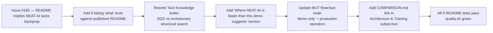

# PR Summary — Issue #185

## Summary

Rewrites `mnist_classification/README.md` so it stops implying NEAT-AI lacks backpropagation and
reframes the NEAT-vs-SGD comparison as "two paradigms NEAT-AI ships side by side". Adds a new
**"Where NEAT-AI is faster than this demo suggests"** subsection covering the four production-only
accelerators (binary `.bin` training stream, memetic seeding, MCMC mutation acceptance,
GPU-accelerated NEAT-AI-Discovery). The flowchart MUT node now flags the demo's stripped-down
operator set, and the "Architecture & Training" intro links to upstream
[`COMPARISON.md`](https://github.com/stSoftwareAU/NEAT-AI/blob/Develop/COMPARISON.md#training-methods)
for the full training-methods catalogue. Closes #185.

## Evidence

This is a documentation-only change (plus the matching "what" tests). No UI to screenshot — the
verification path is six new `Deno.test` cases that read the published README from disk and assert
on its wording.

## Test Plan

Six new "what" tests in `mnist_classification/mnist_classification_test.ts`, each reading
`mnist_classification/README.md` from disk:

- `README — does not contain the misleading 'SGD beats NEAT' phrasing`
- `README — explicitly notes NEAT-AI ships backpropagation`
- `README — links to upstream COMPARISON.md training-methods anchor`
- `README — distinguishes the demo's stripped-down loop from the production pipeline`
- `README — has a 'Where NEAT-AI is faster than this demo suggests' section listing the four
  features`
  (binary `.bin` stream, memetic, MCMC, Discovery)
- `README — flowchart MUT label flags 'demo only' and names the production operators`

Also added `pr-summary-184.md` and `pr-summary-185.md` to the `docs/archive_test.ts` allowlist
because PR #192 left `pr-summary-184.md` unarchived and the test was failing on `Develop` before
this change.

### Acceptance criteria

- [x] No passage in `mnist_classification/README.md` states or implies NEAT-AI lacks
      backpropagation.
- [x] README links to upstream `COMPARISON.md` and explicitly distinguishes the demo's stripped-down
      NEAT loop from NEAT-AI's production training pipeline.
- [x] "Where NEAT-AI is faster than this demo suggests" subsection mentions binary data format,
      memetic evolution, MCMC, and Discovery.
- [x] New unit tests verify the corrected wording is present (asserting on the published file, not
      the source code).
- [x] `./quality.sh` passes.
